# B4-1 · 나를 소개하는 웹페이지 처음부터 만들기 — 구술 평가 대비 학습 문서

> 종이 자기소개서는 한 번 인쇄하면 끝이다. 이 과제는 **화면 크기에 맞춰 스스로 접히고, 누르면 반응하고, 지난번 설정을 기억하는** 자기소개서를 손으로 짓는 일이다. 틀(HTML)을 세우고, 옷(CSS)을 입히고, 스위치와 배선(JavaScript)을 연결한 뒤, 마지막으로 가게 문을 연다(GitHub Pages 배포).
>
> 정확히 말하면: React·Bootstrap 같은 외부 라이브러리 없이 **순수 HTML·CSS·JavaScript** 만으로 반응형 포트폴리오 한 페이지를 만들고, 다크 모드·햄버거 메뉴·스크롤 효과·폼 검증·GitHub API 연동(로딩/성공/에러/빈 상태)을 모두 **"이벤트 → 상태 변경 → 화면 업데이트"** 흐름으로 구현해 배포하는 과제다. 과제 원문은 이것을 "사용자 이벤트 → DOM 조작 → 화면 변화"가 연결되는 웹의 동작 원리를 결과물로 확인하는 일이라고 부르며, 다음 미션인 React 의 필수 기반이라고 적는다.

**읽는 법.**
① 처음이면 §1 부터 끝까지 정독한다(전체 약 220분이라 두세 번에 나눠 읽는다. 처음에는 §3 의 "한 칸 아래"와 §6.5 를 건너뛰면 약 180분). ② 평가 전날이면 §1 · §5 · §6 · §7 만 다시 본다. ③ 평가 30분 전이면 §8 만 본다.
§6 의 접이식 문답은 **질문만 보고 먼저 소리 내어 답해 본 뒤** 펼친다. 읽기만 하면 평가장에서 입이 열리지 않는다.
이 문서의 `파일:줄` 은 전부 현재 코드(커밋 `bea8a6e`, 2026-09-21 — **커밋**은 저장소에 남긴 변경 기록 한 건)에서 다시 확인한 것이다. "실측" 이라고 적은 값은 2026-09-23 에 저장소 **복사본**을 `python3 -m http.server`(폴더를 그대로 웹 서버로 띄우는 파이썬 기본 명령)로 띄우고 **헤드리스 Chromium**(화면 없이 명령으로 조작하는 크롬)으로 실제로 조작해 얻은 값이다. 평가장에서는 같은 조작을 크롬 DevTools 로 하면 된다(§5).

## 1. 한눈에 보기

### 1.1 이 과제를 한 문장으로

**비유.** 한 장짜리 작은 가게를 여는 일이다. 설계도(`index.html`)가 벽과 방의 위치를 정하고, 인테리어 지침서(`css/`)가 색과 배치를 정하고, 직원 아홉 명(`js/` 의 기능 모듈)이 손님의 행동에 반응한다. 개점 신호를 주는 지배인(`main.js`)은 문이 열리면 아홉 명을 차례로 불러 자리에 세운다. 가게는 바깥 거래처 세 곳과 연락한다 — 손님 취향을 적어 두는 서랍(`localStorage`), 진열할 물건을 대 주는 공급처(GitHub API), 손님 편지를 대신 부쳐 주는 우체국(Formspree). 그리고 검수를 통과한 설계도만 실제 가게로 지어진다(CI — 푸시할 때마다 자동으로 검사하는 장치, §3.15 → GitHub Pages).

**정확한 정의.** 브라우저가 한 번 방문할 때 `index.html` 1개가 CSS 진입점 1개(`css/style.css`, 안에서 13개를 `@import` — CSS 파일 안에서 다른 CSS 파일을 불러오는 문장)와 `<script defer>` 11개(`defer` 는 HTML 을 다 읽은 뒤 순서대로 실행하라는 표시, §3.1)를 불러온다. JS 는 **상태(state) 객체**(지금 화면을 결정하는 값 묶음)를 바꾸고, 바뀐 상태를 **`render()`**(상태를 보고 화면을 고치는 함수)가 화면에 옮긴다. 여기서 화면이란 **DOM**(브라우저가 HTML 을 읽어 만든 요소 나무, §3.1)이다. 다크 모드·GitHub 프로젝트 목록·문의 폼 세 기능이 모두 이 같은 틀을 쓴다.

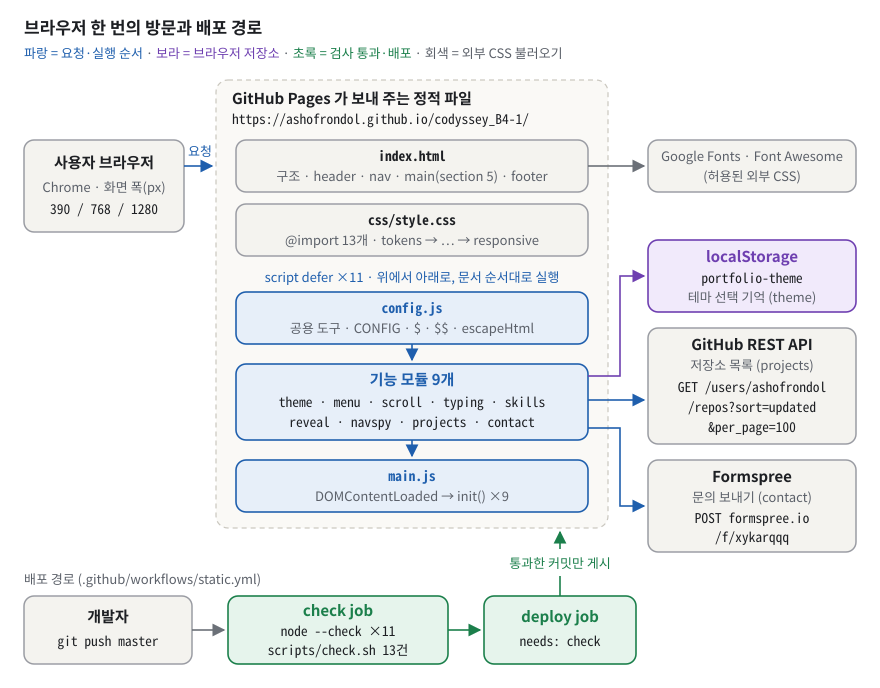
*그림 1. 브라우저 한 번의 방문 — `index.html` 이 CSS 1개와 JS 11개를 불러오고, JS 가 localStorage·GitHub API·Formspree 와 이야기한다. 아래 띠는 검사를 통과한 커밋만 배포되는 길이다.*

그림 1 에서 봐야 할 것은 네 가지다.

- **가운데 영역의 세 층.** 위에서부터 구조(`index.html`) → 표현(`css/style.css`) → 동작(JS) 이다. 체크리스트 2-1 "파일을 왜 나눴나"의 답이 이 세 층이다(§3.1).
- **파란 JS 세 칸(위 → 아래).** `config.js`(공용 설정·도구) → 기능 모듈 9개 → `main.js`(시작 버튼). 그 위의 메모 `script defer ×11 · 위에서 아래로, 문서 순서대로 실행` 이 이 순서를 보장한다(§3.1).
- **오른쪽 세로 칸.** 보라색 `localStorage` 는 테마를 기억하는 저장소, 파란 화살표 두 개는 네트워크 요청이다. GitHub API 는 **읽기**(GET), Formspree 는 **보내기**(POST)다.
- **아래 초록 띠.** `git push master` 가 곧바로 배포되지 않는다. `check` job(**job** 은 자동 작업 한 단위 — 문법 검사 11개 + 검사 13건: 과제 제약 10 · README 문서 좌표 3)이 통과해야 `deploy` job 이 시작된다(`needs: check` — 앞 job 이 성공해야 시작한다는 조건). "규칙은 문서가 아니라 검사에 산다"를 실제로 구현한 부분이다(§3.15).

**규모(실측).** `index.html` 384줄 · CSS 14파일 1,160줄 · JS 11파일 838줄 · 제약 검사 `scripts/check.sh` 179줄(검사 13건) · 워크플로 `.github/workflows/static.yml` 67줄. `images/` 에는 자리표시 문서 `images/README.md` 하나뿐이고 이미지 파일은 0개다. 자동 행위 테스트(기능을 눌러 보는 테스트)는 **없다**.

### 1.2 평가자는 무엇을 보나

체크리스트(`checklists_md/responsive_web_javascript.md`)는 4영역 **15문항**이다. 이 문서는 15문항 모두를 §6 에 그대로 옮겨 두었다.

| 영역 | 문항 수 | 평가자가 확인하는 것 | 대비하는 곳 |
|---|---|---|---|
| 1. 기능 동작 검증 | 5 | 반응형, 다크 모드 유지, 햄버거·스크롤·맨 위로, API 4상태, 폼 즉시 피드백을 **직접 보여 주는가** | §5 시연, [§6.1](#61-기능-동작-검증) |
| 2. 구현 구조 설명 | 4 | 파일 분리 이유, 시맨틱 태그 선택 기준, CSS 변수의 이점, `onclick` vs `addEventListener` | §3.1~§3.4, §3.8, [§6.2](#62-구현-구조-설명) |
| 3. 핵심 개념 이해 | 4 | 이벤트→상태→화면 흐름, `async/await`+`try/catch` 분기, `map`/`filter` 변환, Flex vs Grid | §3.6, §3.9, §3.10, §3.13, §4.2, [§6.3](#63-핵심-개념-이해) |
| 4. 확장 사고·트러블슈팅 | 2 | 상태 객체를 따로 둔 이유, 모바일 퍼스트의 이유 | §3.5, §3.10, [§6.4](#64-확장-사고--트러블슈팅) |

**이 학습자가 다른 과제 평가에서 실제로 받은 지적**은 이번에도 그대로 나온다고 보고 준비한다.

- "코드 읽는 속도가 느리다", "주석을 지웠으면 한다" → 이 저장소는 **줄 끝 주석이 매우 많다**(§7.3). 주석을 가리고도 코드를 읽을 수 있어야 한다. §3·§4 의 발췌는 주석을 떼고 실었다.
- "실질적으로 **어떻게** 작동하는지" → 기능 이름이 아니라 메커니즘을 묻는다. 모든 개념에 "한 칸 아래"를 붙였다.
- "상황에 따라 어떤 것을 쓸지" → Flex vs Grid, `onclick` vs `addEventListener`, 상태 객체 vs 변수처럼 **대안과 비교한 선택 이유**를 준비한다.
- "자신감 있게" → 답의 첫 문장은 결론, 그다음 근거, 그다음 코드 위치.

### 1.3 30초 자기소개 스크립트

> "외부 라이브러리 없이 HTML·CSS·JavaScript 만으로 반응형 포트폴리오를 만들어 GitHub Pages 에 배포했습니다. 다크 모드, GitHub 프로젝트 목록, 문의 폼 세 기능을 모두 '상태 객체 → setState → render' 한 가지 틀로 만들었고, 프로젝트 목록은 status 값 하나로 로딩·성공·에러·빈 상태를 나눕니다. 색은 CSS 변수로 모아 다크 모드는 html 속성 하나로 바뀌고, 레이아웃은 모바일을 기본으로 768·1024px 에서 규칙을 더했습니다. 과제 제약은 검사 스크립트로 만들어, 통과한 커밋만 배포되게 했습니다."

소리 내어 읽으면 30초 안쪽이다. 파일 경로(`scripts/check.sh`, `.github/workflows/static.yml`)는 대본에 넣지 않고, 평가자가 "어디서요?"라고 물을 때 댄다.

## 2. 명세 정독 — 무엇을 요구받았나

### 2.1 요구사항 지도

원문은 과제 PDF 의 "4. 기능 요구 사항" 이다. ID(R1-1 등)는 원문에 없고 README `§ 0.4` 가 붙인 번호를 그대로 쓴다. 상태: ✅ 충족 · ⚠️ 부분 · ❌ 미충족 · 🔍 이 저장소만으로는 검증 불가.

> [!TIP]
> 처음 읽을 때는 표의 '쉬운 말'과 '상태' 두 열만 훑고 §3 으로 넘어가도 된다. 표에 나오는 낯선 용어(호이스팅, classList, IntersectionObserver, 구조분해 …)는 §3 에서 차례로 풀고 부록 A 에 모아 두었다. §3 까지 읽은 뒤 이 표로 돌아오면 '내 구현' 열의 `파일:줄` 이 읽힌다.

#### R1 · R2 — 폴더 구성과 HTML 구조

| ID | 원문 요지 | 쉬운 말 | 왜 이런 요구를? | 내 구현 | 상태 |
|---|---|---|---|---|---|
| `R1-1` | index.html / css/ / js/ / images/ 역할 분리 | 폴더를 역할별로 나눠라 | 구조·표현·동작이 바뀌는 이유가 다르다 | 루트 `index.html`, `css/` 14, `js/` 11, `images/README.md:1-3` | ✅ (`images/` 는 자리표시 문서만) |
| `R1-2` | "외부 스타일시트와 JavaScript 파일을 HTML에 올바르게 연결한다." | 경로가 맞아야 한다 | 404 없이 로드 | `index.html:39`, `index.html:47-67`, `css/style.css:22-46` | ✅ `check.sh` 가 로컬 참조 실재 검사 |
| `R1-3` | "VS Code + Live Server로 실시간 개발 환경을 구성한다." | 로컬 http 서버로 개발 | `file://` 과 `http://` 의 차이 체감 | `.vscode/settings.json:5` (포트 5500) | 🔍 설치 여부는 저장소로 증명 불가 (§7.1) |
| `R2-1` | `header` `nav` `main` `section` `article` `footer` 사용 | 의미 있는 태그 | 스크린 리더·검색엔진이 구조를 읽는다 | `index.html:72`, `index.html:74`, `index.html:125`, `index.html:128`, `index.html:175`, `index.html:335`, 카드 `js/projects.js:203` | ✅ header 5·nav 1·main 1·section 5·article 1(+카드 12)·footer 1 |
| `R2-2` | Hero(인사말, CTA)·About(자기소개, 프로필 이미지)·Skills·Projects·Contact·Footer | 여섯 구역 | 포트폴리오의 기본 골격 | `index.html:128-163`, `index.html:167-211`, `index.html:215-226`, `index.html:230-250`, `index.html:254-330`, `index.html:335-371` | ⚠️ About 의 "프로필 이미지"가 아이콘(`index.html:177-182`) |
| `R2-3` | 네비게이션에 각 섹션 앵커 링크 | 메뉴 → `#id` | 한 페이지 안 이동 | `index.html:85-89` | ✅ href 5개 모두 id 실재 |
| `R2-4` | 모든 이미지에 의미있는 alt | 대체 텍스트 | 이미지를 못 보는 사람·로딩 실패 대비 | — | ⚠️ `` 0개라 증명할 대상이 없다 |
| `R2-5` | `<label>` for-id 매칭 | 라벨과 입력칸을 짝짓기 | 입력칸의 이름·클릭 영역 | `index.html:269`↔`index.html:274`, `index.html:285`↔`index.html:289`, `index.html:300`↔`index.html:303` | ✅ 3쌍 |

#### R3 — CSS 스타일링

| ID | 원문 요지 | 쉬운 말 | 왜 이런 요구를? | 내 구현 | 상태 |
|---|---|---|---|---|---|
| `R3-1` | 외부 스타일시트( `css/style.css` ) | CSS 는 파일로 | 분리·캐시 | `index.html:39` | ✅ |
| `R3-2` | CSS 변수( `:root` )로 색상, 폰트, 간격 | 디자인 기준값에 이름 붙이기 | 한 곳 수정 → 전체 반영 | `css/tokens.css:11-59` | ✅ 변수 37개 |
| `R3-3` | 다크 모드용 CSS 변수 별도( `[data-theme="dark"]` ) | 다크 값만 다시 정의 | 속성 하나로 테마 전환 | `css/tokens.css:63-78` | ✅ 14개 재정의 |
| `R3-4` | 네비게이션: Flexbox (로고 왼쪽, 메뉴 오른쪽) | 한 줄 배치 | Flex 사용 경험 | `css/header.css:33-38` | ✅ Flex 사용. 메뉴는 로고와 버튼 **사이**(가운데)에 온다 — 원문 결과 예시 `Logo  Menu  [D]` 와 같은 배치(§3.6) |
| `R3-5` | Projects 카드: Grid( `auto-fit` , `minmax` ) | 칸 자동 계산 | 미디어 쿼리 없는 반응형 | `css/projects.css:44-49` | ✅ 1/2/3열 실측 |
| `R3-6` | 모바일 퍼스트로 작성 | 좁은 화면이 기본 | 규칙 덧쌓기가 한 방향 | `css/responsive.css:11`, `css/responsive.css:53` | ✅ `max-width` 쿼리 0건 |
| `R3-7` | 브레이크포인트: 768px(태블릿), 1024px(데스크톱) | 두 경계 | 기기군 대응 | 같은 두 줄 | ✅ 767/768·1023/1024 경계 실측 |
| `R3-8` | 모바일에서 네비 숨김 + 햄버거 | 좁으면 ☰ | 공간 절약 | `css/header.css:64-67`, `css/responsive.css:18-38` | ✅ |
| `R3-9` | 버튼, 카드에 hover + transition | 마우스 반응 | 누를 수 있다는 신호 | `css/buttons.css:30-34`, `css/buttons.css:42-46`, `css/projects.css:60-70` | ⚠️ 버튼 ✅ / 카드·스킬 카드는 hover 때 그림자·테두리만 **전환 없이** 바뀌고 떠오르지 않음(`.reveal` 규칙에 덮임, §7.2 I) |
| `R3-10` | 카드에 box-shadow | 떠 있는 느낌 | 시각 위계 | `css/projects.css:59`, `css/projects.css:68`, `css/tokens.css:24-26` | ✅ |

#### R4 — JavaScript 기초 (DOM · 이벤트)

| ID | 원문 요지 | 쉬운 말 | 왜 이런 요구를? | 내 구현 | 상태 |
|---|---|---|---|---|---|
| `R4-1` | JS 를 defer 로 연결 | 파싱 끝나고 순서대로 실행 | DOM 준비·실행 순서 보장 | `index.html:47-67` | ✅ 11/11 |
| `R4-2` | var 대신 const, let 만 | 블록 스코프 변수만 | 호이스팅 버그 예방 | `js/*.js` 전체 | ✅ `var` 0건(검사) |
| `R4-3` | onclick 속성 대신 addEventListener | 동작은 JS 에서 연결 | 구조·동작 분리, 여러 핸들러 | 호출 12곳(§6.2 Q6.2-4) | ✅ 인라인 `on*=` 0건(직접 grep). 자동 검사는 이벤트 7종만 본다(§7.3) |
| `R4-4` | querySelector, querySelectorAll | CSS 셀렉터로 찾기 | 표준 DOM API | 래퍼 `js/config.js:35-37` | ✅ |
| `R4-5` | textContent, innerHTML | 글자 넣기 / HTML 넣기 | DOM 조작 기본 | `js/main.js:21`, `js/contact.js:170` / `js/projects.js:194`, `js/skills.js:30` | ✅ textContent 4줄 · innerHTML 11줄 |
| `R4-6` | classList.add, remove, toggle | 클래스로 상태 표시 | 스타일은 CSS 에 둔다 | `js/menu.js:20`, `js/reveal.js:25`, `js/menu.js:30` | ✅ toggle 6 · add 2 · remove 2 |
| `R4-7` | click, submit, scroll, input | 이벤트 4종 | 기본 이벤트 체득 | `js/menu.js:19`, `js/contact.js:58`, `js/scroll.js:20`, `js/contact.js:50` (+ blur `js/contact.js:45`) | ✅ |
| `R4-8` | event.preventDefault() | 기본 동작 끄기 | 폼 새로고침·앵커 점프 막기 | `js/contact.js:59`, `js/scroll.js:48` | ✅ 제출 뒤 URL 불변(실측) |

#### R5 · R6 — 인터랙션과 폼

| ID | 원문 요지 | 쉬운 말 | 왜 이런 요구를? | 내 구현 | 상태 |
|---|---|---|---|---|---|
| `R5-1` | 햄버거 클릭 → 메뉴, 다시 클릭 → 사라짐, `classList.toggle('active')` 활용 | 메뉴 토글 | 클래스 토글 패턴 | `js/menu.js:19-24` | ✅ 클래스 이름은 `is-open` (링크로 닫을 때 라벨 결함 §7.2) |
| `R5-2` | 메뉴 클릭 시 해당 섹션으로 부드럽게 이동 | 스무스 스크롤 | 위치 감각 유지 | `css/base.css:18-19`, `js/scroll.js:42-51` | ✅ (첫 이동 24px 어긋남 · 움직임 줄이기 설정에서도 부드럽게 움직임 §7.2) |
| `R5-3` | 스크롤 300px 이상에서 버튼, 클릭 시 맨 위 (기준값 README 명시) | 맨 위로 버튼 | 긴 페이지 UX | `js/config.js:24`, `js/scroll.js:25-28`, `js/scroll.js:36-38` | ✅ 비교는 `>` (§7.3) |
| `R5-4` | 스크롤 60px 이상에서 네비 배경 변경 (README 명시) | 네비 배경 | 본문 위 글자 가독성 | `js/config.js:26`, `js/scroll.js:24`, `css/header.css:26-30` | ✅ 비교는 `>` |
| `R5-5` | 토글 → 테마 전환, 로컬스토리지 저장 → 새로고침 후 유지 | 다크 모드 기억 | 상태의 수명 | `js/theme.js:28-63`, `js/config.js:30` | ✅ 로컬·배포본 모두 실측 |
| `R5-6` | Intersection Observer 임계값 0.2 이상 권장 (README 명시) | 스크롤 등장 효과 | 브라우저에게 관찰을 맡긴다 | `js/config.js:28`, `js/reveal.js:21-31` | ✅ (짧은 화면에서 Projects 투명 결함 §7.2) |
| `R6-1` | 문의 폼 (이름, 이메일, 메시지) | 3칸 폼 | 폼 UX | `index.html:266-328` | ✅ |
| `R6-2` | 필수값 검증 (빈 필드 제출 불가) | 빈칸 막기 | 잘못된 전송 예방 | `js/contact.js:135-137`, `js/contact.js:82-85` | ✅ |
| `R6-3` | 이메일 형식 검증 | 형식 검사 | 오타 예방 | `js/contact.js:138-140`, `js/contact.js:147-150` | ✅ |
| `R6-4` | 에러 메시지가 입력 필드 근처 | 칸 바로 아래 | 어느 칸이 틀렸는지 즉시 | `index.html:280`, `js/contact.js:164-171`, `css/form.css:48-58` | ✅ |
| `R6-5` | 제출 시 preventDefault, 성공 메시지 | 새로고침 없이 성공 안내 | JS 가 제출을 떠맡는다 | `js/contact.js:59`, `js/contact.js:120-129`, `index.html:318-321` | ✅ 5초 뒤 자동 숨김 |

#### R7 · R8 · R9 — ES6+, 비동기, 상태 관리

| ID | 원문 요지 | 쉬운 말 | 왜 이런 요구를? | 내 구현 | 상태 |
|---|---|---|---|---|---|
| `R7-1` | 화살표 함수 | `() =>` | 짧은 콜백, 바깥 `this` 유지 | 38줄(예 `js/theme.js:49`) | ✅ |
| `R7-2` | 템플릿 리터럴로 HTML 동적 생성 | 백틱 문자열 | 데이터 → 마크업 | `js/projects.js:202-224`, `js/skills.js:32-36` | ✅ |
| `R7-3` | 구조분해 할당 | 필요한 필드만 꺼내기 | 코드가 쓰는 값을 드러냄 | `js/projects.js:86`, `js/projects.js:195-202`, `js/theme.js:67`, `js/contact.js:154` | ✅ |
| `R7-4` | map: GitHub 데이터 → HTML 카드 | 데이터 → 뷰 변환 | React 렌더의 원형 | `js/projects.js:194-225` | ✅ |
| `R7-5` | filter: 특정 조건만 (선택) | 거르기 | 필터 UI | `js/projects.js:68`, `js/projects.js:154`, `js/projects.js:182` | ✅ |
| `R7-6` | forEach: 배열 순회 | 하나씩 돌며 작업 | 부수효과 처리 | 12곳(예 `js/main.js:24`, `js/menu.js:27`) | ✅ |
| `R8-1` | fetch 와 async/await | 비동기 호출 | 기다리는 코드를 위→아래로 | `js/projects.js:45`, `js/projects.js:50`, `js/projects.js:64` | ✅ |
| `R8-2` | 엔드포인트 `https://api.github.com/users/{본인아이디}/repos` | 내 저장소 목록 | 실제 API 경험 | `js/projects.js:49`, `js/config.js:17` | ✅ `?sort=updated&per_page=100` 추가 |
| `R8-3` | 로딩: 스피너 또는 "로딩 중..." | 기다리는 중 표시 | 빈 화면 방지 | `js/projects.js:92-100`, `css/projects.css:171-184` | ✅ |
| `R8-4` | 성공: 카드 리스트 | 카드 그리기 | | `js/projects.js:135-139`, `js/projects.js:176-229` | ✅ |
| `R8-5` | 에러: "프로젝트를 불러올 수 없습니다" + 재시도 버튼 | 실패 안내 + 다시 | 복구 수단 | `js/projects.js:102-123` | ✅ |
| `R8-6` | 빈 상태: "표시할 프로젝트가 없습니다" | 0개 안내 | 에러와 구분 | `js/projects.js:125-133` | ✅ |
| `R8-7` | try/catch 로 에러 처리 | 실패를 한 곳에서 받기 | | `js/projects.js:48`, `js/projects.js:77-80` | ✅ + `res.ok` 검사 `js/projects.js:54-62` |
| `R9-1` | "사용자 이벤트 → 상태 변경 → 화면 업데이트" 흐름이 명확 | 단방향 흐름 | React 의 기초 | Theme·Projects·ContactForm 의 `setState`/`render` | ✅ |
| `R9-2` | 3가지 이상의 "상태 → 렌더링" 흐름 | 예시 1~4 | | 다크 모드, API 4상태, 폼 검증, 언어 필터 | ✅ 4개 |

#### R10 · 제출물 — 배포

| ID | 원문 요지 | 쉬운 말 | 왜 이런 요구를? | 내 구현 | 상태 |
|---|---|---|---|---|---|
| `R10-1` | GitHub Pages로 배포 | 외부 접속 URL | 결과물 공개 | `.github/workflows/static.yml:49-67` | README 🔍 → 2026-09-23 배포 URL HTTP 200 직접 확인 |
| `R10-2` | 배포된 URL에서 모든 기능 정상 동작 | 배포본도 된다 | 로컬과 배포 환경 차이 | — | README 🔍 → 배포 URL 에서 카드 12장·햄버거·다크 유지·폼 에러·콘솔 에러 0 확인. **저장소 안 증거는 없음** |
| `R10-3` | README 에 설명, 사용 기술, 배포 URL, 스크린샷 | 문서화 | 채점자가 한눈에 | README 머리말, `§ 🛠️ 사용 기술`, `§ 🌐 배포 URL`, `§ 📸 스크린샷` | ⚠️ 스크린샷 파일 3장 없음 |
| 제출물 | 데스크톱/모바일/다크모드 스크린샷 | 캡처 3장 | 동작 증거 | `images/` | ❌ 이미지 0개 |
| 제약 | 레이트 리밋 시(403) 에러 상태 UI | 403 도 에러 화면으로 | `fetch` 는 403 을 실패로 보지 않는다 | `js/projects.js:55-57` | ✅ 403 주입 실측 |

**README 의 종합 판정**(`README.md § 0.10 ✅ 과제 수행 점검 (명세 대조)` 그대로): "필수 65개 중 충족 57 / 부분 5 / 미충족 0 / 로컬검증불가 3". 부분 5건은 R2(묶음)·R2-2·R2-4·R10(묶음)·R10-3 이고 모두 **이미지 자산**(스크린샷·프로필 사진)이 있어야 풀린다. 검증 불가 3건은 R1-3·R10-1·R10-2 다. 이번 확인으로 R10-1·R10-2 는 실제로 동작함을 봤지만, "증거가 저장소에 없다"는 지적은 그대로 유효하다(§7.1).

### 2.2 지켜야 할 제약과 그 이유

| 제약 (원문 그대로) | 왜 이런 제약을 거나 | 이 저장소에서 지키는 방법 | 기계 검사 |
|---|---|---|---|
| "React, Vue, jQuery, Bootstrap, Tailwind CSS 등 외부 라이브러리 사용 금지" / "순수 HTML, CSS, JavaScript만 사용" | 프레임워크가 자동으로 해 주는 "상태가 바뀌면 화면을 다시 그린다"를 손으로 배선해 봐야 React 가 무엇을 대신해 주는지 안다 | 외부 로드는 Google Fonts(`index.html:22-29`)와 Font Awesome CSS(`index.html:33-36`) 뿐 | `scripts/check.sh:68-73`, 허용 출처 목록 `scripts/check.sh:79-92` |
| "아이콘(Font Awesome), 웹 폰트(Google Fonts)는 허용" | 표현 자원은 동작 원리 학습과 무관 | 둘만 사용 | 같음 |
| "var 대신 const , let 사용" | `var` 의 함수 스코프·호이스팅이 만드는 버그를 처음부터 피한다 | `var` 0건, 모든 JS 파일 `'use strict'` | `scripts/check.sh:48-49` |
| "HTML에 onclick 대신 addEventListener 사용" | 구조(HTML)와 동작(JS)의 분리, 한 요소에 여러 핸들러 | 인라인 `on*=` 0건 | `scripts/check.sh:52-53`(이벤트 7종만 검사 — §7.3) |
| "인라인 스타일( style="..." ) 사용 금지" | 표현은 CSS 파일에, 테마는 변수로 — JS 가 색을 직접 칠하면 다크 모드가 CSS 한 곳에서 끝나지 않는다 | HTML `style="` 0건 + JS `.style.` 0건 | `scripts/check.sh:56-61` |
| "최신 Chrome 브라우저에서 정상 동작" | 기준 브라우저를 하나로 고정 | Chromium 으로 실측 | — |
| "인증 없이 호출 시 시간당 60회 제한(레이트 리밋)이 있으므로, 짧은 시간 내 반복 새로고침을 피한다." / "레이트 리밋 발생 시(403 응답) 에러 상태 UI가 표시되도록 처리한다." | `fetch` 는 403 을 **실패로 보지 않는** 함정을 직접 겪게 하려는 요구 | `res.ok` 검사 + 403 전용 문구 `js/projects.js:54-57` | 403 주입 실측 |
| 임계값 "(기준값은 자유 변경 가능하나 README에 명시)" ×2(300px·60px) + IO 임계값 "(자유 변경 가능하나 README에 명시)" | 수치를 스스로 정하고 문서로 남기는 습관 | `README.md § ⚙️ 주요 설정값 (변경 가능)` 표: 300 / 60 / 0.2 | — |
| 핵심 목표: "UI 고퀄리티보다 "이벤트 → 상태 → 렌더링" 흐름 이해 우선" | 평가의 무게중심이 디자인이 아니라 흐름 설명에 있다 | 세 모듈이 같은 `state`/`setState`/`render` 틀 | — |

### 2.3 출력·형식 규칙

원문이 문장을 못 박은 곳은 네 군데다. 코드의 실제 문구를 나란히 둔다.

```text
[원문]  로딩 상태: 데이터 요청 중 스피너 또는 "로딩 중..." 텍스트
[코드]  스피너(role="status") + "프로젝트를 불러오는 중입니다..."        js/projects.js 96-97행

[원문]  에러 상태: "프로젝트를 불러올 수 없습니다" 메시지 + 재시도 버튼
        (결과 예시: "프로젝트를 불러올 수 없습니다. [다시 시도]" 버튼이 보인다.)
[코드]  "프로젝트를 불러올 수 없습니다." + 원인 한 줄 + [다시 시도] 버튼   js/projects.js 116-119행

[원문]  빈 상태: "표시할 프로젝트가 없습니다" 메시지
[코드]  "표시할 프로젝트가 없습니다."                                   js/projects.js 130행

[원문]  엔드포인트: https://api.github.com/users/{본인아이디}/repos
[코드]  https://api.github.com/users/ashofrondol/repos?sort=updated&per_page=100
```

그 밖에 원문 수치 그대로 지킨 것: 브레이크포인트 **768px / 1024px**, 임계값 **300px / 60px / 0.2**, 저장 위치 **로컬스토리지**, 다크 셀렉터 **`[data-theme="dark"]`**, 진입 스타일시트 **`css/style.css`**. `classList.toggle('active')` 는 원문의 예시 이름이고 이 저장소는 같은 기법을 `is-open` 이라는 이름으로 쓴다(README `§ ✨ 주요 기능` 에 명시).


### 2.4 보너스 과제

| 보너스 (원문) | 했나 | 어디서 | 한 줄 설명 |
|---|---|---|---|
| 1. 프로젝트 필터링 — 언어별 버튼, `array.filter()` | ✅ | `js/projects.js:149-191`, `css/projects.css:19-41` | 언어를 `Set` 으로 중복 제거해 버튼 6개, 클릭하면 `activeLang` 상태만 바꾼다. **언어 이름 이스케이프 누락**(§7.2) |
| 2. 타이핑 효과 | ✅ | `js/typing.js:16-33`, `index.html:137`, `index.html:139` | 90ms 마다 `setTimeout` 으로 한 글자씩 늘린다 |
| 3. 폼 실제 전송 — Formspree 또는 EmailJS | ✅ (메일 도달 🔍) | `js/config.js:22`, `js/contact.js:99-116` | `POST` · `multipart/form-data` · `Accept: application/json` 요청 형태는 실측, 실제 메일 도착은 확인 불가 |
| 4. 시스템 다크 모드 감지 — `prefers-color-scheme` | ✅ | `js/theme.js:31-33`, `js/theme.js:47` | 저장값이 없을 때만 적용, 처음 한 번만 판정(OS 설정을 바꿔도 즉시 따라가지 않음) |

## 3. 배경 개념 — 처음부터 차근차근

개념은 쉬운 것에서 어려운 것 순서로 쌓는다. 앞 칸을 모르면 뒤 칸이 안 들어오므로 건너뛰지 않는다.
**3.1~3.6 은 화면(HTML·CSS)**, **3.7~3.12 는 동작(JS·브라우저 API)**, **3.13~3.15 는 바깥 세계(네트워크·폼·배포)** 다.

### 3.1 브라우저가 파일 세 종류로 화면을 만드는 과정 — 파싱·렌더링·defer

**비유로 먼저.** 건물을 짓는다고 하자. 설계도(HTML)는 방의 위치와 이름을, 인테리어 지침서(CSS)는 벽 색과 가구 배치를, 전기 배선과 스위치(JS)는 "스위치를 누르면 불이 켜진다" 같은 동작을 정한다. 셋은 따로 고칠 수 있다 — 벽 색을 바꾸려고 설계도를 다시 그리지 않는다.
비유의 한계: 실제 브라우저는 셋을 합쳐 하나의 나무 구조로 만들고, JS 는 공사가 끝난 뒤에도 설계도와 지침서를 직접 고칠 수 있다(아래의 DOM·CSSOM 이 그 설계도·지침서다).

**정확히 말하면.** 브라우저는 HTML 글자를 읽어(**파싱**, 글자를 구조로 바꾸는 일) 요소 나무인 **DOM**(Document Object Model)을 만들고, CSS 를 읽어 규칙 구조인 **CSSOM** 을 만든다. 둘을 합쳐 무엇을 어디에 얼마나 크게 둘지 계산하고(**레이아웃**), 색을 칠하고(**페인트**), 여러 층을 겹쳐 최종 화면을 만든다(**합성**). JS 는 DOM·CSSOM 을 읽고 바꾼다.
`<script>` 를 어떻게 붙이느냐에 따라 실행 시점이 달라진다.

| 붙이는 법 | 내려받기 | 실행 시점 | 순서 |
|---|---|---|---|
| `<script src>` (속성 없음) | 파서를 **멈추고** 받음 | 받는 즉시 | 문서 순서 |
| `<script src defer>` | 파싱과 **나란히** 받음 | HTML 파싱이 끝난 뒤, `DOMContentLoaded` 직전 | **문서 순서 보장** |
| `<script src async>` | 파싱과 나란히 받음 | 도착하는 즉시 | 순서 없음 |

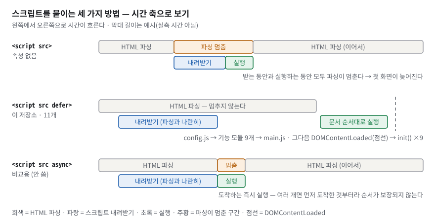
*그림 2. 스크립트를 붙이는 세 가지 방법을 시간 축에 놓았다. 속성이 없으면 파싱이 멈추고, `defer` 는 파싱과 나란히 받아 파싱이 끝난 뒤 문서 순서대로 실행한다.*

그림 2 의 가운데 줄이 이 저장소다. 회색 파싱 막대가 한 번도 끊기지 않고, 초록 실행은 파싱이 끝난 뒤에 몰려 있다. 그 직후의 점선이 `DOMContentLoaded` 이고, 여기서 `main.js` 가 `init()` 아홉 개를 부른다. 위 줄(속성 없음)은 주황 구간만큼 파싱이 멈추고, 아래 줄(`async`)은 도착한 순서대로 실행돼 `main.js` 가 `config.js` 보다 먼저 실행될 수도 있다. 막대 길이는 개념을 보여 주려는 예시다.

**구체적인 숫자로.** `index.html` 384줄이 DOM 이 된다. 로컬 스타일시트 `<link>` 는 1개(`index.html:39`)이고 그 파일 `css/style.css` 가 13개를 `@import` 한다(`css/style.css:22-46`). 이 밖에 허용된 외부 CSS 링크가 2개(Google Fonts `index.html:26-29`, Font Awesome `index.html:33-36`) 있다. `<script defer>` 는 11개(`index.html:47-67`)이고 순서는 `config.js` → 기능 모듈 9개(theme·menu·scroll·typing·skills·reveal·navspy·projects·contact) → `main.js` 다.

**이 과제에서는.** 기능 파일 9개는 객체를 **정의만** 한다. 실제로 움직이기 시작하는 곳은 `main.js` 한 곳이다(`js/main.js:19-39`, 주석 제거).

```js
document.addEventListener('DOMContentLoaded', () => {
  $('#year').textContent = new Date().getFullYear();
  ['#about', '#skills', '#projects', '#contact', '.hero__inner'].forEach((sel) => {
    const el = $(sel);
    if (el) el.classList.add('reveal');
  });
  Theme.init();
  Menu.init();
  Scroll.init();
  Typing.init();
  Skills.init();
  ContactForm.init();
  Reveal.init();
  NavSpy.init();
  Projects.init();
});
```

- `DOMContentLoaded` 는 "HTML 을 다 읽어 DOM 이 완성됐다"는 신호다. 이 **콜백**(나중에 불러 달라고 넘겨 둔 함수) 안에서만 DOM 을 찾으므로 요소가 없어서 `null` 이 나오는 일이 없다.
- 그래서 **순서 규칙은 두 개뿐**이다: 모두가 쓰는 `config.js`(`CONFIG`, `$`, `$$`, `escapeHtml`)가 처음, 시작 버튼 `main.js` 가 마지막. 기능 파일 사이 순서는 상관없다(서로 부르는 일은 모두 `init()` 이후에 일어난다).
- 파일이 달라도 `Projects`, `CONFIG` 가 보이는 이유: 이 스크립트들은 모듈이 아닌 **classic script**(`type="module"` 이 없는 보통 스크립트)라 최상위 `const` 가 모든 파일이 함께 쓰는 **전역 스코프**(**스코프**는 이름이 보이는 범위)에 올라간다.

**한 칸 아래.** 
- CSS 는 **렌더 차단** 자원이다. CSSOM 이 완성돼야 첫 화면을 칠한다. 그런데 `@import` 는 `style.css` 를 받아 해석한 **뒤에야** 13개 요청을 시작하므로 요청이 한 단계 늦게 출발한다(일반 지식). `<link>` 13개나 한 파일로 합치기(번들)가 더 빠르다. 이 저장소는 "HTML 이 로컬 CSS 로는 `css/style.css` 하나만 연결"이라는 명세 모양을 택하고 그 대가를 받아들였다(§4.3).
- `defer` 를 11개 모두 뺀 사본으로 실험하면 **에러 0, 카드 12장**(실측). 모든 DOM 접근이 `DOMContentLoaded` 안에 있기 때문이다. 대신 `<head>` 의 스크립트가 파싱을 멈춰 첫 화면이 늦어진다. 즉 여기서 `defer` 의 실익은 "에러 방지"가 아니라 "파싱을 막지 않으면서 순서 보장"이다.
- 전역 공유의 정확한 모양: 전역에는 칸이 두 개 있다 — `window` 객체의 속성 칸, 그리고 `const`·`let` 이 들어가는 선언용 칸. 최상위 `const Projects` 는 선언용 칸에 들어가서 이름으로는 모든 파일이 보지만 `window.Projects` 로는 안 보인다(실측 `typeof Projects` → `"object"`, `typeof window.Projects` → `"undefined"`). `function escapeHtml` 선언은 `window` 칸에도 올라간다(`typeof window.escapeHtml` → `"function"`).

> [!WARNING]
> **흔한 오해.** "defer 가 없으면 무조건 `null` 에러가 난다" → DOM 접근을 `DOMContentLoaded` 안에서만 하면 나지 않는다(실측). / "`@import` 와 `<link>` 는 성능이 같다" → `@import` 는 앞 파일을 해석한 뒤에야 요청이 출발한다.

### 3.2 시맨틱 HTML 과 접근성 트리 — 스크린 리더가 받는 구조

**비유로 먼저.** 목차·장 제목·각주가 있는 책과, 모든 글을 같은 크기로 쓴 종이 묶음을 떠올리자. 눈으로 훑는 사람에게는 둘이 비슷해 보여도, **목차로 곧장 건너뛰는 사람**에게는 전혀 다르다. 화면을 소리로 읽어 주는 프로그램(**스크린 리더**)을 쓰는 사람이 바로 그렇다.
비유의 한계: 시맨틱 태그는 겉모양을 거의 바꾸지 않는다(대부분 기본값이 `display: block`). 차이는 기계가 읽는 구조에만 있다.

**정확히 말하면.** **시맨틱 태그**는 `header`, `nav` 처럼 이름이 역할을 말하는 태그다. 브라우저는 DOM 에서 역할과 이름만 추린 **접근성 트리**를 만들어 보조기기에 넘긴다. 그중 큰 영역은 **랜드마크**(스크린 리더가 목록으로 보고 바로 건너뛸 수 있는 영역)가 된다.

| 태그 | 접근성 트리의 역할 | 조건 |
|---|---|---|
| `header` | banner | `main`·`section` 등의 **안이 아닌** 최상위일 때만 |
| `nav` | navigation | 항상 |
| `main` | main | 페이지에 하나 |
| `footer` | contentinfo | 최상위일 때만 |
| `article` | article | 항상 |
| `section` | region | **접근 가능한 이름**(`aria-label` 또는 `aria-labelledby`)이 있을 때만 |
| `label for="x"` | 입력칸 `#x` 의 이름 | `for` 와 `id` 가 같을 때 |


*그림 3. 왼쪽은 내가 쓴 태그, 오른쪽은 스크린 리더가 받는 접근성 트리다. `header`·`nav`·`main`·`footer` 는 랜드마크가 되지만, 이름 없는 `section` 은 되지 않는다.*

그림 3 의 파란 실선은 "태그가 접근성 트리의 **역할**로 옮겨졌다"는 뜻이다. 그중 '랜드마크' 표시가 붙은 banner·navigation·main·contentinfo 네 개만 스크린 리더가 목록으로 보고 건너뛸 수 있는 랜드마크이고, article·tablist·textbox 는 일반 역할이다. 주황 점선 두 개가 핵심이다 — `section` 다섯 개는 이름이 없어서 region 이 되지 **않았고**, 섹션 안의 `header.section__head` 는 최상위가 아니라서 banner 가 되지 **않았다**.

**구체적인 숫자로.** 정적 HTML 에서 `header` 5(페이지 1 + 섹션 머리말 4) · `nav` 1 · `main` 1 · `section` 5 · `article` 1 · `footer` 1 · `img` 0 · `label` 3. 런타임에는 저장소 카드가 `<article class="card reveal">`(`js/projects.js:203`)로 12개 더해져 `article` 이 13개다. Chromium 이 만든 접근성 트리(실측): `banner` / `navigation "주 메뉴"` / `main` / `article` ×13 / `tablist "언어 필터"` / `textbox "이름"`·`"이메일"`·`"메시지"` / `contentinfo`. region 은 0개다.

**이 과제에서는.** 태그를 고른 기준은 "화면에서 어떻게 보이나"가 아니라 **"문서에서 무슨 역할인가"** 다.

| 역할 | 고른 태그 | 위치 |
|---|---|---|
| 사이트 머리(로고·메뉴) | `header` + `nav aria-label="주 메뉴"` | `index.html:72`, `index.html:74` |
| 페이지의 핵심 내용 | `main` (1개) | `index.html:125` |
| 제목이 있는 주제 묶음 | `section` ×5 (hero·about·skills·projects·contact) | `index.html:128`, `index.html:167`, `index.html:215`, `index.html:230`, `index.html:254` |
| 떼어 내도 뜻이 통하는 단위 | `article` (소개 카드, 저장소 카드) | `index.html:175`, `js/projects.js:203` |
| 저작권·소셜 링크 | `footer` | `index.html:335` |
| 의미 없는 배치용 상자 | `div` | `.nav__actions`(`index.html:93`), `.form__field`(`index.html:268`), `.state-box` |

보조 장치도 함께 달았다: 문서 언어 `lang="ko"`(`index.html:9`), 일부 장식 요소의 `aria-hidden="true"`(테마 달 아이콘 `index.html:102`, 타이핑 커서 `index.html:139`, 아바타 `index.html:179`), 아이콘만 있는 링크·버튼의 `aria-label`(테마 `index.html:99`, 푸터 소셜 `index.html:347`, 맨 위로 `index.html:379`), 햄버거의 `aria-expanded`·`aria-controls`(`index.html:112-113`), 카드 영역의 `aria-live="polite"`(`index.html:246`), 라벨-입력 3쌍(`index.html:269`, `index.html:285`, `index.html:300`). 다만 글자 옆에 붙은 장식 아이콘 다수(예 `index.html:151`, `index.html:195-197`)에는 `aria-hidden` 이 빠져 있다 — 실측으로 `aria-hidden` 도 `aria-label` 도 없는 Font Awesome 아이콘이 45개였다(§7.2 G).

**한 칸 아래.** 스크린 리더 사용자는 랜드마크 목록을 열어 "main 으로 이동", "navigation 으로 이동"을 한 번에 한다. 전부 `div` 면 이 목록이 비어 처음부터 끝까지 읽어 내려가야 한다. `aria-live="polite"` 는 그 영역의 내용이 바뀌면 **읽던 문장을 끝낸 뒤** 바뀐 내용을 알려 준다 — 로딩 → 카드 전환이 소리로 전달된다. 스피너의 `role="status"` 도 암묵적으로 polite 라이브 영역이다.

> [!WARNING]
> **흔한 오해.** "`section` 을 쓰면 랜드마크가 된다" → 이름이 없으면 아니다(실측 region 0개). / "`header` 는 페이지에 하나뿐" → 섹션마다 써도 된다. 최상위 하나만 banner 가 된다. / "시맨틱 태그는 모양이 다르다" → 모양은 거의 같고 기계가 읽는 구조가 다르다.

### 3.3 박스 모델과 box-sizing — 카드 336px 는 어떻게 나뉘나

**비유로 먼저.** 액자를 떠올리자. 그림(내용) 둘레에 흰 매트(안쪽 여백), 그 둘레에 나무 틀(테두리), 그리고 벽의 다른 액자와 띄우는 간격(바깥 여백)이 있다. "액자 폭 30cm"가 그림만의 폭인지 틀까지 포함한 폭인지 정해야 벽에 몇 개가 들어갈지 계산할 수 있다.
비유의 한계: CSS 에는 위아래 바깥 여백이 서로 겹쳐 하나로 합쳐지는(margin collapse) 규칙이 있는데, 액자에는 그런 일이 없다.

**정확히 말하면.** 모든 요소는 **content(내용) → padding(안쪽 여백) → border(테두리) → margin(바깥 여백)** 네 겹 상자다(**박스 모델**). `box-sizing` 은 `width` 가 어디까지를 가리킬지 정한다.
- `content-box`(브라우저 기본): `width` = 내용 폭. padding·border 는 **바깥에 더해진다**.
- `border-box`: `width` = 내용 + padding + border. padding 을 늘리면 **내용이 줄어든다**.

이 저장소는 모든 요소를 `border-box` 로 통일했다(`css/base.css:10-14`).

*그림 4. 카드 336px 는 테두리·안쪽 여백·내용의 합이다. `box-sizing: border-box` 가 아니었다면 390px 화면에서 컨테이너가 438px 가 되어 가로 스크롤이 생긴다(실측).*

**구체적인 숫자로.** 그림 4 위쪽: 1280px 화면에서 카드 한 장의 폭은 336px 이고 `336 = 1 + 24 + 286 + 24 + 1` 이다(테두리 1, 안쪽 여백 `var(--space-5)` = 24, 내용 286). 그림 4 아래쪽: 390px 화면에서 `.container { width: 100%; padding: 0 24px }` 는 border-box 일 때 390px 에 딱 맞는다. 같은 규칙을 content-box 로 바꾸면 내용 390 + 좌우 여백 48 = **438px** 가 되어 문서 폭이 438px, 가로 스크롤이 48px 생긴다(실측 `scrollWidth` 438). 넘친 48px 는 내용 390 중 화면 밖으로 나간 24px 와 오른쪽 여백 24px 다(그림 4 아래 막대의 분홍 두 칸).

**이 과제에서는.** `css/base.css:10-14` 한 규칙이 모든 계산의 출발선이다.

```css
*,
*::before,
*::after {
  box-sizing: border-box;
}
```

`.container`(`css/layout.css:11-16`)는 `width: 100%` + `max-width: 1120px` + 좌우 여백이고, 카드(`css/projects.css:52-59`)는 테두리 1px + 여백 24px 다. border-box 덕분에 "폭 100%에 여백을 더하면 넘친다"는 계산을 하지 않아도 된다.

**한 칸 아래.** `box-shadow`, `outline`, `transform` 은 박스 크기에 들어가지 않는다. 그래서 `.card:hover`(`css/projects.css:66-70`)처럼 그림자를 키우고 `transform: translateY(-6px)` 를 줘도 옆 카드를 밀지 않는다 — 원리로는 그렇다. **그런데 이 저장소의 카드는 실제로 떠오르지 않는다.** 같은 명시도에서 나중 규칙이 이기는 캐스케이드 때문이다(§3.4 한 칸 아래, §7.2 I). 평가자가 마우스를 올려 볼 수 있으니 반드시 알아 둔다. 또 `transform`·`opacity` 변화는 레이아웃을 다시 계산하지 않고 **합성** 단계에서 처리되므로 움직임이 부드럽다(일반 지식). 반대로 `width`·`margin` 을 애니메이션하면 매 프레임 레이아웃을 다시 해야 한다.

> [!WARNING]
> **흔한 오해.** "padding 을 늘리면 카드가 커진다" → border-box 에서는 카드 폭은 그대로이고 내용 폭이 줄어든다. / "그림자도 크기에 포함된다" → 포함되지 않는다.

### 3.4 캐스케이드·명시도·상속과 CSS 변수 — 다크 모드가 CSS 한 곳에서 끝나는 이유

**비유로 먼저.** 회사 규정집에 전사 규정(`:root`)과 야간 근무 규정(`[data-theme="dark"]`)이 있다. 둘의 등급이 같으면 **나중에 공포된 규정**이 우선한다. 그리고 모든 부서는 색·간격을 직접 적지 않고 "기준표 3번 색"처럼 **기준표**(CSS 변수)를 참조한다. 야간 규정이 기준표 값만 바꾸면 모든 부서가 따라 바뀐다.
비유의 한계: CSS 는 등급(명시도)을 **먼저** 보고, 등급이 같을 때만 순서를 본다.

**정확히 말하면.** 먼저 낱말 하나. **셀렉터**(선택자)는 규칙을 어느 요소에 적용할지 고르는 부분이다 — `header`(태그 이름), `.card`(class 가 card), `#about`(id 가 about), `[hidden]`(hidden 속성이 있는 것), `:hover`(마우스가 올라간 상태. 이렇게 상태로 고르는 것을 **가상 클래스**라 한다).
한 요소에 여러 규칙이 부딪치면 브라우저는 다음 순서로 승자를 고른다(**캐스케이드**).
1. 중요도·출처(`!important`, 브라우저 기본 스타일 vs 저자 CSS)
2. **명시도**(specificity) — 셀렉터의 구체성 점수. (id 개수, 클래스·속성·가상 클래스 개수, 태그 개수) 세 자리를 앞자리부터 비교한다.
3. 소스 순서 — 명시도까지 같으면 **나중에 나온 규칙**이 이긴다.

`--color-bg: #ffffff` 처럼 `--` 로 시작하는 **사용자 정의 속성(CSS 변수)** 은 부모에서 자식으로 **상속**되고, `var(--color-bg)` 는 값을 계산하는 단계에서 그 자리에 대입된다. `:root` 는 문서 최상위 요소 `<html>` 을 가리킨다.


*그림 5. `:root` 와 `[data-theme="dark"]` 는 둘 다 `<html>` 에 걸리고 명시도가 같아 뒤에 쓴 다크 규칙이 이긴다. 변수 값만 바뀌면 그 변수를 쓰는 모든 곳이 함께 바뀐다.*

그림 5 에서 `data-theme="dark"` 인 `<html>`(왼쪽 아래 상자)에는 **두 규칙이 모두** 걸린다 — 그 상자에서 나가는 화살표가 두 개다. 둘 다 (0,1,0) 이므로 소스 순서로 가리고, `css/tokens.css:63` 의 다크 규칙이 `css/tokens.css:11` 보다 뒤에 있어 이긴다. 이기는 규칙으로 가는 화살표만 굵게 그렸다. 노란색으로 칠한 값이 다크에서 바뀐 값이다.

**구체적인 숫자로.**
- `:root` 에 변수 **37개**(색·그림자·네비 배경 16, 간격 9, 레이아웃 5, 글꼴 3, 모션 4). 다크 규칙은 그중 색·그림자·네비 배경 **14개**만 다시 정의한다. 간격·글꼴·모션은 테마와 상관없으니 그대로다.
- 배경: 라이트 `#ffffff` → 다크 `#0f1117`(`css/tokens.css:64`). 실측 `body` 배경 `rgb(255, 255, 255)` → `rgb(15, 17, 23)`, 글자 `rgb(26, 29, 35)` → `rgb(231, 234, 242)`.
- CSS 전체에서 변수 35종을 `var(--…)` 로 **226번** 참조한다(소스 집계, 주석 제외). 변수 하나로 보면 `--ease` 33곳, `--color-primary` 27곳, `--color-bg` 2곳이고, 다크에서 다시 정의하는 14개를 모두 합치면 **94곳**이다 — 다크 전환 때 값이 바뀌는 자리가 이 94곳이다. 다크 모드용으로 따로 쓴 컴포넌트 CSS 는 **0줄**이다.
- 명시도 실험(그림 5 아래 띠): `.form__success { display: flex }` 는 (0,1,0), `.form__success[hidden] { display: none }` 은 (0,2,0) 이다(`css/form.css:60-75`). 두 번째 규칙을 지운 사본에서는 `hidden` 속성이 있는데도 배너가 `display: flex` 로 **보였다**(실측).

**이 과제에서는.** 토큰 파일(`css/tokens.css:11-78`)을 짧게 줄이면 이렇다.

```css
:root {
  --color-bg: #ffffff;
  --color-text: #1a1d23;
  --space-5: 1.5rem;
}
[data-theme="dark"] {
  --color-bg: #0f1117;
  --color-text: #e7eaf2;
}
body {
  color: var(--color-text);
  background-color: var(--color-bg);
}
```

마지막 `body` 규칙이 `css/base.css:23-33` 이다. JS 는 `<html>` 의 `data-theme` 속성만 바꾸고(§3.10), 색은 전혀 모른다.
변수로 관리하는 이점은 네 가지로 말한다. ① 값 한 곳을 고치면 그 변수를 쓰는 곳이 모두 따라온다(예: `--color-primary` 1곳 수정 → 27곳). ② 다크 모드가 "속성 1개 + 변수 14개"로 끝나고, 새 컴포넌트도 토큰만 쓰면 자동으로 다크에 대응한다. ③ 간격이 4px 척도(`--space-1`~`--space-12`, `css/tokens.css:31-39`)로 통일돼 들쭉날쭉하지 않다. ④ Sass 같은 전처리기 변수는 빌드 때 값으로 바뀌어 사라지지만, CSS 변수는 **브라우저 안에서 살아 있어** 속성 셀렉터·미디어 쿼리·JS 로 실행 중에 바꿀 수 있다.

**한 칸 아래.**
- `hidden` 속성이 요소를 숨기는 것은 브라우저 기본(UA) 스타일시트의 `display: none` 덕분이다. 캐스케이드에서 **저자 CSS 가 UA 스타일보다 앞서므로** `.form__success { display: flex }` 가 이를 이긴다. 그래서 `[hidden]` 규칙을 명시적으로 다시 써 둔 것이다.
- `@import` 순서가 곧 소스 순서다. 그래서 `responsive.css` 를 맨 마지막(`css/style.css:46`)에 둬야 같은 명시도의 모바일 기본값을 덮는다.
- **동점이면 나중 규칙이 이긴다 — 이 저장소의 실제 함정.** 카드 태그는 `class="card reveal"` 이다(`js/projects.js:203`). 화면에 나타난 뒤에는 `.reveal.is-visible { transform: translateY(0) }`(`css/widgets.css:50-53`)과 `.card:hover { transform: translateY(-6px) }`(`css/projects.css:66-70`)가 함께 걸리는데, 둘 다 명시도 (0,2,0) 이고 `widgets.css` 가 `projects.css` 보다 뒤에 `@import` 되므로(`css/style.css:38`, `css/style.css:44`) 뒤의 규칙이 이긴다. `transition` 도 같은 이유로 `.reveal` 의 `opacity, transform` 700ms(`css/widgets.css:46`)가 `.card` 의 250ms 선언(`css/projects.css:60-62`)을 통째로 덮는다. 실측(1280px): hover 전후 `transform` 이 둘 다 `matrix(1, 0, 0, 1, 0, 0)`, 카드 위치 그대로, 그림자·테두리는 hover 20ms 뒤 이미 최종값(전환 없음). 같은 카드에서 `reveal`·`is-visible` 을 떼면 `matrix(1, 0, 0, 1, 0, -6)` 로 떠올랐다. 스킬 카드(`css/skills.css:28-32`)도 같다(§7.2 I).
- 정의되지 않은 변수를 `var()` 로 쓰면 그 선언은 "계산값 시점에 무효"가 되어 상속값이나 초기값으로 돌아간다. **오류 메시지가 없다.** `var(--x, 대체값)` 으로 대비할 수 있다.
- 변수가 새는 곳도 있다: 브랜드색 위 흰 글자 `#fff` 5곳(두 테마 공통이라 의도적)과 반투명 `rgba(…)` 리터럴 6곳. 특히 입력칸 포커스 링 `rgba(91, 108, 255, 0.18)`(`css/form.css:45`)은 다크에서도 라이트 주색 기준이다(§7.2).

> [!WARNING]
> **흔한 오해.** "`hidden` 속성은 무조건 숨긴다" → 저자 CSS 가 `display` 를 주면 보인다(실측). / "충돌은 `!important` 로 해결한다" → 이 저장소의 `!important` 는 움직임 줄이기 설정 4줄(`css/responsive.css:71-74`)뿐이고, 나머지는 명시도와 순서로 푼다. / "`:hover` 규칙은 늘 이긴다" → `.card:hover` 도 (0,2,0) 이라 같은 점수의 뒤 규칙에 진다(실측).

### 3.5 반응형 — 뷰포트·미디어 쿼리·모바일 퍼스트·clamp

**비유로 먼저.** 옷을 만든다고 하자. S 사이즈를 먼저 만들고 M·L 이 필요할 때 천을 **덧대는** 방식(모바일 퍼스트)과, L 을 먼저 만들고 작은 사이즈에서 **잘라 내는** 방식(데스크톱 퍼스트)이 있다. 덧대는 쪽은 "무엇을 더할까"만 생각하면 되고, 잘라 내는 쪽은 "무엇을 되돌릴까"를 계속 생각해야 한다.
비유의 한계: 브라우저는 규칙을 순서대로 덧대 가는 게 아니라, 모든 규칙을 평가한 뒤 조건이 맞는 블록만 적용한다.

**정확히 말하면.**
- **뷰포트**는 브라우저 창에서 페이지가 보이는 영역이다. `<meta name="viewport" content="width=device-width, initial-scale=1.0">`(`index.html:14`)가 있어야 폰이 페이지를 **기기 폭**으로 그린다.
- **미디어 쿼리** `@media (min-width: 768px) { … }` 안의 규칙은 뷰포트 폭이 768px **이상**일 때만 켜진다. 규칙이 바뀌는 폭을 **브레이크포인트**라고 한다.
- **모바일 퍼스트**: 쿼리 밖의 기본 규칙을 가장 좁은 화면용으로 쓰고, `min-width` 로 넓은 화면 규칙을 **더한다**.
- `clamp(최소, 선호, 최대)` 는 선호값을 쓰되 최소~최대 사이로 묶는다. `vw` 는 뷰포트 폭의 1%, `rem` 은 루트 글자 크기(16px)의 배수다.

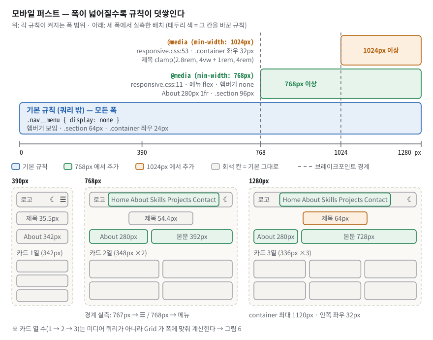
*그림 6. 모바일 퍼스트는 기본 규칙 위에 768px·1024px 규칙을 덧쌓는다. 아래는 세 폭에서 실제로 측정한 배치다 — 카드 열 수는 미디어 쿼리가 아니라 Grid 가 정한다.*

그림 6 위쪽의 세 막대는 **오른쪽 끝이 모두 같다** — 넓은 화면은 좁은 화면 규칙을 버리지 않고 그 위에 더 받는다. 아래 와이어프레임에서 새로 켜진 부분은 그 막대 색 테두리로 표시돼 있다.

**구체적인 숫자로.** 폭을 바꿔 가며 계산된 스타일을 실측했다.

| 폭 | 메뉴 `#navMenu` | 햄버거 | Projects 열 | About 열 | 섹션 위아래 여백 | 컨테이너 좌우 여백 | 제목 글자 |
|---|---|---|---|---|---|---|---|
| `390` | `none` | 보임 | 342px (1열) | 342px | 64px | 24px | 35.5px |
| `767` | `none` | 보임 | 347.5px ×2 | 719px | 64px | 24px | 54.35px |
| `768` | `flex` | 숨김 | 348px ×2 | 280px 392px | 96px | 24px | 54.4px |
| `1023` | `flex` | 숨김 | 309px ×3 | 280px 647px | 96px | 24px | 56px |
| `1024` | `flex` | 숨김 | 304px ×3 | 280px 632px | 96px | 32px | 56.96px |
| `1280` | `flex` | 숨김 | 336px ×3 | 280px 728px | 96px | 32px (폭 1120 상한) | 64px |

- 767 → 768 한 칸에서 햄버거가 가로 메뉴로, About 이 2열로, 섹션 여백이 64 → 96px 로 바뀐다. 이것이 미디어 쿼리의 일이다. 1023 → 1024 에서 바뀌는 것은 두 가지뿐이다 — 컨테이너 좌우 여백 24 → 32px, 히어로 제목 크기(`css/responsive.css:53-63`).
- 그런데 **카드 열 수는 767px 에서 이미 2열, 1023px 에서 이미 3열**이다. 카드 열은 미디어 쿼리가 아니라 Grid 가 계산한다는 증거다(§3.6).
- 제목 크기 `--fs-h1: clamp(2rem, 5vw + 1rem, 3.5rem)`(`css/tokens.css:51`)를 390px 에서 손으로 계산하면: 5vw = 19.5px, + 16px = 35.5px, 최소 32px·최대 56px 사이이므로 **35.5px**(실측 동일). 1024px 이상에서는 `clamp(2.8rem, 4vw + 1rem, 4rem)`(`css/responsive.css:61`)로 바뀌어 1024px 에서 56.96px, 1280px 에서는 67.2px 가 상한 64px 에 걸려 **64px** 다.
- viewport 메타를 지운 사본을 모바일 390px 로 열면(실측): `innerWidth` 가 **980**, `(min-width: 768px)` 가 참, 가로 메뉴·카드 3열 294.656px — 데스크톱 화면을 줄여 보여 준다. 메타가 있으면 `innerWidth` 390, 카드 1열 342px.

**이 과제에서는.** 기본 규칙이 모바일이다 — 메뉴는 기본으로 숨김(`css/header.css:64-67`), About 은 기본으로 `display: grid` 1열(`css/about.css:10-14`). 넓은 화면은 `css/responsive.css` 가 덧붙인다(768 블록 일부, 주석 제거).

```css
@media (min-width: 768px) {
  .section { padding: var(--space-12) 0; }
  .nav__menu { display: flex; }
  .nav__menu.is-open {
    position: static;
    flex-direction: row;
    width: auto;
  }
  .hamburger { display: none; }
  .about { grid-template-columns: 280px 1fr; gap: var(--space-8); }
}
```

About 은 모바일에서 저절로 1열이므로 768 에서 **열 정의만 추가**하면 된다. 데스크톱 퍼스트였다면 2열을 먼저 쓰고 모바일에서 1열로 **되돌리는** 규칙이 필요했다.

다만 예외가 하나 있다. 모바일 전용 드롭다운 `.nav__menu.is-open`(`css/header.css:168-181`)은 명시도가 (0,2,0) 이라 768 의 `.nav__menu`(0,1,0)로는 못 덮는다. 그래서 같은 셀렉터로 되돌리는 블록(`css/responsive.css:23-33`)을 따로 뒀다.
실측: 390px 에서 메뉴를 연 채로 1024px 로 넓히면 `position: static`·가로 배치로 돌아온다. 이 블록을 지운 사본에서는 `absolute`·세로·폭 1024px 패널로 남았다.

**한 칸 아래.** 창 폭이 바뀌면 브라우저는 미디어 쿼리를 다시 평가 → 스타일 재계산 → 레이아웃을 다시 한다. 조건이 거짓인 블록도 **내려받고 해석은 한다**. 적용만 안 할 뿐이다. 이 저장소는 `max-width` 쿼리를 0건으로 유지하고 이를 `scripts/check.sh:64-65` 가 검사한다.

> [!WARNING]
> **흔한 오해.** "모바일은 데스크톱 CSS 를 다운로드하지 않는다" → 같은 파일 안의 미디어 쿼리 블록은 받고 해석한다. / "카드 열 수도 미디어 쿼리가 바꾼다" → Grid `auto-fit` 이 바꾼다(767px 에서 이미 2열). / "viewport 메타는 없어도 된다" → 없으면 폰이 980px 로 그린다(실측).

### 3.6 Flexbox 와 Grid — 한 줄 배치와 칸 배치

**비유로 먼저.** Flexbox 는 **한 줄 서기**다. 사람(요소)이 자기 몸 크기대로 줄을 서고, 남는 공간을 사이사이에 어떻게 나눌지 정한다. Grid 는 **주차장 구획**이다. 가로·세로 칸을 먼저 그어 두고 차(요소)를 칸에 넣는다.
비유의 한계: Flex 도 `flex-wrap` 으로 여러 줄이 될 수 있다. 다만 줄끼리 열을 맞추지는 않는다.

**정확히 말하면.**
- **Flexbox**(1차원): 요소가 늘어서는 방향인 **주축** 하나를 따라 배치한다. 각 요소의 크기는 내용이 정하고, 남는 공간은 `justify-content`(주축 방향 분배)·`align-items`(교차축 정렬)로 나눈다.
- **Grid**(2차원): 컨테이너가 행과 열 **트랙**을 먼저 정의하고 요소를 칸에 넣는다. `fr` 은 남은 공간의 몫, `minmax(280px, 1fr)` 은 "최소 280px, 최대 1몫" 이다.
- `repeat(auto-fit, minmax(280px, 1fr))` = 최소 280px 짜리 열을 **들어갈 만큼** 만들고, 빈 열은 **접고**, 남는 공간은 똑같이 나눈다. `auto-fill` 은 빈 열을 **남긴다**.

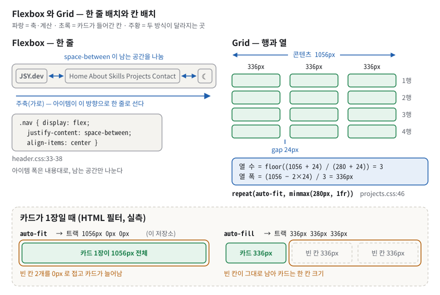
*그림 7. Flex 는 한 줄에서 남는 공간을 나누고, Grid 는 칸을 먼저 만든 뒤 넣는다. 카드가 1장일 때 `auto-fit` 은 빈 칸을 접어 카드를 1056px 로, `auto-fill` 은 336px 로 둔다(실측).*

**구체적인 숫자로.** 그림 7 오른쪽 계산을 손으로 따라가자. 1280px 화면에서 컨테이너는 최대 1120px, 좌우 여백 32px 씩이므로 콘텐츠 폭은 1056px, 열 사이 간격(gap)은 24px 다.
- 열 수 = floor((1056 + 24) / (280 + 24)) = floor(1080 / 304) = **3**
- 열 폭 = (1056 − 2 × 24) / 3 = **336px**

같은 공식으로 768px(콘텐츠 720) → 2열 348px, 390px(콘텐츠 342) → 1열 342px, 1023px(콘텐츠 975) → 3열 309px. §3.5 표의 실측값과 모두 같다.
그림 7 아래 띠: HTML 필터를 눌러 카드가 **1장**이 되면 `auto-fit` 트랙은 `1056px 0px 0px`(카드가 1056px 로 늘어남), `auto-fill` 로 바꾼 사본은 `336px 336px 336px`(카드 336px, 빈 칸 2개)이었다(실측).

**이 과제에서는.** 두 도구를 어디에 썼는지와 그 이유다.

| 도구 | 적용 위치 | 왜 이 도구인가 |
|---|---|---|
| Flex | 네비 `.nav`(`css/header.css:33-38`) — 자식은 로고·메뉴·버튼 묶음 세 덩어리. 로고는 왼쪽 끝, 버튼 묶음은 오른쪽 끝, 메뉴는 그 **사이**(1280px 실측: 로고 112–221px, 메뉴 507–843px, 버튼 1128–1168px) | 내용 크기대로 놓고 남는 공간을 `space-between` 으로 **덩어리 사이사이에 똑같이** 나누면 끝 |
| Flex | CTA 버튼 `.hero__cta`(`css/hero.css:74-79`), 필터 줄 `.filters`(`css/projects.css:10-16`) | 개수가 바뀌어도 한 줄로 흐르다 넘치면 줄바꿈(`flex-wrap: wrap`, `css/hero.css:78`, `css/projects.css:12`) |
| Flex | `.nav__actions`(`css/header.css:106-110`), 푸터(`css/footer.css:16-31`) | 몇 개 안 되는 항목을 한 줄로 정렬(푸터 바깥 묶음은 `flex-direction: column` 으로 세로 한 줄). 줄바꿈 없음 |
| Flex | 모바일 드롭다운 `.nav__menu.is-open`(`css/header.css:168-171`) | 세로 한 줄(`flex-direction: column`) |
| Flex | **카드 내부** `.card`(`css/projects.css:57-58`) + `.card__desc { flex: 1 }`(`css/projects.css:98`) + `.card__link { margin-top: auto }`(`css/projects.css:139`) | 설명 길이가 달라도 "저장소 보기" 링크를 카드 바닥에 붙인다 |
| Grid | 카드 목록 `.projects`(`css/projects.css:44-49`) | 줄끼리 **열을 맞춰야** 하고, 폭에 따라 열 수가 자동으로 바뀌어야 한다 |
| Grid | 스킬 `.skills`(`css/skills.css:8-12`, `minmax(140px, 1fr)`), About 2열(`css/responsive.css:41-44`), 폼 세로 쌓기(`css/form.css:7-20`) | 칸 구조가 먼저 있는 배치 |

선택 기준 한 문장: **줄끼리 열을 맞춰야 하면 Grid, 한 줄 안에서 내용 크기대로 나누면 Flex.** 카드를 `flex-wrap` 으로 했다면 마지막 줄의 카드 폭이 윗줄과 달라진다.

**한 칸 아래.** 둘은 층위가 다른 도구라 **겹쳐 쓴다** — 카드들의 배치는 Grid, 카드 한 장의 속은 Flex column 이다. `.state-box { grid-column: 1 / -1 }`(`css/projects.css:149`)는 로딩·에러·빈 상태 상자가 Grid 의 모든 열을 가로지르게 한다(`-1` 은 마지막 선). `auto-fit` 의 대가도 안다 — 카드가 적으면 한 장이 전체 폭으로 늘어난다(그림 7). 또 `minmax(280px, 1fr)` 의 최소 280px 는 컨테이너보다 클 수 있다. 280px 화면(콘텐츠 232px)에서는 열이 280px 로 넘쳐 가로 스크롤이 24px 생겼고, 320px 화면에서는 카드 오른쪽 끝(304px)이 콘텐츠 끝(296px)을 8px 넘었다(실측). `minmax(min(280px, 100%), 1fr)` 로 바꾼 사본에서는 두 폭 모두 카드 오른쪽 끝이 콘텐츠 끝과 같아졌다(280px 256 = 256, 320px 296 = 296).

> [!WARNING]
> **흔한 오해.** "Grid 가 Flex 의 상위호환이다" → 목적이 다르다. 네비를 Grid 로 하면 메뉴 개수·로고 폭이 바뀔 때마다 열 정의를 고쳐야 한다. / "`auto-fit` 과 `auto-fill` 은 같다" → 아이템이 트랙보다 적을 때 다르다(실측 1056px vs 336px).

### 3.7 DOM 선택·조작과 innerHTML 의 위험 — XSS

**비유로 먼저.** DOM 은 회사 조직도다. `querySelector` 는 "마케팅팀의 첫 번째 대리"처럼 **조건(CSS 셀렉터)** 으로 사람을 찾는 일이다. 게시판에 쪽지를 붙일 때 `textContent` 는 쪽지를 **글자 그대로** 붙이고, `innerHTML` 은 쪽지 속 문장을 **지시로 해석해** 게시판을 다시 꾸민다. 누군가 쪽지에 "게시판을 불태워라"라고 써 두면 `innerHTML` 은 그대로 따른다.
비유의 한계: DOM 은 살아 있어서, 찾아 둔 목록이 이후 변경을 반영하는지는 목록 종류에 따라 다르다(`querySelectorAll` 은 찾은 순간의 사진).

**정확히 말하면.**
- `querySelector(sel)` 는 조건에 맞는 **첫** 요소, 없으면 `null`. `querySelectorAll(sel)` 은 모든 요소를 담은 **NodeList**(진짜 배열은 아닌 목록)를 준다. 이 저장소는 둘을 `$`, `$$` 로 짧게 감쌌고 `$$` 는 `Array.from` 으로 진짜 배열을 만든다(`js/config.js:35-37`).
- `classList.add/remove/toggle` 은 클래스를 붙였다 뗀다. `toggle(이름, 조건)` 은 조건이 참이면 붙이고 거짓이면 뗀다 — 이 저장소가 가장 많이 쓰는 형태다.
- **XSS**(Cross-Site Scripting)는 남이 넣은 글이 페이지 안에서 스크립트로 실행되는 공격이다. `innerHTML` 에 외부 데이터를 그대로 넣으면 생긴다. 막는 방법이 **이스케이프** — `<` 를 `&lt;` 처럼 무해한 글자로 바꾸는 것이다.

**구체적인 숫자로.** 코드 전체에서 `innerHTML` 대입 11줄, `textContent` 대입 4줄, `classList` 는 toggle 6·add 2·remove 2·contains 2 회다(주석 속 한 번은 뺐다).
XSS 실험(실측, 조작한 API 응답 주입): 저장소 이름을 `` 로 바꾸자 카드 제목에는 `&lt;img …&gt;` 라는 **글자**로 찍혔다(이스케이프 효과). 그런데 **언어 이름**을 같은 식으로 바꾸자 필터 영역에 `` 2개가 생기고 `onerror` 스크립트가 **실행됐다**. **별 수**(`stargazers_count`)를 같은 문자열로 바꾼 실험에서도 카드 안에 `` 1개가 생기고 스크립트가 실행됐다.

**이 과제에서는.** 이스케이프 함수(`js/config.js:41-48`, 주석 제거):

```js
function escapeHtml(str) {
  return String(str)
    .replace(/&/g, '&amp;')
    .replace(/</g, '&lt;')
    .replace(/>/g, '&gt;')
    .replace(/"/g, '&quot;')
    .replace(/'/g, '&#039;');
}
```

카드가 구조분해로 꺼내는 외부 값은 여섯 개다(`js/projects.js:195-202`). 그중 문자열 넷은 이 함수를 거친다 — 이름 `js/projects.js:206`, 설명 `js/projects.js:209`, 언어 `js/projects.js:214`, 링크 `js/projects.js:217`. 에러 문구도 `js/projects.js:111` 에서 이스케이프한다. 그러나 숫자라고 가정한 별·포크 수 `${stargazers_count}`·`${forks_count}` 는 그대로 넣는다(`js/projects.js:212-213`). 필터 버튼도 `data-lang="${lang}"` 와 `>${lang}<` 로 언어 이름을 **그대로** 넣고(`js/projects.js:162-164`), 필터 결과 0건 안내의 `"${activeLang}"`(`js/projects.js:188`)도 같다. 이것이 §7.2 B 의 결함이다.

**한 칸 아래.**
- `innerHTML = …` 대입은 HTML 파서를 돌리고 **기존 자식을 전부 버린다**. 버려진 버튼에 붙어 있던 리스너도 함께 사라진다. 그래서 필터를 누를 때마다 버튼을 새로 만들고 리스너를 다시 붙인다(`js/projects.js:168-172`).
- `innerHTML` 로 넣은 `<script>` 태그는 실행되지 않는다. 하지만 `` 같은 **이벤트 속성은 실행된다**. 그래서 "script 만 막으면 안전"은 틀린 말이다.
- `escapeHtml` 은 `&` 를 **맨 먼저** 바꾼다. 나중에 바꾸면 앞에서 만든 `&lt;` 의 `&` 가 다시 `&amp;lt;` 로 망가진다.
- 이스케이프는 URL 의 **스킴**을 검사하지 않는다. `href` 에 `javascript:alert(1)` 이 오면 그대로 통과한다(실측). GitHub 이 주는 `html_url` 은 항상 `https://github.com/…` 이라 실제 위험은 낮지만, 안전하게 하려면 `https://` 로 시작하는지 따로 확인해야 한다.

> [!WARNING]
> **흔한 오해.** "`<script>` 만 막으면 안전하다" → `onerror` 같은 이벤트 속성으로도 실행된다(실측). / "이스케이프하면 링크도 안전하다" → `javascript:` 스킴은 막지 못한다. / "`textContent` 와 `innerHTML` 은 같은데 짧은 쪽을 쓰면 된다" → 외부 데이터에는 `textContent` 가 기본값이다.

### 3.8 이벤트 모델 — addEventListener·전파·기본 동작

**비유로 먼저.** 건물의 화재경보를 떠올리자. 불이 난 방(**타깃**)에서 시작한 알림이 복도 → 층 → 건물 전체로 올라간다(**버블링**). 층마다 담당자(**리스너**)를 **여러 명** 둘 수 있고, 각자 자기 일을 한다.
비유의 한계: 실제로는 알림이 먼저 건물 꼭대기에서 불 난 방까지 **내려오는** 단계(캡처)가 있고, 그다음에 올라간다.

**정확히 말하면.** **이벤트**는 클릭·입력·스크롤처럼 사용자나 브라우저가 일으키는 일이다. `요소.addEventListener(종류, 함수, 옵션)` 으로 그 일이 났을 때 실행할 함수(**리스너**)를 등록한다. 이벤트는 세 단계로 전달된다(**전파**).
1. 캡처 — `window` 에서 타깃까지 내려온다.
2. 타깃 — 실제로 클릭된 요소.
3. 버블 — 타깃에서 `window` 까지 다시 올라간다. `addEventListener` 의 기본 등록은 이 단계다.

`event.preventDefault()` 는 브라우저의 **기본 동작**(링크 점프, 폼 제출 새로고침)을 취소하고, `event.stopPropagation()` 은 **전달**을 멈춘다. 둘은 다른 일이다.
HTML 속성 `onclick="…"` 이나 `요소.onclick = 함수` 는 요소마다 **슬롯이 하나**뿐이라 두 번째 대입이 첫 번째를 조용히 덮는다.

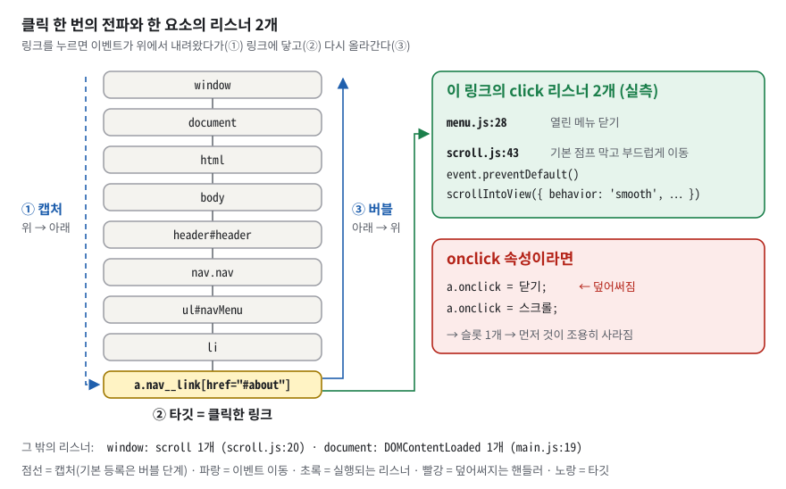
*그림 8. 링크를 클릭하면 이벤트는 위에서 내려왔다(캡처) 다시 올라간다(버블). 이 링크에는 서로 다른 파일의 click 리스너 2개가 붙어 있다 — onclick 속성이었다면 하나만 남는다.*

그림 8 오른쪽 초록 상자가 이 저장소의 실제 사례다. About 링크 하나에 `js/menu.js:28`(열린 메뉴 닫기)와 `js/scroll.js:43`(`preventDefault()` 후 부드러운 스크롤)이 **서로 모른 채** 붙어 있고, 둘 다 실행된다. 빨간 상자는 같은 일을 `onclick` 으로 했을 때 먼저 대입한 "닫기"가 사라지는 모습이다.

**구체적인 숫자로.** `addEventListener` 호출은 12곳이다.

| 파일:줄 | 대상 | 이벤트 | 하는 일 |
|---|---|---|---|
| `js/main.js:19` | `document` | DOMContentLoaded | 모듈 9개 시작 |
| `js/theme.js:49` | 테마 버튼 | click | `toggle()` |
| `js/menu.js:19` | 햄버거 | click | 메뉴 열고 닫기 |
| `js/menu.js:28` | 메뉴 링크 ×5 | click | 열린 메뉴 닫기 |
| `js/scroll.js:20` | `window` | scroll | 헤더·맨 위 버튼 클래스(rAF — 다음 화면 그리기 직전에 한 번, §3.12) |
| `js/scroll.js:36` | 맨 위 버튼 | click | `scrollTo({ top: 0 })` |
| `js/scroll.js:43` | `#` 링크 전부 | click | `preventDefault` + 부드러운 스크롤 |
| `js/contact.js:45` | 입력칸 ×3 | blur | 그 칸만 검증 |
| `js/contact.js:50` | 입력칸 ×3 | input | 그 칸 에러 지우기 |
| `js/contact.js:58` | 폼 | submit | `preventDefault` + 전체 검증·전송 |
| `js/projects.js:121` | 다시 시도 버튼 | click | `fetchRepos()` |
| `js/projects.js:169` | 필터 버튼 ×6 | click | `setState({ activeLang })` |

DevTools 프로토콜로 실측한 리스너 수: `a.nav__link[href="#about"]` 의 click 2개, `window` 의 scroll 1개, `document` 의 DOMContentLoaded 1개. `preventDefault` 는 2곳(`js/contact.js:59`, `js/scroll.js:48`), `stopPropagation` 은 0곳이다. HTML 의 인라인 `on*=` 속성은 0건이다(`\son[a-z]+\s*=` 로 직접 grep). 단 `scripts/check.sh:52-53` 의 자동 검사는 click·submit·change·input·load·mouseover·keydown 7종만 찾는다(§7.3).

**이 과제에서는.** 두 방식을 비교하면 이렇다.

| 비교 | `onclick` 인라인 속성 | `addEventListener` |
|---|---|---|
| 한 요소에 여러 개 | 슬롯 1개 — 나중 것이 먼저 것을 덮음 | 등록한 만큼 모두 실행 |
| 코드 위치 | HTML 안에 JS 문자열이 섞임 | JS 파일에만 있음(구조·동작 분리) |
| 옵션 | 없음 | `{ capture, once, passive, signal }` |
| 떼어 내기 | 속성을 지워야 함 | `removeEventListener` |
| 보안 정책(CSP) | 인라인 코드를 허용하는 `'unsafe-inline'` 이 필요 | 외부 JS 파일만 허용해도 됨 |
| 실행 방식 | 속성 문자열을 함수로 컴파일해 실행. 스코프에 요소 → 폼 → document 가 끼어들어 이름이 엉뚱하게 풀릴 수 있다(실측: 폼 안 버튼의 `onclick` 에서 `tagName` 은 버튼의 `BUTTON`, `email` 은 폼의 입력칸) | 함수 참조를 그대로 호출 |

동적으로 만든 버튼(재시도, 필터)은 HTML 에 속성을 쓸 수 없으니 렌더 직후 JS 로 붙인다(`js/projects.js:121`, `js/projects.js:168-172`).

**한 칸 아래.** 클릭이 일어나면 브라우저는 그 일을 **태스크 큐**(처리 대기열)에 넣고, JS 가 지금 하던 일(**콜 스택** — 실행 중인 함수들이 쌓인 곳)을 끝내면 꺼내서 리스너들을 **차례로, 동기적으로**(한 줄이 끝나야 다음 줄로 가는 방식) 실행한다. 리스너가 오래 걸리면 그동안 화면이 멈춘다. 폼에서 `preventDefault()` 를 빼면, `action`·`method` 가 없는 이 폼(`index.html:266`)은 현재 주소로 GET 제출돼 입력값이 `?name=…&email=…` 로 주소에 붙고 페이지가 새로고침된다(일반 지식 — 실측은 `preventDefault` 가 있는 상태에서 "제출 뒤 URL·스크롤 위치 그대로"만 확인했다).

> [!WARNING]
> **흔한 오해.** "`preventDefault` 가 전파도 막는다" → 기본 동작만 막는다. / "`onclick` 도 여러 개 붙는다" → 속성·프로퍼티 방식은 하나만 남는다. / "`addEventListener` 는 버블 단계만 된다" → 세 번째 인자 `{ capture: true }` 로 캡처 단계에 등록할 수 있다.

### 3.9 ES6+ 문법 — const/let, 화살표 함수와 this, 템플릿 리터럴, 구조분해·스프레드, 배열 메서드

**비유로 먼저.** **구조분해**는 택배 상자에서 필요한 물건만 꺼내 이름표를 붙이는 일이다. **스프레드**(`...`)는 기존 서류를 복사한 뒤 바뀐 칸만 새로 적는 일이다. **배열 메서드**는 공장 컨베이어 벨트의 공정이다 — `filter` 는 불량품을 빼는 검사대, `map` 은 부품을 완제품으로 바꾸는 조립대, `forEach` 는 하나씩 들고 도장을 찍는 작업대다.
비유의 한계: 스프레드 복사는 **얕다**. 서류철 겉표지만 새로 만들고, 안에 끼운 서류(안쪽 배열·객체)는 원본과 같은 것을 가리킨다.

**정확히 말하면.**
- `const`/`let` 은 **블록 스코프**(중괄호 안에서만 보임)다. `const` 는 **이름과 값의 연결(바인딩)** 만 고정한다 — 객체 자체의 속성은 바뀐다. `const Projects = {…}` 인데 `Projects.state = …` 가 되는 이유다. `var` 는 함수 스코프이고, 선언이 함수 맨 위로 끌어올려져(**호이스팅**) `undefined` 로 시작한다.
- `this` 는 "이 함수를 부른 주인 객체"다. `Theme.toggle()` 로 부르면 `toggle` 안의 `this` 는 `Theme` 이다. **화살표 함수** `(x) => …` 는 자기 `this` 가 없어 바깥의 `this` 를 그대로 쓴다. `$('#themeToggle').addEventListener('click', () => this.toggle())`(`js/theme.js:49`)의 `this` 는 `init()` 을 부른 `Theme` 객체다. 일반 `function` 콜백이었다면 `this` 는 클릭된 버튼 요소가 되어 `this.toggle` 이 없다(실측: 같은 버튼에 `function` 콜백을 붙여 누르자 `TypeError: this.toggle is not a function`, `this` 는 `BUTTON#themeToggle`).
- **템플릿 리터럴** `` `…${값}…` `` 은 백틱 문자열 안에 값을 끼운다. 여러 줄 HTML 을 만들 때 쓴다.
- **구조분해** `const { theme } = this.state;`(`js/theme.js:67`), **스프레드** `{ ...this.state, ...partial }`(`js/theme.js:54`), **계산된 속성명** `{ [field.id]: … }`(`js/contact.js:47`) — 키 이름을 실행 중에 정한다.
- `map` 은 같은 길이의 **새 배열을 돌려준다**(변환). `filter` 는 조건에 맞는 것만 담은 새 배열, `forEach` 는 아무것도 돌려주지 않고(`undefined`) 하나씩 작업만 한다. `Set` 은 중복을 허용하지 않는 값 모음이다.

**구체적인 숫자로.** 코드 전체에서 `var` 0 · 화살표 함수가 있는 줄 38 · `map` 4 · `filter` 3 · `forEach` 12 · `every` 1 · `join` 6. 모든 JS 파일 11개가 `'use strict'`(흔한 실수를 에러로 바꾸는 엄격 모드)로 시작한다.
스프레드 실측: `Projects.setState({ activeLang: 'CSS' })` 앞뒤의 `state` 객체를 비교하면 **다른 객체**(`same: false`)지만, 안쪽 `repos` 배열은 **같은 참조**(같은 물건을 가리키는 주소, `reposShared: true`)였다.

**이 과제에서는.** 폼의 입력칸 리스너 한 벌(`js/contact.js:44-55`, 주석 제거)에 화살표 함수·스프레드·계산된 속성명이 다 들어 있다.

```js
$$('input, textarea', this.form).forEach((field) => {
  field.addEventListener('blur', () => {
    this.setState({
      errors: { ...this.state.errors, [field.id]: this.validate(field) },
    });
  });
  field.addEventListener('input', () => {
    this.setState({
      errors: { ...this.state.errors, [field.id]: '' },
      status: 'idle',
    });
  });
});
```

`field.id` 가 `'email'` 이면 `[field.id]` 는 `email` 키가 된다. 칸 세 개에 똑같은 코드를 세 번 쓰지 않아도 된다. 배열 메서드가 GitHub 데이터를 카드로 바꾸는 전 과정은 §4.2 와 Q6.3-3 에서 실제 데이터로 따라간다.

**한 칸 아래.** `let`/`const` 는 선언 전에 접근하면 `ReferenceError` 가 나는 구간(**TDZ**, Temporal Dead Zone)이 있다. `var` 는 같은 상황에서 조용히 `undefined` 를 준다 — 버그가 늦게 드러난다. 반복문 안에서 콜백을 만들 때도 `let` 은 반복마다 새 변수를 만들지만 `var` 는 하나를 공유해 모든 콜백이 마지막 값을 보게 된다(일반 지식). 과제가 `var` 를 금지하는 이유다.

> [!WARNING]
> **흔한 오해.** "`const` 면 값이 불변이다" → 바인딩만 고정이고 객체 속성은 바뀐다. / "스프레드는 깊은 복사다" → 얕은 복사다(실측 `repos` 같은 참조). / "`forEach` 로도 새 배열을 만들 수 있다" → `forEach` 는 `undefined` 를 돌려준다. 변환은 `map`.

### 3.10 상태 → 렌더링 — 단일 진실 원천·단방향 흐름·유한 상태

**비유로 먼저.** 경기장 전광판을 떠올리자. 운영실 기록지(**state**)에 "3:2"라고 적으면, 전광판(**DOM**)은 기록지를 보고 그대로 표시한다. 누가 전광판에 직접 페인트로 "4:2"라고 칠하면(DOM 직접 수정) 기록지와 전광판이 어긋나고, 다음에 기록지를 다시 옮겨 적는 순간 페인트는 지워진다.
비유의 한계: 이 저장소의 운영실은 자동으로 전광판을 갱신하지 않는다. `setState` 가 매번 `render` 를 **직접 불러 준다**.

**정확히 말하면.**
- **상태(state)** 는 "지금 화면을 결정하는 데이터"다. 다크 모드라면 `{ theme: 'dark' }` 한 줄이다.
- **렌더(render)** 는 상태를 읽어 DOM 을 바꾸는 함수다. 방향은 항상 이벤트 → 상태 → 화면 한쪽이다(**단방향 데이터 흐름**).
- **`setState(partial)`** 는 상태를 바꾸는 **유일한 통로**다. `{ ...state, ...partial }` 로 새 객체를 만들고 곧바로 `render()` 를 부른다.
- 어떤 사실을 한 곳에만 두는 원칙을 **단일 진실 원천**(SSOT, Single Source of Truth)이라고 한다. "지금 어떤 필터가 켜져 있나"는 DOM 의 버튼 클래스가 아니라 `state.activeLang` 을 보면 된다.
- `status` 처럼 정해진 몇 개 값 중 하나에만 있고 정해진 길로만 옮겨 가는 모델을 **유한 상태 기계**(FSM, Finite State Machine)라고 한다. 이 저장소는 **허용 값**은 검사하지만(아래 표) **어디서 어디로 옮겨 가는지**는 검사하지 않는다. 그래서 ContactForm 은 `sending` 도중 입력 한 글자로 `idle` 로 돌아갈 수 있다(§7.2 J).


*그림 9. 버튼 클릭이 화면 색이 되기까지 — 상태는 `setState` 로만 바뀌고 화면은 `render` 만 바꾼다. Projects·ContactForm 도 같은 틀이다.*

그림 9 를 ① → ⑥ 순서로 따라가면 체크리스트 3-1 의 답이 된다. 보라색 가지(② 오른쪽)는 `localStorage` 저장이다. `setState` 는 저장하지 않는다 — `setState`·`render` 가 끝난 **뒤** `toggle()` 의 마지막 줄(`js/theme.js:62`)이 저장한다. 새로고침하면 점선을 따라 `init()` 이 그 값을 읽어 ③으로 돌아온다. 맨 아래 빨간 점선 상자는 "지름길을 쓰면 화면이 안 바뀐다"는 실험 결과다.

**구체적인 숫자로.** 세 모듈의 상태 모양이다. 마지막 열의 **throw** 는 "여기서 멈추고 에러(**예외**)를 알린다"는 문장이다.

| 모듈 | state | 위치 | 허용 값 검사 |
|---|---|---|---|
| Theme | `{ theme }` — `'light'` 또는 `'dark'` | `js/theme.js:23-25` | `THEMES` `js/theme.js:20`, 모르는 값이면 `render` 가 throw `js/theme.js:68-72` |
| Projects | `{ status, repos, activeLang, error }` | `js/projects.js:21-26` | `render` 마지막의 throw `js/projects.js:145` |
| ContactForm | `{ errors: { name, email, message }, status }` | `js/contact.js:29-32` | `STATUSES` `js/contact.js:26`, `render` 시작의 검사 `js/contact.js:156-161` |

Projects 의 `status` 는 다섯 값 `'idle' · 'loading' · 'success' · 'error' · 'empty'` 이고, 옮겨 가는 길은 정해져 있다: `idle → loading → success | empty | error`, `error → (다시 시도) → loading`, `success → (필터 클릭) → success`. `fetchRepos()` 한 번에 `render()` 는 **두 번**(loading, success) 불린다.
실측 실험 두 가지:
- `Projects.state.activeLang = 'Shell'` 로 **직접 대입** → 화면 그대로(카드 1장, HTML 필터 버튼이 여전히 활성). `Projects.setState({ activeLang: 'Shell' })` → 카드 2장 + Shell 버튼 활성.
- 오타 `Projects.setState({ status: 'loadin' })` → `Projects.render(): 처리할 수 없는 status "loadin" — render() 에 분기를 추가하세요.` 예외가 즉시 난다.

**이 과제에서는.** 다크 모드의 세 함수(`js/theme.js:53-73`, 주석 제거·아이콘 부분 생략)다.

```js
setState(partial) {
  this.state = { ...this.state, ...partial };
  this.render();
},
toggle() {
  const theme = this.state.theme === 'dark' ? 'light' : 'dark';
  this.setState({ theme });
  localStorage.setItem(CONFIG.STORAGE_KEY_THEME, theme);
},
render() {
  const { theme } = this.state;
  if (this.THEMES.indexOf(theme) === -1) { throw new Error(/* … */); }
  document.documentElement.setAttribute('data-theme', theme);
  /* 아이콘 fa-moon ↔ fa-sun 교체: js/theme.js:75-81 */
},
```

`setState` 는 세 모듈 모두 똑같이 두 줄이다(`js/theme.js:53-56`, `js/projects.js:39-42`, `js/contact.js:67-70`). 규칙은 한 문장으로 외운다: **상태는 `setState` 로만 바꾸고, DOM 은 `render` 에서만 바꾼다.**

**한 칸 아래.** 이 구현은 **동기 즉시 렌더**다 — `setState` 한 번이 곧바로 `render` 한 번이다. React 는 한 이벤트 안의 여러 `setState` 를 묶어 한 번만 그리고(배치), **가상 DOM**(화면의 가벼운 사본)을 이전 것과 비교해 바뀐 노드만 고친다. 여기의 `render` 는 `innerHTML` 로 영역을 통째로 바꾸므로 비용이 카드 수에 비례한다 — 12장이면 문제없지만 수천 장이면 느리고, 입력 포커스나 붙여 둔 리스너가 사라진다. 또 `state` 는 누구나 대입할 수 있는 공개 객체라 "`setState` 로만"이라는 규칙은 **규율**에 기댄다.

> [!WARNING]
> **흔한 오해.** "state 를 객체로 만들면 React 처럼 자동으로 다시 그려진다" → `setState` 를 거쳐야만 그려진다(실측: 직접 대입은 화면 그대로). / "localStorage 가 상태다" → 진실 원천은 메모리의 `Theme.state` 이고, localStorage 는 새로고침 때 복원하는 **복사본**이다.

### 3.11 localStorage 와 상태의 수명, FOUC

**비유로 먼저.** 메모리의 `state` 는 교실 화이트보드다 — 새로고침(수업 종료)하면 지워진다. `localStorage` 는 책상 서랍 속 메모다 — 다음 날 와도 그대로 있다. 서랍은 **주소(오리진)마다 따로** 있다.
비유의 한계: 서랍은 브라우저·프로필마다 따로라서, 폰과 노트북이 서랍을 공유하지 않는다.

**정확히 말하면.** `localStorage` 는 브라우저가 **오리진**(스킴 + 호스트 + 포트, 예 `https://ashofrondol.github.io`)별로 주는 문자열 키-값 저장소다. 만료가 없고, 서버로 전송되지 않고, 읽고 쓰는 함수가 즉시 끝나는 동기 API 다.

| 저장 방법 | 수명 | 서버로 가나 | 이 저장소 |
|---|---|---|---|
| 메모리 변수(`Theme.state`) | 새로고침하면 사라짐 | 아니오 | 진실 원천 |
| `localStorage` | 지울 때까지 | 아니오 | 테마 복사본 |
| `sessionStorage` | 탭을 닫으면 사라짐 | 아니오 | 안 씀 |
| 쿠키 | 만료일까지 | **요청마다 감** | 안 씀 |

**구체적인 숫자로.** 키는 `'portfolio-theme'`(`js/config.js:30`), 값은 `"dark"` 또는 `"light"`. 복원 우선순위는 **저장값 > 시스템 설정(`prefers-color-scheme`) > light** 다(`js/theme.js:47`). 실측:
- 처음 방문: 저장값 `null`, `data-theme="light"` → 클릭 → 저장값 `"dark"` → 새로고침 → 여전히 dark.
- 저장값 없음 + 시스템 다크 → 처음부터 dark(보너스 4).
- 저장값을 `'dark-blue'` 로 조작 → 콘솔 `[Theme] 저장된 테마 "dark-blue" 를 알 수 없어 무시합니다. 허용 값: light | dark` → light.

**이 과제에서는.** 복원(`js/theme.js:30-47`, 주석 제거):

```js
const saved = localStorage.getItem(CONFIG.STORAGE_KEY_THEME);
const systemDark =
  window.matchMedia &&
  window.matchMedia('(prefers-color-scheme: dark)').matches;
const isKnownTheme = this.THEMES.indexOf(saved) !== -1;
if (saved !== null && !isKnownTheme) {
  console.warn(`[Theme] 저장된 테마 "${saved}" 를 알 수 없어 무시합니다. ` +
    `허용 값: ${this.THEMES.join(' | ')}`);
}
const restored = isKnownTheme ? saved : null;
this.setState({ theme: restored || (systemDark ? 'dark' : 'light') });
```

저장은 `toggle()` 의 한 줄(`js/theme.js:62`)이다. 시스템 설정은 `init()` 때 **한 번만** 읽고 `change` 리스너가 없으므로, 페이지를 연 채 OS 다크 모드를 켜도 즉시 따라가지 않는다.

**한 칸 아래.**
- **FOUC**(Flash Of Unstyled Content)는 스타일이 늦게 적용돼 잠깐 다른 모습이 번쩍이는 현상이다. 이 사이트는 테마를 `DOMContentLoaded` 뒤(모든 `defer` 스크립트 실행 후)에 적용하므로, 다크 사용자가 새로고침하면 흰 화면이 잠깐 보일 수 있다. 실측: `main.js` 응답을 일부러 붙잡아 두자 저장값이 dark 인데 `data-theme` 없음·배경 `rgb(255, 255, 255)`·`readyState: "interactive"` 인 화면이 그려졌고, 풀어 주자 `rgb(15, 17, 23)` 가 됐다. 해결책은 `<head>` 의 아주 작은 동기 스크립트로 `data-theme` 를 먼저 지정하는 것이다(§7.2).
- `https://ashofrondol.github.io/codyssey_B4-1/` 과, 같은 계정으로 다른 저장소를 Pages 에 올렸을 때의 주소(`…/다른저장소/`)는 **같은 오리진**이다 — 경로는 오리진에 들어가지 않는다. 그래서 localStorage 를 공유하고, 키 이름이 겹치면 서로 덮는다. 키를 `theme` 이 아니라 `portfolio-theme` 처럼 구체적으로 지은 이유가 된다.
- Live Server(`http://127.0.0.1:5500`)와 배포본은 오리진이 다르므로 저장값도 따로다.
- 코드에 `localStorage` 접근을 감싼 `try/catch` 가 없고, `main.js` 는 `init()` 아홉 개를 격리 없이 차례로 부른다(`js/main.js:30-38`). 그래서 저장소 접근이 막힌 환경(사이트 데이터 차단 등)에서는 첫 호출 `Theme.init()` 의 `localStorage.getItem`(`js/theme.js:30`)이 던진 예외 하나로 뒤의 8개 모듈이 전부 시작되지 않는다. 실측(`localStorage` 를 읽으면 `SecurityError` 를 던지게 흉내): 카드 0·스킬 0, 햄버거를 눌러도 안 열림, 빈 폼 제출이 `index.html?name=&email=&message=` 로 새로고침(리스너가 안 붙어 `preventDefault` 도 없음), `reveal` 은 이미 붙은 뒤라 모든 섹션이 opacity 0. 푸터 연도만 채워졌다(§7.2 K).

> [!WARNING]
> **흔한 오해.** "localStorage 는 사이트 경로별로 따로다" → 오리진별이다(같은 github.io 계정의 사이트끼리 공유). / "저장하면 서버도 안다" → 서버로 가지 않는다(쿠키와 다른 점). / "OS 설정을 바꾸면 바로 따라간다" → 이 코드는 처음 한 번만 읽는다.

### 3.12 스크롤 이벤트·requestAnimationFrame·IntersectionObserver

**비유로 먼저.** `scroll` 이벤트는 쉴 새 없이 울리는 초인종이다. 울릴 때마다 문을 열면 지친다. **requestAnimationFrame**(rAF)은 "다음에 화면을 새로 그릴 때 한 번만 문을 열겠다"는 약속이다. **IntersectionObserver**(IO)는 경비원에게 "이 사람이 문 안으로 20% 들어오면 알려 줘"라고 맡기는 일이다 — 내가 창문을 계속 내다볼 필요가 없다.
비유의 한계: 요즘 브라우저는 `scroll` 이벤트 자체를 이미 화면 갱신 주기에 맞춰 보낸다. 그래서 실제 스크롤에서는 초인종이 비유만큼 과하게 울리지 않는다(아래 실측).

**정확히 말하면.**
- `requestAnimationFrame(콜백)` 은 콜백을 **다음 화면 그리기 직전에 한 번** 실행한다. 이 저장소는 `ticking` 깃발로 "이미 예약했으면 또 예약하지 않는다"를 구현했다 — 너무 잦은 실행을 줄이는 **스로틀**이다.
- IO 는 관찰 대상과 루트(기본은 뷰포트)가 겹친 비율 `intersectionRatio` 가 **threshold** 를 넘나들 때 콜백을 부른다. 비율의 **분모는 대상 요소 자신의 면적**이다. **rootMargin** 은 판정 영역을 늘리거나 줄이는 여백이다.

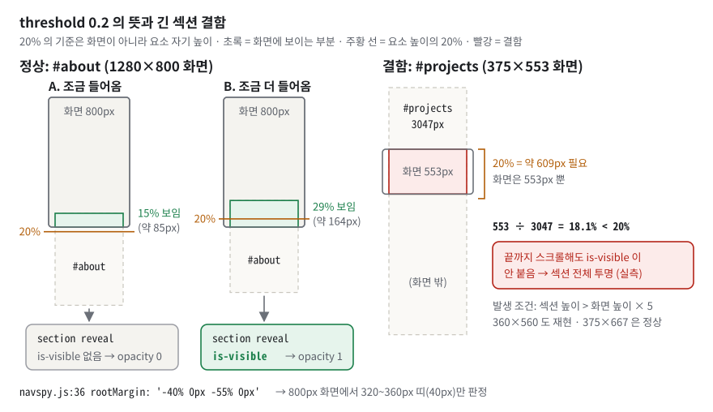
*그림 10. threshold 0.2 는 '요소 자기 높이의 20%'가 보일 때다. 화면이 553px 인 폰에서 3047px 짜리 Projects 섹션은 최대 18.1% 만 보여 끝내 나타나지 않는다(실측).*

그림 10 왼쪽의 주황 기준선이 "요소 높이의 20%"(#about 이면 약 113px)이다. 초록으로 칠한 보이는 부분이 그 선을 넘어야 `is-visible` 이 붙는다. 오른쪽은 분모가 너무 커서 선에 영원히 닿지 못하는 경우다.

**구체적인 숫자로.**
- 임계값(`js/config.js:24`, `js/config.js:26`)은 `y > 60`, `y > 300` 으로 비교한다. 실측: `scrollY` 60 → 헤더 그대로, **61** → 헤더 배경 `rgba(255, 255, 255, 0.65)` → `0.92`. 300 → 버튼 숨김, **301** → 버튼 opacity 1. 원문은 "300px 이상", "60px 이상"이라 1px 차이가 있다(§7.3).
- 스로틀 실측: 한 태스크 안에서 scroll 이벤트 100개를 발생시키자 핸들러 100번, **rAF 예약 1번**, 헤더 클래스는 루프 직후가 아니라 다음 프레임에 한 번 바뀌었다. 실제 휠 스크롤 40번(8ms 간격)에서는 scroll 40번·rAF 40번으로 1:1 — 브라우저가 이미 프레임마다 한 번씩 보내기 때문이다.
- 등장 효과: `#about` 은 1280×800 화면에서 높이 566.75px 이므로 × 0.2 ≈ **113px** 가 보여야 한다. 실측 15% 보일 때 `section reveal`(클래스 없음), 29% 보일 때 `section reveal is-visible`. 관찰 대상 `.reveal` 은 25개(섹션 4 + `.hero__inner` 1 + 스킬 8 + 카드 12).
- 네비 스파이 `rootMargin: '-40% 0px -55% 0px'`(`js/navspy.js:36`): 800px 화면에서 위 40%(320px)와 아래 55%(440px)를 깎으면 **320~360px, 높이 40px 띠**만 판정 영역으로 남는다(실측). 그 띠에 걸친 섹션의 메뉴 링크 하나만 `is-active` 가 된다.
- 결함: 390px 폭 기준 `#projects` 높이 3047px. 375×553 화면이면 최대 553 ÷ 3047 = **18.1% < 20%** — 끝까지 스크롤해도 섹션 전체가 투명하게 남는다. 360×560 도 재현(18.4%), 375×667(21.9%)·414×715(23.5%)는 정상. 조건은 "섹션 높이 > 화면 높이 × 5"다(§7.2). 섹션 높이는 폭마다 다르다 — 768 폭 1735px, 1280 폭 1299px(실측)라서 경계 창 높이는 각각 약 347px·260px 로 훨씬 낮다(1280×250 에서 재현).

**이 과제에서는.** 스크롤 스로틀(`js/scroll.js:19-31`, 주석 제거):

```js
let ticking = false;
window.addEventListener('scroll', () => {
  if (ticking) return;
  window.requestAnimationFrame(() => {
    const y = window.scrollY;
    header.classList.toggle('is-scrolled', y > CONFIG.NAV_SCROLL_THRESHOLD);
    scrollTopBtn.classList.toggle('is-visible', y > CONFIG.SCROLL_TOP_THRESHOLD);
    ticking = false;
  });
  ticking = true;
});
```

등장 효과(`js/reveal.js:21-31`)는 `entry.isIntersecting` 이면 `is-visible` 을 붙이고 **`unobserve`** 로 관찰을 끝낸다(`js/reveal.js:25-26`). CSS 는 `.reveal { opacity: 0; transform: translateY(24px) }` → `.reveal.is-visible { opacity: 1; transform: translateY(0) }` 을 700ms 동안 바꾼다(`css/widgets.css:43-53`). 새로 그린 카드도 관찰하도록 `renderCards()` 끝에서 `Reveal.observe()` 를 다시 부른다(`js/projects.js:228`).

**한 칸 아래.** 스크롤마다 `getBoundingClientRect()` 로 위치를 재면 브라우저가 그 자리에서 레이아웃을 강제로 다시 계산해야 한다. IO 는 교차 계산을 브라우저의 렌더링 단계 안에서 하고 결과를 **비동기 콜백**으로 한 번에 넘기므로 싸다. 한 번 보인 요소를 `unobserve` 하면 계산 대상에서 빠진다. 움직임 줄이기 설정(`prefers-reduced-motion: reduce`, `css/responsive.css:66-76`)은 CSS 애니메이션·전환 시간과 CSS `scroll-behavior` 만 거의 0 으로 줄인다. JS 가 `behavior: 'smooth'` 를 직접 요청하는 앵커 이동(`js/scroll.js:49`)과 맨 위로(`js/scroll.js:37`)는 **계속 부드럽게** 움직인다 — 실측: reduce 설정에서 `html` 의 `scroll-behavior` 는 `auto` 였지만, Contact 메뉴를 누른 뒤 프레임마다 찍은 `scrollY` 가 39가지 값으로 나뉘어 조금씩 이동했다(§7.2 M). **JS 타이핑 효과도 끄지 않는다**(실측: reduce 설정에서도 300ms 시점 `"Jeong"` → 1.8초 뒤 `"JeongSeYoung"`).

> [!WARNING]
> **흔한 오해.** "threshold 0.2 = 화면의 20%" → **요소 면적**의 20%다. 그래서 화면보다 5배 넘게 긴 요소는 도달하지 못한다(실측 결함). / "scroll 리스너에 `{ passive: true }` 를 주면 빨라진다" → `scroll` 은 원래 취소할 수 없는 이벤트라 효과가 없다. `passive` 는 `touchstart`·`touchmove`·`wheel` 용이고, 이 코드에는 `passive` 가 없다. / "reduced-motion 이 타이핑도 끈다" → 끄지 않는다(실측). / "reduced-motion 이면 스무스 스크롤도 꺼진다" → CSS 쪽만 꺼진다. JS 의 `behavior: 'smooth'` 는 그대로다(실측).

### 3.13 비동기 — 이벤트 루프·Promise·fetch·async/await·try/catch·HTTP 상태·CORS

**비유로 먼저.** 푸드코트의 진동벨이다. 주문(`fetch`)하면 벨(**Promise**)을 받고 자리로 가서 다른 일을 한다. 주방이 "재료가 없어요"(403·404)라고 해도 **벨은 울린다** — 음식이 있는지는 쟁반(`res.ok`)을 봐야 안다. 벨 자체가 고장 났을 때(네트워크 끊김)만 "주문 실패"다.
비유의 한계: JS 는 한 번에 한 줄씩(단일 스레드) 실행하지만, 네트워크 대기는 브라우저의 다른 부분이 대신 한다. 손님(JS)은 정말로 다른 일을 할 수 있다.

**정확히 말하면.**
- **비동기**는 결과를 기다리는 동안 다른 일을 계속하는 실행 방식이다. **이벤트 루프**는 대기열의 일을 하나씩 꺼내 실행하는 반복 구조다. 대기열은 둘 — 클릭·타이머 같은 **태스크**와, Promise 뒤처리인 **마이크로태스크**(지금 태스크가 끝나면 다음 태스크보다 먼저 모두 처리).
- **Promise** 는 나중에 끝날 작업의 결과를 담는 약속 객체다. 대기 → 성공(fulfilled) 또는 실패(rejected) 중 하나로 한 번만 끝난다.
- `async` 함수는 항상 Promise 를 돌려준다. `await` 는 그 Promise 가 끝날 때까지 **그 함수만** 멈추고 제어를 돌려준다. 재개는 마이크로태스크로 이어진다.
- `try/catch` 는 `await` 에서 난 실패(reject)와 직접 `throw` 한 에러를 한 곳에서 받는다.
- **HTTP 상태코드**: 200번대 성공(`res.ok` 가 `true`), 403 금지(GitHub 은 호출 한도 초과에 사용), 404 없음, 500번대 서버 오류. **`fetch` 는 응답만 오면 상태코드와 상관없이 성공으로 끝난다.** 네트워크 자체가 실패할 때만 reject 한다.
- 응답은 **헤더**(본문 앞에 붙는 꼬리표 — 상태코드·내용 종류·호출 한도 등)와 본문으로 온다. GitHub 의 본문은 **JSON**(`{"name": "…"}` 처럼 데이터를 글자로 적는 형식)이다.

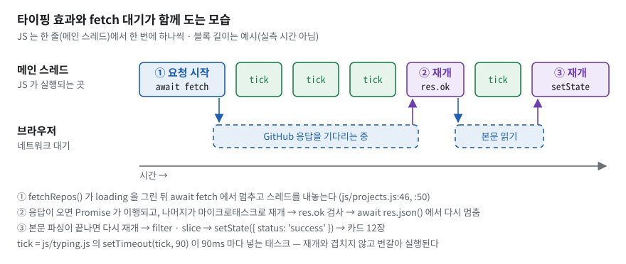
*그림 11. JS 는 한 줄에서 한 번에 하나씩 실행한다. `await` 로 멈춘 동안 그 줄을 타이핑 `tick` 이 쓰고, 응답이 오면 `fetchRepos` 가 이어서 실행된다.*

그림 11 의 위 줄(메인 스레드)에서 블록은 겹치지 않는다. ①이 `await fetch` 에서 멈추면 JS 줄이 비고, 그 사이를 90ms 마다 오는 `tick` 태스크가 채운다. 네트워크 대기는 아래 줄(브라우저)이 맡는다. 응답 헤더가 오면 Promise 가 이행되고 ②가 마이크로태스크로 이어서 실행되며, `await res.json()` 에서 한 번 더 멈췄다가 본문을 다 읽으면 ③이 카드를 그린다. 블록 길이는 예시다.

**구체적인 숫자로.** 실패를 일부러 만들어 `catch` 로 모이는 메시지를 실측했다.

| 원인 | 어디서 에러가 되나 | 화면에 나온 원인 문구 |
|---|---|---|
| 403 | `js/projects.js:55-57` 직접 throw | `GitHub API 호출 한도(시간당 60회)를 초과했습니다. 잠시 후 다시 시도해 주세요.` |
| 404 | `js/projects.js:58-60` 직접 throw | `사용자를 찾을 수 없습니다. config.js의 GITHUB_USERNAME 값을 확인해 주세요.` |
| 500 | `js/projects.js:61` 직접 throw | `요청 실패 (HTTP 500)` |
| 네트워크 끊김 | `js/projects.js:50` 의 `await fetch` 가 reject | `Failed to fetch` |
| 200 인데 JSON 이 아님 | `js/projects.js:64` 의 `res.json()` | `Unexpected token '<', "<html>oops" is not valid JSON` |
| 200 인데 배열이 아님 | `js/projects.js:68` 의 `data.filter` | `data.filter is not a function` |

여섯 경우 모두 화면 첫 줄은 `프로젝트를 불러올 수 없습니다.` 와 `다시 시도` 버튼이다. 실제 GitHub 응답 헤더(실측)에는 `x-ratelimit-limit: 60` 과 남은 횟수 `x-ratelimit-remaining` 이 있고, 이번 확인 중 호출 시점마다 34·52·55·59 로 달랐다. `await` 한 개를 빼먹은 함수로 실험하면 `res` 가 Promise 객체라 `res.ok` 가 `undefined` → `!res.ok` 가 참 → `요청 실패 (HTTP undefined)` 가 화면에 나왔다(실측).

**이 과제에서는.** `fetchRepos()` 앞부분(`js/projects.js:45-62`, 주석 제거, 49행의 `url` 계산은 생략):

```js
async fetchRepos() {
  this.setState({ status: 'loading', error: null });
  try {
    const res = await fetch(url, {
      headers: { Accept: 'application/vnd.github+json' },
    });
    if (!res.ok) {
      if (res.status === 403) {
        throw new Error('GitHub API 호출 한도(시간당 60회)를 초과했습니다. 잠시 후 다시 시도해 주세요.');
      }
      if (res.status === 404) {
        throw new Error('사용자를 찾을 수 없습니다. config.js의 GITHUB_USERNAME 값을 확인해 주세요.');
      }
      throw new Error(`요청 실패 (HTTP ${res.status})`);
    }
```

뒷부분(`js/projects.js:64-80`, 주석 제거):

```js
    const data = await res.json();
    const repos = data
      .filter((r) => !r.fork)
      .slice(0, 12);
    if (repos.length === 0) {
      this.setState({ status: 'empty', repos: [] });
      return;
    }
    this.setState({ status: 'success', repos });
  } catch (err) {
    console.error('[GitHub API]', err);
    this.setState({ status: 'error', error: err.message });
  }
},
```

핵심은 두 가지다.

- ① `if (!res.ok)` 에서 **직접 throw** 해야 403 이 "호출 한도 초과"라는 올바른 문구로 에러 화면에 간다. 이 검사가 없으면 `fetch` 가 성공으로 끝난 403 응답의 본문(GitHub 은 `{ message: … }` 모양의 객체를 준다 — 일반 지식)을 `json()` 으로 읽고, 다음 줄 `data.filter` 에서 `data.filter is not a function` 이라는 엉뚱한 에러가 난다(배열이 아닌 200 응답을 넣은 실측과 같은 경로).
- ② 모든 실패가 `catch` **한 곳**에 모이고, 개발자용 정보(`console.error`, 스택 포함)와 사용자용 문구(`err.message`, 화면에는 `escapeHtml` 을 거쳐 표시 `js/projects.js:110-112`)를 나눴다. 다만 `try` 가 `setState({ status: 'success' })`(`js/projects.js:76`)까지 감싸서, 그 안에서 곧바로 불리는 `render` → `renderCards` → `Reveal.observe` 의 **코드 버그도** 같은 `catch` 로 들어간다. 실측: 응답 전에 `Reveal.observe` 가 에러를 던지게 바꾸자 화면이 `프로젝트를 불러올 수 없습니다.` + `render bug in Reveal.observe` 가 됐다 — 네트워크 실패처럼 보인다(§7.2 L).

`Projects.init()` 은 `fetchRepos()` 를 `await` 하지 않는다(`js/projects.js:35`). 돌려받은 Promise 를 버려도 함수 안의 `catch` 가 모든 실패를 잡으므로 "처리되지 않은 reject" 경고가 남지 않는다.

**한 칸 아래 — CORS.** 브라우저는 다른 오리진의 응답을 JS 가 읽는 것을 기본으로 막는다. 서버가 응답 헤더 `Access-Control-Allow-Origin` 으로 허락해야 읽을 수 있다(**CORS**, Cross-Origin Resource Sharing). GitHub API 는 이 헤더에 `*`(모두 허용)를 준다(실측 헤더). 그래서 Live Server(`http://127.0.0.1:5500`)·GitHub Pages·그리고 **`file://` 로 연 페이지에서도** 카드 12장이 떴다(실측, 가로채기 없는 실제 호출). Formspree 전송은 `multipart/form-data` 본문 + `Accept` 헤더라 CORS 의 "단순 요청"에 해당해, 본 요청 전의 확인 요청(OPTIONS)이 없다(일반 지식).

> [!WARNING]
> **흔한 오해.** "`fetch` 는 404 면 `catch` 로 간다" → 가지 않는다. `res.ok` 를 보고 직접 던져야 한다. / "`file://` 에서는 외부 API `fetch` 가 막힌다" → 이 API 는 `*` 를 주므로 된다(실측). 저장소 README 와 `.vscode/settings.json:3-4` 주석의 이 설명은 틀렸다(§7.1). / "`await` 동안 페이지가 멈춘다" → 그 함수만 멈춘다. 그동안 타이핑 효과와 스크롤이 계속된다.

### 3.14 폼 검증 UX — blur·input·submit 세 박자

**비유로 먼저.** 원서 접수 창구다. 한 칸을 다 쓰고 다음 칸으로 넘어가면(blur) 직원이 그 칸만 확인해 준다. 틀렸다고 빨간 펜 표시를 받은 칸을 고치기 시작하면(input) 표시를 치워 준다. 마지막에 제출하면(submit) 전부 다시 본다.
비유의 한계: 창구 확인(브라우저 쪽 검증)은 사용자가 우회할 수 있다. 원서를 받는 본사(서버)도 다시 확인해야 한다.

**정확히 말하면.** 검증에는 두 층이 있다. HTML **제약 검증**(`required`, `type="email"`)은 브라우저가 기본 말풍선으로 알려 준다. **스크립트 검증**은 JS 가 규칙을 직접 적용하고 메시지를 원하는 곳에 그린다. `<form novalidate>`(`index.html:266`)는 브라우저 기본 검증을 끄고 스크립트 검증만 쓰겠다는 뜻이다. `submit` 이벤트는 제출 버튼 클릭뿐 아니라 입력칸에서 Enter 를 눌러도(암묵적 제출) 발생한다.

**구체적인 숫자로.** 실측 결과다.
- 빈 폼 제출 → 세 칸 모두 `필수 입력 항목입니다.`, 빨간 테두리, 주소·스크롤 위치 그대로(새로고침 없음).
- 이름 입력 → 이름 에러만 사라짐.
- 이메일 `abc` 입력 후 다른 칸 클릭 → `올바른 이메일 형식이 아닙니다.`
- 메시지 공백 5칸 → `필수 입력 항목입니다.`(`trim()` 효과) / `hi` → `메시지는 5자 이상 입력해 주세요.`
- 이메일 정규식 `/^[^\s@]+@[^\s@]+\.[^\s@]+$/`(`js/contact.js:149`) 판정: `abc@` ✗, `abc@x` ✗, `a@b.c` ✓, `a b@c.d` ✗, `a@@b.c` ✗.
- 정상 제출(요청 가로채기) → 버튼 `전송 중…`·비활성 → 성공 배너 `메시지가 정상적으로 전송되었습니다. 감사합니다!`·폼 비움 → **5초** 뒤 배너 숨김. 요청 형태는 `POST` · `content-type: multipart/form-data` · `accept: application/json`. 전송 중에 Enter 를 다시 눌러도 POST 는 1건. **단, 전송 중에 입력칸에 한 글자라도 치면** `input` 리스너(`js/contact.js:50-54`)가 `status` 를 `idle` 로 되돌려 버튼이 다시 켜지고, 그때 누르면 POST 가 2건 나갔다(응답을 붙잡아 둔 실측, §7.2 J).
- 서버가 500 을 주면 → 실패 배너 + 콘솔 `[Contact] 전송 실패 — 응답 상태: 500`.

**이 과제에서는.** 검증 규칙은 순수 함수 하나다(`js/contact.js:132-145`, 주석 제거).

```js
validate(field) {
  const value = field.value.trim();
  if (field.required && value === '') {
    return '필수 입력 항목입니다.';
  }
  if (field.type === 'email' && value !== '' && !this.isValidEmail(value)) {
    return '올바른 이메일 형식이 아닙니다.';
  }
  if (field.id === 'message' && value !== '' && value.length < 5) {
    return '메시지는 5자 이상 입력해 주세요.';
  }
  return '';
},
```

에러는 `render()` 가 그린다(`js/contact.js:164-171`): 칸마다 `[data-error-for="…"]` 자리(`index.html:280`, `index.html:295`, `index.html:309`)에 `textContent` 로 문구를 쓰고, 칸 묶음 `.form__field` 에 `has-error` 를 토글한다. CSS 가 그 클래스를 보고 테두리를 빨갛게 한다(`css/form.css:48-52`). `alert()` 는 쓰지 않는다.

**한 칸 아래.**
- `novalidate` 를 켰는데도 `required`·`type="email"` 을 HTML 에 남긴 이유: 의미(보조기기가 "필수"라고 읽음)·자동완성·모바일 이메일 키보드 때문이고, `validate()` 가 `field.required`, `field.type` 을 **규칙의 입력으로** 그대로 읽는다.
- 이메일 형식 검사는 `value !== ''` 일 때만 한다. 빈 이메일에 "필수"와 "형식" 두 에러가 겹치지 않게 하려는 것이다.
- 검증 시점을 blur 로 고른 대가: 빈 칸을 Tab 으로 지나가기만 해도 `필수 입력 항목입니다.` 가 뜬다(실측). 반대로 이메일에 `abc` 를 치는 동안(blur 전)에는 형식 에러가 뜨지 않는다(실측 빈 문자열) — 다 쓰기 전에 다그치지 않으려는 선택이다.
- 입력값 자체는 `state` 에 없고 DOM(`input.value`)이 들고 있다. `state` 에는 에러와 제출 상태만 둔다. React 로 치면 **비제어(uncontrolled)** 방식이다.
- 엔드포인트가 `YOUR_FORM_ID` 자리표시면 실제 전송 없이 성공 화면만 보이는 데모 모드로 돈다(`js/contact.js:88-97`). 지금은 실제 폼 ID(`js/config.js:22`)라 **정상 제출하면 실제 메일이 간다**.

> [!WARNING]
> **흔한 오해.** "`type="email"` 이면 브라우저가 검증해 준다" → `novalidate` 로 꺼 두었다. / "클라이언트 검증이면 충분하다" → 우회할 수 있으므로 받는 쪽(Formspree)도 검증한다. / "이메일 정규식이 RFC 를 완전히 검증한다" → 오타 방지용 단순 패턴이다. 진짜 확인은 메일을 보내 봐야 안다.

### 3.15 배포 — GitHub Pages·Actions CI·상대 경로·캐시

**비유로 먼저.** 인쇄소다. 원고(커밋)를 넘기면 검수팀(check job)이 맞춤법·규정을 확인하고, 통과한 원고만 인쇄(deploy)한다. 검수에서 떨어지면 인쇄기는 아예 돌지 않는다.
비유의 한계: 인쇄소 앞 진열대(브라우저·CDN 캐시)에는 이전 판이 최대 10분 남아 있을 수 있다.

**정확히 말하면.** **GitHub Pages** 는 저장소의 파일을 그대로 웹사이트로 공개해 주는 정적 호스팅이다. **GitHub Actions** 는 푸시 때 정해진 작업을 자동으로 돌리는 기능이고, 그 작업 단위를 **job** 이라고 한다. **CI**(Continuous Integration)는 푸시마다 자동으로 검사하는 관행이다. `needs:` 는 "앞 job 이 성공해야 시작"이라는 조건이다.

**구체적인 숫자로.** 워크플로(`.github/workflows/static.yml`)의 흐름: `master` 에 푸시(`.github/workflows/static.yml:7`) → `check` job(`.github/workflows/static.yml:29-46`)이 JS 11개에 `node --check` + `bash scripts/check.sh`(13건) → 통과하면 `deploy` job(`needs: check`, `.github/workflows/static.yml:50`)이 저장소 전체(`path: '.'`, `.github/workflows/static.yml:64`)를 Pages 에 올린다.
최근 실행(GitHub API 조회): 커밋 `bea8a6e` · 2026-09-21 13:25 UTC · `check` success → `deploy` success. 배포 URL `https://ashofrondol.github.io/codyssey_B4-1/` 응답(2026-09-23 실측): `HTTP/2 200`, `last-modified: Mon, 21 Sep 2026 13:26:08 GMT`, `cache-control: max-age=600`(10분 캐시). 배포본에서도 카드 12장·필터 6개·모바일 햄버거·다크 유지·폼 에러가 동작했고 콘솔 에러는 0건이었다.

**이 과제에서는.** 검사 job 과 배포 조건(`.github/workflows/static.yml:29-50` 중 발췌, 주석 제거):

```yaml
  check:
    runs-on: ubuntu-latest
    steps:
      - name: Checkout
        uses: actions/checkout@v4
      - name: JS 문법 검사 (node --check)
        run: |
          node --version
          for f in js/*.js; do
            echo "checking $f"
            node --check "$f"
          done
      - name: 과제 제약 검사 (bash + grep)
        run: bash scripts/check.sh
  deploy:
    needs: check
```

`scripts/check.sh` 는 bash + grep 만으로 13건(`var` 금지 · 인라인 `on*=` 금지 · `style="` 금지 · JS 의 `.style.` 금지 · `max-width` 쿼리 금지 · 프레임워크 참조 금지 · 외부 `<script src>` 금지 · 외부 출처 허용 목록 · `<script>` 11개 전부 `defer` · 로컬 참조 실재 · README 문서 좌표 3건)을 검사하고 하나라도 걸리면 종료 코드 1 을 낸다. 원래 README 에 손으로 적혀 있던 grep 들을 2026-09-21 커밋에서 검사로 옮긴 것이다.

**한 칸 아래.**
- 이 사이트는 `https://ashofrondol.github.io/codyssey_B4-1/` 이라는 **하위 경로**에 산다. 모든 참조가 상대 경로(`css/style.css`, `js/main.js`)라서 그 아래에서 풀린다. 만약 `href="/css/style.css"` 처럼 `/` 로 시작하는 절대 경로를 썼다면 `https://ashofrondol.github.io/css/style.css` 를 찾아 404 가 났을 것이다.
- `path: '.'` 이라 제출물이 아닌 `README.md`, `scripts/check.sh`, `docs/*.html` 도 공개 URL 로 서빙된다(실측 200). 배포할 폴더를 따로 두면 제출물만 올릴 수 있다(§7.3).
- grep 기반 검사는 문맥을 모른다(예: 주석 속 `var ` 도 걸릴 수 있다). 대신 의존성이 0 이고, **일부러 깨뜨려서 빨간 불이 뜨는지** 확인했다(§4.4).
- 반대로 **놓치는 것**도 있다. R4-3 정규식(`scripts/check.sh:52-53`)은 이벤트 이름 7개(click·submit·change·input·load·mouseover·keydown)만 나열한다. 버리는 사본의 제출 버튼에 `onfocus="alert(1)" onmouseenter="alert(2)"` 를 넣고 돌리자 `ok    R4-3  index.html 에 인라인 on* 핸들러 0건` 이 찍혔다(실측). `grep -rniE '\son[a-z]+[[:space:]]*=' index.html` 로 넓히면 잡힌다(§7.3).

> [!WARNING]
> **흔한 오해.** "푸시하면 바로 반영된다" → CI 두 job 이 돌고, 브라우저 캐시가 최대 10분 남는다. / "배포는 설정 한 번이면 끝" → 검사가 실패하면 배포 job 이 시작조차 하지 않는다. / "README 의 배포 안내가 실제 방식이다" → README `§ 🚀 GitHub Pages 배포` 는 `main` 브랜치·"Deploy from a branch" 를 안내하지만 실제는 `master` + Actions 다(§7.1).

## 4. 내 코드 투어

### 4.1 폴더·파일 지도

```text
codyssey_B4-1/
├── index.html                   구조 · JS 가 붙잡을 id 후크 (384줄)
├── css/
│   ├── style.css                진입점: @import 13개, 순서 = 캐스케이드 순서
│   ├── tokens.css               디자인 토큰 37개 + 다크 재정의 14개
│   ├── base.css  layout.css     리셋·border-box·스무스 스크롤 / 컨테이너·섹션 골격
│   ├── buttons.css header.css   버튼 / 고정 헤더·네비 Flex·햄버거·모바일 패널
│   ├── hero.css about.css skills.css projects.css form.css footer.css   섹션별
│   ├── widgets.css              맨 위로 버튼, .reveal 등장 효과
│   └── responsive.css           768 / 1024 / 움직임 줄이기 (맨 마지막)
├── js/
│   ├── config.js                CONFIG · $ · $$ · escapeHtml (맨 먼저)
│   ├── theme.js menu.js scroll.js typing.js skills.js
│   ├── reveal.js navspy.js projects.js contact.js     기능 모듈 9개
│   └── main.js                  DOMContentLoaded → init() ×9 (맨 마지막)
├── images/README.md             자리표시 문서 (이미지 0개)
├── scripts/check.sh             과제 제약 검사 13건
├── .github/workflows/static.yml check → deploy
├── .vscode/settings.json        Live Server 포트 5500
├── docs/                        학습자용 해설 HTML 2개 (제출물 아님)
└── README.md                    명세 원문·수행 점검(0.10)·설정값 표
```

| 파일 | 줄 | 책임 한 줄 | 먼저 짚을 위치 |
|---|---|---|---|
| `index.html` | 384 | 구조와 JS 후크(id) | CSS 연결 `index.html:39`, JS 연결 `index.html:47-67`, 헤더 `index.html:72-122`, 폼 `index.html:266-328` |
| `css/style.css` | 46 | `@import` 13개 | `css/style.css:22-46` |
| `css/tokens.css` | 78 | 변수 37 + 다크 14 | `css/tokens.css:11-59`, `css/tokens.css:63-78` |
| `css/base.css` | 68 | border-box·스무스 스크롤·포커스 링 | `css/base.css:10-14`, `css/base.css:17-20`, `css/base.css:64-68` |
| `css/layout.css` | 62 | `.container`(최대 1120)·`.section` | `css/layout.css:11-16`, `css/layout.css:24-26` |
| `css/header.css` | 193 | 고정 헤더·네비 Flex·햄버거·모바일 패널 | `css/header.css:33-38`, `css/header.css:64-67`, `css/header.css:168-181` |
| `css/responsive.css` | 76 | 768·1024·움직임 줄이기 | `css/responsive.css:11-50`, `css/responsive.css:53-63`, `css/responsive.css:66-76` |
| `css/projects.css` | 184 | 필터·카드 Grid·상태 상자·스피너 | `css/projects.css:44-49`, `css/projects.css:52-70`, `css/projects.css:148-184` |
| `css/form.css` | 92 | 폼 Grid·에러 표시·배너 | `css/form.css:48-58`, `css/form.css:60-92` |
| `css/widgets.css` | 53 | 맨 위로 버튼·`.reveal` | `css/widgets.css:8-34`, `css/widgets.css:43-53` |
| `js/config.js` | 48 | 설정값·셀렉터 도구·이스케이프 | `js/config.js:15-31`, `js/config.js:35-37`, `js/config.js:41-48` |
| `js/main.js` | 39 | 시작 버튼 | `js/main.js:19-39` |
| `js/theme.js` | 83 | 다크 모드(state/setState/render) | `js/theme.js:20-82` |
| `js/menu.js` | 37 | 햄버거 토글 | `js/menu.js:19-35` |
| `js/scroll.js` | 53 | 스크롤 임계값(rAF)·맨 위로·앵커 | `js/scroll.js:19-51` |
| `js/typing.js` | 34 | 타이핑 효과(90ms 재귀 `setTimeout`) | `js/typing.js:16-33` |
| `js/skills.js` | 40 | 스킬 8개 데이터 → `map` 렌더 | `js/skills.js:13-38` |
| `js/reveal.js` | 44 | IO(threshold 0.2) 등장 효과 | `js/reveal.js:20-43` |
| `js/navspy.js` | 41 | IO(rootMargin) 현재 메뉴 표시 | `js/navspy.js:17-40` |
| `js/projects.js` | 230 | GitHub API 상태 기계·필터·카드 | `js/projects.js:21-229` |
| `js/contact.js` | 189 | 폼 검증·전송 상태 기계 | `js/contact.js:26-188` |
| `scripts/check.sh` | 179 | 제약 검사 13건 | 헬퍼 `scripts/check.sh:31-43`, 검사 `scripts/check.sh:48-172` |
| `.github/workflows/static.yml` | 67 | check → deploy | `.github/workflows/static.yml:29-46`, `.github/workflows/static.yml:49-67` |

`main.js` 의 `init()` 호출 순서(`js/main.js:30-38`)는 Theme → Menu → Scroll → Typing → Skills → ContactForm → Reveal → NavSpy → Projects 다. Skills 가 Reveal 보다 먼저라 스킬 카드 8개는 처음부터 관찰 대상에 들어가고, Projects 카드는 API 응답 뒤에 생기므로 `renderCards()` 가 `Reveal.observe()` 를 다시 부른다(`js/projects.js:228`).

### 4.2 핵심 시나리오 따라가기 — 첫 방문에서 카드 12장까지

체크리스트 1-4 와 3-2·3-3 이 모두 이 한 흐름에서 나온다. 그림 12 를 보며 번호 순서로 따라간다.


*그림 12. 첫 방문에서 카드 12장이 뜨기까지. `fetch` 는 403·404 에서도 성공으로 끝나므로 `res.ok` 를 보고 직접 던져야 에러 상태로 간다. 모든 실패는 `catch` 한 곳에 모인다.*

1. **시작.** 브라우저가 `index.html` 을 파싱하고 `defer` 스크립트 11개를 순서대로 실행한다(객체 정의만). 파싱이 끝나면 `DOMContentLoaded` → `js/main.js:19` 콜백 → `js/main.js:38` 의 `Projects.init()`.
2. **요소 캐시.** `js/projects.js:33-34` 가 `#projects-container` 와 `#filters` 를 찾아 두고 `js/projects.js:35` 에서 `fetchRepos()` 를 부른다.
3. **로딩 상태.** `js/projects.js:46` `setState({ status: 'loading', error: null })` → `render()` 의 loading 분기(`js/projects.js:92-100`)가 스피너(`role="status"`)와 `프로젝트를 불러오는 중입니다...` 를 그린다. 그림 12 의 ② 바로 아래 상자와 오른쪽 "loading 화면" 칩.
4. **요청.** `js/projects.js:50` `await fetch(…)`. 이 함수는 여기서 멈추지만 페이지는 멈추지 않는다 — 타이핑 효과와 스크롤이 계속된다(그림 11). 그림 12 의 ③.
5. **응답 판정.** `js/projects.js:54` `res.ok` 가 참이면 `js/projects.js:64` `await res.json()` → 저장소 15개(2026-09-23 실측, fork — 남의 저장소를 복사해 온 것 — 0개) → `js/projects.js:67-69` `filter` 로 fork 제외(15개) → `slice(0, 12)` 로 12개. 그림 12 의 ④⑤.
6. **빈 상태 판정.** `js/projects.js:71` 0개가 아니므로 `js/projects.js:76` `setState({ status: 'success', repos })`. 그림 12 의 ⑥.
7. **성공 렌더.** `render()` 의 success 분기(`js/projects.js:135-139`) → `renderFilters()`(`js/projects.js:149-173`)가 버튼 6개와 리스너 → `renderCards()`(`js/projects.js:176-229`)가 카드 12장 → `js/projects.js:228` `Reveal.observe()`.
8. **등장.** 스크롤로 카드가 20% 보이면 `js/reveal.js:24-26` 이 `is-visible` 을 붙이고, CSS(`css/widgets.css:50-53`)가 아래에서 제자리로 떠오르게 한다. 이 `is-visible` 규칙이 뒤에서 카드 hover 를 덮는다(§7.2 I).

**배열 메서드가 데이터를 카드로 바꾸는 과정(실제 데이터).** 체크리스트 3-3 의 답이다.

| 단계 | 코드 | 결과 |
|---|---|---|
| ① 응답 | `await res.json()` (`js/projects.js:64`) | 객체 15개 배열 |
| ② 거르기·자르기 | `.filter((r) => !r.fork).slice(0, 12)` (`js/projects.js:67-69`) | 15개 → 12개 → `state.repos` |
| ③ 언어 뽑기 | `repos.map((r) => r.language)` (`js/projects.js:154`) | `HTML, Python, Python, JavaScript, Python, CSS, Python, Python, Shell, Shell, Python, Python` |
| ④ 빈 값 빼기·중복 제거 | `.filter(Boolean)` → `new Set(…)` → `['All', ...]` (`js/projects.js:153-155`) | `All · HTML · Python · JavaScript · CSS · Shell` 6개 |
| ⑤ 버튼 HTML | `` langs.map((lang) => `<button …>`).join('') `` (`js/projects.js:157-166`) | 버튼 6개 문자열 → `innerHTML` |
| ⑥ 필터 적용 | `activeLang === 'All' ? repos : repos.filter((r) => r.language === activeLang)` (`js/projects.js:179-182`) | All 12 · Python 7 · Shell 2 · HTML 1 |
| ⑦ 카드 HTML | `` .map(({ name, description, html_url, stargazers_count, forks_count, language }) => `<article class="card reveal">…`) `` (`js/projects.js:194-224`) | 구조분해로 6개 필드만 꺼내 카드 문자열 |
| ⑧ 합치기·주입 | `.join('')` → `this.container.innerHTML = …` (`js/projects.js:194`, `js/projects.js:225`) | 카드 12장 |

원본 `state.repos` 는 그대로 두고 **그릴 때만** 거른다. 그래서 필터를 'All' 로 되돌려도 네트워크 요청이 다시 나가지 않는다. 카드의 외부 값 여섯 중 문자열 넷은 `escapeHtml()` 을 거치지만, 별·포크 수 둘은 그대로 들어간다(§3.7, §7.2 B).

**갈림길(그림 12 의 빨간 경로).**
- `res.ok` 가 거짓 → `js/projects.js:55-61` 에서 상태코드별 문구로 `throw` → `js/projects.js:77` `catch` → `js/projects.js:79` `setState({ status: 'error', error: err.message })` → `render()` 의 error 분기(`js/projects.js:102-123`)가 경고 아이콘 + `프로젝트를 불러올 수 없습니다.` + 원인 한 줄 + `다시 시도` 버튼을 그리고, 그 버튼에 리스너를 붙인다(`js/projects.js:121`). 클릭하면 3번부터 다시.
- 네트워크 실패 → 4번의 `await fetch` 가 곧바로 reject → `catch` 로 직행(`Failed to fetch`).
- 12개가 0개 → `js/projects.js:72` `setState({ status: 'empty', repos: [] })` → `js/projects.js:125-133` `표시할 프로젝트가 없습니다.`

**시나리오 2 — 필터 "Python" 클릭(그림 12 오른쪽 아래 점선 상자).** `js/projects.js:169` 클릭 → `js/projects.js:170` `setState({ activeLang: 'Python' })` → `render()` 가 status `'success'` 분기로 → `renderFilters()` 가 버튼 6개를 **새로 만들고** Python 에 `is-active`, 리스너도 다시 붙임 → `renderCards()` 가 7장 → `Reveal.observe()`. 네트워크 요청은 없다.

**시나리오 3 — 폼 정상 제출.** Enter 또는 버튼 → `js/contact.js:58` submit → `js/contact.js:59` `preventDefault()` → `js/contact.js:77-80` 세 칸 `validate` → 모두 `''` → `js/contact.js:88` 엔드포인트가 자리표시인지 확인(실제 ID) → `js/contact.js:100` `setState({ status: 'sending' })` → `render()` 가 버튼 비활성·`전송 중…`(`js/contact.js:181-187`) → `js/contact.js:102-106` `await fetch(POST, FormData)` → `js/contact.js:107` `res.ok` → `handleSuccess()`(`js/contact.js:120-129`): `form.reset()` → `status: 'success'` 로 성공 배너 → 5초 뒤 여전히 success 면 `idle`.

**시나리오 4 — 다크 모드.** 그림 9 의 ①~⑥(§3.10)이 그대로 시나리오다. Q6.3-1 에서 말로 따라간다.

### 4.3 설계 결정과 이유

| 결정 | 대안 | 왜 이걸 골랐나 | 대가(트레이드오프) |
|---|---|---|---|
| 모듈 = 전역 객체(`const Theme = { … }`) + classic `<script defer>` | ES 모듈(`type="module"`, `import`/`export`) | 빌드·서버 설정 없이 동작하고 과제 수준에서 읽기 쉽다 | 전역 이름 공유, `config.js` 가 먼저여야 하는 로드 순서 의존, `init()` 을 격리 없이 차례로 불러 한 모듈의 예외가 뒤 모듈을 모두 멈춤(§7.2 K) |
| 세 모듈 모두 `state` + `setState` + `render` | 모듈마다 변수와 직접 DOM 조작 | 단일 진실 원천, 설명이 한 가지로 통일, React 로 그대로 이어짐 | 변경마다 영역 전체 다시 그리기, 공개 state 라 규칙이 규율에 의존 |
| `status` 문자열 하나 + 허용 값 검사 + 모르는 값 `throw` | `isLoading`, `hasError` 같은 참/거짓 여러 개 | "로딩 중이면서 에러" 같은 모순 상태가 표현 불가, 오타가 즉시 드러남 | 상태를 추가하면 분기와 목록 두 곳을 고쳐야 함 |
| 테마 = `<html data-theme>` + CSS 변수 | JS 가 색을 직접 지정, 테마별 CSS 파일 교체 | 인라인 스타일 금지 준수, 다크 전용 CSS 0줄 | JS 실행 뒤 적용이라 FOUC 가능(§3.11) |
| 카드 열 = Grid `auto-fit` + `minmax` | 미디어 쿼리마다 열 수 지정 | 폭에 따라 자동, 쿼리 수 절약 | 카드가 적으면 한 장이 전체 폭으로 늘어남 |
| 스크롤 = rAF 스로틀, 등장 = IntersectionObserver | 매 scroll 에 계산, 등장 라이브러리(금지) | 성능, 표준 API | IO 비율 한계로 짧은 화면에서 긴 섹션이 안 보임(§7.2) |
| `innerHTML` + 템플릿 리터럴 + `escapeHtml` | `createElement` + `textContent` | 명세(R7-2)가 요구, 코드가 짧다 | 이스케이프를 한 곳이라도 빼면 XSS(필터 버튼·별·포크 수) |
| 폼 값은 DOM, 에러·제출 상태만 state | 모든 입력값을 state 로(제어 방식) | 코드 단순 | "DOM 이 아니라 state 가 출처"라는 설명과 약간 어긋남 — 물으면 비제어 방식이라고 설명 |
| 제약을 `scripts/check.sh` + CI `needs: check` 로 강제 | README 에 grep 을 적어 두기(이전 방식) | 규칙은 문서가 아니라 검사에 산다 | grep 이라 문맥을 모른다 |
| `@import` 로 CSS 13개 연결 | `<link>` 13개, 번들러 | HTML 의 로컬 CSS `<link>` 는 한 줄, 명세의 `css/style.css` 모양 | 요청이 한 단계 늦게 출발해 첫 화면 지연 |

### 4.4 어떻게 검증했나

**① 저장소가 가진 검사 — 복사본에서 직접 실행한 출력.**

```text
$ bash scripts/check.sh
=== 과제 제약 검사 (scripts/check.sh) ===
ok    R4-2  js/ 에 var 선언 0건
ok    R4-3  index.html 에 인라인 on* 핸들러 0건
ok    0.6   index.html/js 에 style=" 속성 0건
ok    0.6   js/ 에 .style.* 직접 조작 0건
ok    R3-6  css/ 에 max-width 미디어쿼리 0건
ok    0.6   index.html 에 React/Vue/jQuery/Bootstrap/Tailwind 참조 0건
ok    0.6   index.html 에 외부 도메인 <script src> 0건
ok    0.6   index.html 외부 출처는 허용 목록(Google Fonts·Font Awesome) 뿐
ok    R4-1  index.html 의 <script> 전부 defer (11개)
ok    R1-2  index.html·css/style.css 의 로컬 참조 전부 실재
ok    문서  README 자기 참조에 줄번호 0건 (§ 섹션명 만 허용)
ok    문서  README 의 § 섹션 참조 전부 실재
ok    문서  README 가 적어 둔 검사 건수(13건)가 실제와 일치

검사 13건 전부 통과.
exit=0

$ for f in js/*.js; do node --check "$f" && echo "ok $f"; done      # node v22.22.1
ok js/config.js
ok js/contact.js
ok js/main.js
ok js/menu.js
ok js/navspy.js
ok js/projects.js
ok js/reveal.js
ok js/scroll.js
ok js/skills.js
ok js/theme.js
ok js/typing.js
```

**② 일부러 깨뜨려 보기.** 버리는 사본에서 `js/menu.js` 끝에 `var leaked = 1;` 을 붙이고, 줄 끝이 `<button` 인 세 곳에 `onclick="alert(1)"` 을 넣고, 768 쿼리를 `max-width: 767px` 로 바꿨다. 깨지지 않는 검사는 검사가 아니므로 빨간 불이 뜨는지 본 것이다.

```text
FAIL  R4-2  js/ 에 var 선언 0건
        js/menu.js:38:var leaked = 1;
FAIL  R4-3  index.html 에 인라인 on* 핸들러 0건
        95:        <button onclick="alert(1)"
        107:        <button onclick="alert(1)"
        375:  <button onclick="alert(1)"
ok    0.6   index.html/js 에 style=" 속성 0건
ok    0.6   js/ 에 .style.* 직접 조작 0건
FAIL  R3-6  css/ 에 max-width 미디어쿼리 0건
        css/responsive.css:11:@media (max-width: 767px) {
(… 나머지 10건 ok …)
검사 13건 중 실패 3건 — 위 FAIL 줄을 보고 고쳐라.
exit=1
```

**③ CI 실행 기록**(GitHub API 조회): 워크플로 `Deploy static content to Pages` · 커밋 `bea8a6e` · master · push · 2026-09-21T13:25:18Z · **success**. job `check`(Checkout, `JS 문법 검사 (node --check)`, `과제 제약 검사 (bash + grep)`) → `deploy`(Setup Pages, Upload artifact, Deploy to GitHub Pages) 모두 success.

**④ 브라우저 실측.** 저장소에 행위 테스트가 없으므로(테스트 수 0, README `§ 🧪 실행 검증 기록` 도 같은 말) 기능 동작은 복사본을 `python3 -m http.server` 로 띄우고 헤드리스 Chromium 으로 직접 조작해 확인했다. 확인한 것을 묶으면 이렇다.

- **레이아웃.** 폭 6종(390/767/768/1023/1024/1280)의 계산된 스타일, 좁은 폭 280/320, box-sizing 실험, `auto-fit`/`auto-fill`, 명시도 실험, 카드 hover(떠오르지 않음), 네비 배치.
- **테마.** 전환·새로고침 유지·잘못된 저장값·시스템 다크, FOUC, 저장소 접근 차단.
- **스크롤.** 임계값 60/61·300/301, 등장 효과 비율, 네비 스파이, 움직임 줄이기 설정.
- **API.** GitHub API 12가지 응답(성공·403 후 재시도·404·500·네트워크 끊김·JSON 깨짐·배열 아님·빈 배열·전부 fork·XSS 조작), 필터, 직접 대입 vs `setState`, 넓은 `try`.
- **폼.** 전 과정, 전송 중 입력으로 풀리는 잠금, blur 시점.
- **기타.** 햄버거와 리스너 수, 접근성 트리, `defer` 제거 사본, viewport 메타 제거 사본, **가로채기 없는 실제 API 호출**(http·`file://`·배포 URL).

API 응답은 2026-09-23 에 실제로 한 번 받은 저장소 15개 목록을 주입해 재현했다(호출 한도 절약). 정상 로드 시 콘솔 메시지는 0건이었다.

**⑤ 시연 명령 재확인**(이 문서 작성 중 같은 방식으로 다시 실행): 카드 12장·필터 6개, 콘솔에서 `loading`/`empty`/`error` 상태를 넣으면 §5.4 의 화면, 다시 시도 → 카드 12장, Python → 7장, 테마 클릭 → `data-theme="dark"`·저장값 `"dark"`·배경 `rgb(15, 17, 23)` → 새로고침 후에도 동일.

## 5. 시연 리허설 — 평가장에서 그대로

체크리스트 1절 순서대로 준비한다. 각 단계는 **조작 → 실제로 보이는 것 → 이때 말할 한두 문장**이다.

### 5.0 준비 (평가 5분 전)

```bash
cd codyssey_B4-1
bash scripts/check.sh           # 마지막 줄 "검사 13건 전부 통과."
python3 -m http.server 5500     # Live Server 가 없을 때의 대용 → http://127.0.0.1:5500/
```

같은 방식으로 띄운 복사본에서 확인한 응답이다.

```text
$ curl -s -o /dev/null -w '%{http_code} %{content_type}\n' http://127.0.0.1:5500/
200 text/html
$ curl -s -o /dev/null -w '%{http_code}\n' http://127.0.0.1:5500/css/style.css
200
```

또는 배포 URL `https://ashofrondol.github.io/codyssey_B4-1/` 을 연다(2026-09-23 HTTP 200). 크롬 DevTools(F12)를 열어 둔다.

> [!CAUTION]
> **새로고침 1번 = GitHub API 호출 1번**이다. 인증 없는 호출은 시간당 60회다. 연습하다 한도를 다 쓰면 평가장에서 에러 화면부터 보게 된다. 그리고 **창 높이를 넉넉히** 둔다. 모바일 폭(390px)에서 창 높이가 약 610px 미만이면 Projects 섹션이 투명하게 남는 결함이 있다(§7.2 A). 경계는 폭마다 다르다 — 768 폭은 약 347px, 1280 폭은 약 260px 미만일 때만 생긴다(조건: 섹션 높이 > 창 높이 × 5). DevTools 기기 툴바에서는 툴바에 적은 높이가 곧 화면 높이이므로, 모바일을 보여 줄 때 390×844 처럼 키 큰 크기를 쓴다.

### 5.1 반응형 — 체크리스트 1-1

- **조작.** DevTools 기기 툴바(<kbd>Ctrl</kbd>+<kbd>Shift</kbd>+<kbd>M</kbd>)에서 폭 390 → 767 → 768 → 1280.
- **보이는 것(실측).** 390: 햄버거·카드 1열 342px / 767: 여전히 햄버거, 카드는 **이미 2열** / 768: 가로 메뉴·About 2열(`280px 392px`)·섹션 여백 96px / 1280: 카드 3열 336px.
- **말할 것.** "기본 규칙이 모바일이고 768·1024 에서 `min-width` 로 규칙을 더합니다(`css/responsive.css:11`, `css/responsive.css:53`). 카드 열 수는 미디어 쿼리가 아니라 Grid `auto-fit, minmax(280px, 1fr)` 가 계산합니다 — 767px 에서 이미 2열인 게 그 증거입니다."

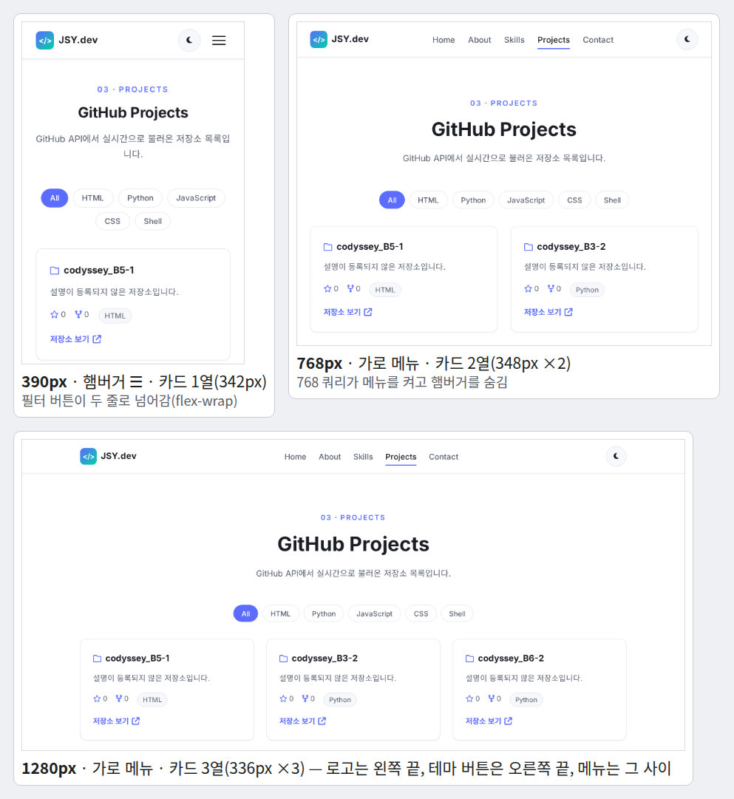
*그림 13. 세 폭에서 본 실제 화면(복사본에 2026-09-23 에 받은 저장소 목록을 주입해 헤드리스 Chromium 으로 캡처). 햄버거 ↔ 가로 메뉴는 768 쿼리가, 카드 1·2·3열은 Grid 가 정한다.*

그림 13 에서 평가자에게 짚을 곳은 세 군데다. 390px 의 오른쪽 위 ☰ 버튼, 768px 부터 생기는 가로 메뉴, 그리고 카드 열 수다. 1280px 에서 메뉴가 로고와 테마 버튼 **사이**에 있는 것도 보인다(§3.6).

### 5.2 다크 모드 — 체크리스트 1-2

- **조작.** 달 아이콘 클릭 → DevTools Application › Local Storage 에서 `portfolio-theme: dark` 확인 → F5 → 여전히 다크. Elements 에서 `<html lang="ko" data-theme="dark">` 확인.
- **콘솔.** `localStorage.getItem('portfolio-theme')` → `'dark'`, `Theme.state` → `{theme: 'dark'}`.
- **보이는 것(실측).** 배경 `rgb(255, 255, 255)` → `rgb(15, 17, 23)`, 아이콘 달 → 해, 새로고침 뒤에도 dark.
- **말할 것.** "JS 는 `<html>` 의 `data-theme` 속성 하나만 바꾸고, 색은 `[data-theme="dark"]` 가 변수 14개를 다시 정의해서 바뀝니다. 새로고침하면 `init()` 이 저장값을 읽어 복원합니다(`js/theme.js:30`, `js/theme.js:47`)."

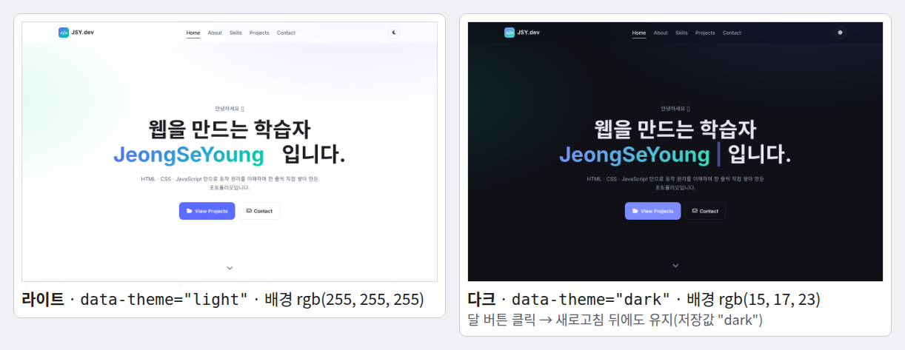
*그림 14. 같은 페이지의 라이트와 다크(헤드리스 Chromium 캡처). 오른쪽은 달 버튼을 누른 뒤 새로고침한 화면으로, 저장값 `"dark"` 가 복원됐다. 인사말 끝의 이모지는 캡처 환경에 글꼴이 없어 네모로 찍혔다.*

그림 14 의 두 화면에서 바뀐 것은 색과 오른쪽 위 버튼 아이콘(달 → 해)뿐이다. 배치·글자·버튼 위치는 그대로다 — JS 는 `data-theme` 속성 하나만 바꿨고 색은 CSS 변수가 바꿨다는 증거다.

### 5.3 햄버거·스크롤 애니메이션·맨 위로 — 체크리스트 1-3

- **햄버거.** 390 폭에서 ☰ 클릭 → 메뉴가 펼쳐지고 아이콘이 X 로, Elements 에서 `aria-expanded="true"`·`aria-label="메뉴 닫기"` → 다시 클릭 → 닫힘·`"false"`. 메뉴의 About 클릭 → 닫히며 About 으로 부드럽게 이동.
- **스크롤.** 데스크톱에서 천천히 스크롤: 61px 부터 헤더가 불투명해지고 그림자, 301px 부터 오른쪽 아래 ↑ 버튼 → 클릭 → 맨 위(실측 `scrollY` 0).
- **등장 효과.** 섹션이 20% 보일 때 아래에서 떠오르며 나타난다. Elements 에서 `class="section reveal"` → `class="section reveal is-visible"` 로 바뀌는 순간을 보여 준다.
- **주의.** 카드에 마우스를 올려도 떠오르지 않는다(§7.2 I). 평가자가 hover 해 보면 "같은 명시도라 뒤에 `@import` 된 `.reveal.is-visible` 규칙이 이깁니다"라고 먼저 말한다.
- **말할 것.** "scroll 은 requestAnimationFrame 으로 한 프레임에 한 번만 계산하고(`js/scroll.js:19-31`), 등장은 IntersectionObserver 에 맡겼습니다(`js/reveal.js:21-31`). 기준값 300·60·0.2 는 `js/config.js` 와 README 설정값 표에 있습니다."

### 5.4 GitHub API 4상태 — 체크리스트 1-4

- **성공.** 새로고침 → 스피너가 잠깐 → 카드 12장·필터 6개 → Python 클릭 → 7장. Network 탭에 추가 요청이 없음을 보여 준다.
- **나머지 상태는 콘솔에서 상태만 바꿔** 보여 준다. 이것 자체가 "상태 → 렌더" 시연이다. 실제로 실행한 결과:

```text
> Projects.setState({ status: 'loading' })
  화면: 스피너 + "프로젝트를 불러오는 중입니다..."
> Projects.setState({ status: 'empty', repos: [] })
  화면: "표시할 프로젝트가 없습니다."
> Projects.setState({ status: 'error', error: 'GitHub API 호출 한도(시간당 60회)를 초과했습니다. 잠시 후 다시 시도해 주세요.' })
  화면: "프로젝트를 불러올 수 없습니다." / 그 문구 / [다시 시도]
> [다시 시도] 클릭
  화면: 실제 재요청 → 카드 12장
```

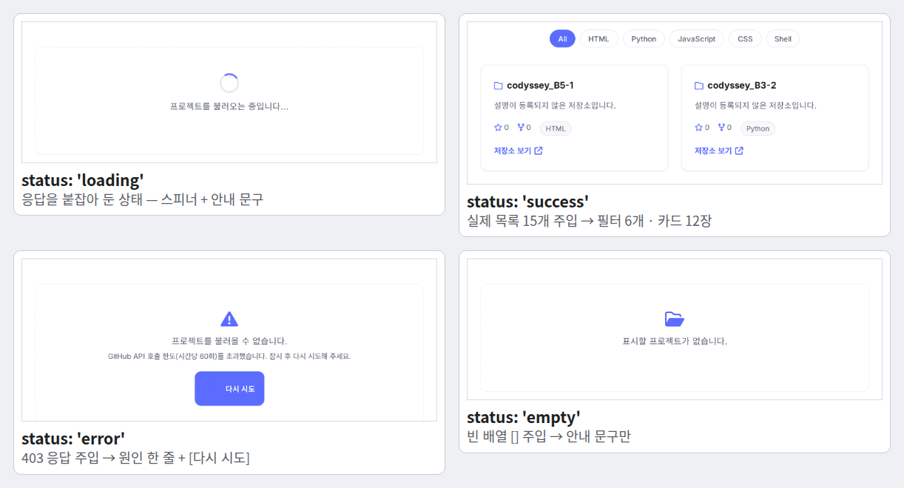
*그림 15. `status` 네 값이 그린 실제 화면(768px 폭 캡처). loading 은 응답을 붙잡아 두고, error 는 403 을, empty 는 빈 배열 `[]` 을 주입해 만들었다.*

그림 15 를 보며 말한다 — 네 칸 모두 같은 `#projects-container` 자리이고, `render()` 가 `status` 하나만 보고 다른 HTML 을 넣었다. 왼쪽 아래 error 칸의 원인 한 줄과 `다시 시도` 버튼이 명세의 "재시도 버튼"이다. 그 버튼의 글자 앞이 비어 보이는 것은 캡처 탓이 아니라 결함이다 — `.state-box i` 규칙(`css/projects.css:159-163`)이 버튼 속 회전 아이콘까지 주색 `rgb(91, 108, 255)`·32px 로 칠해, 아이콘이 버튼 배경과 같은 색이 됐다(실측, §7.2 N).

- **진짜 실패**를 보이려면 DevTools Network 에서 Offline 으로 바꾸고 새로고침한다. 같은 조작의 실측 결과: `프로젝트를 불러올 수 없습니다.` + `Failed to fetch` + `다시 시도`.
- **말할 것.** "`fetch` 는 403 에서도 성공으로 끝나기 때문에 `res.ok` 를 직접 검사해 던집니다(`js/projects.js:54-62`). 빈 상태는 요청은 성공했는데 보여 줄 게 0개인 경우라 에러와 다른 상태이고 문구도 다릅니다."

### 5.5 폼 검증 — 체크리스트 1-5

- **조작과 실측.** 빈 채로 `메시지 보내기` → 세 칸 아래 `필수 입력 항목입니다.`·빨간 테두리·주소창 그대로 → 이름 입력 → 이름 에러만 사라짐 → 이메일 `abc` 입력 후 다른 칸 클릭 → `올바른 이메일 형식이 아닙니다.` → 메시지 `hi` → `메시지는 5자 이상 입력해 주세요.`
- **정상 제출은 신중히.** `js/config.js:22` 는 실제 Formspree 폼 ID 라 **정상 제출하면 실제 메일이 간다**. 평가장에서 보낼지 미리 정한다. 보내면 `전송 중…`(버튼 비활성) → `메시지가 정상적으로 전송되었습니다. 감사합니다!` → 5초 뒤 사라짐(요청 가로채기 실측).
- **말할 것.** "blur 로 칸별 검증, input 으로 그 칸 에러 즉시 해제, submit 에서 `preventDefault()` 후 전체 검증합니다(`js/contact.js:45-61`). 에러는 칸 바로 아래 `data-error-for` 자리에 `textContent` 로 씁니다."

### 5.6 실행할 수 없는 것의 대체 증거

| 항목 | 이 환경에서 못 보이는 이유 | 대신 보여 줄 것 |
|---|---|---|
| 실제 메일 도착(보너스 3) | 받은 편지함은 확인 불가 | 전송 코드 `js/contact.js:99-116` + 요청 형태(POST · multipart · `Accept: application/json`) |
| Live Server 설치(R1-3) | 설치 여부는 저장소에 남지 않음 | `.vscode/settings.json:5` 포트 5500 설정 |
| 스크린샷 3종(제출물) | **파일이 없다** | 배포 URL 에서 그 자리에서 캡처해 보여 준다(§7.1) |
| 배포본 동작(R10-2) | 저장소 안 증거 없음 | 배포 URL 을 직접 열어 5.1~5.5 를 반복 |

## 6. 구술 문답 — 체크리스트 전 문항 + 꼬리 질문

질문만 보고 **먼저 소리 내어 답한 뒤** 펼친다. 답의 모양은 항상 같다 — 첫 문장 결론, 다음 근거, 다음 코드 위치.

### 6.1 기능 동작 검증

<details>
<summary><b>Q6.1-1</b> 브라우저 창 크기를 줄였을 때 레이아웃이 모바일에 맞게 변경되나요? <sub>체크리스트 1-1</sub></summary>

**핵심 한 줄.** 바뀐다 — 기본 규칙이 모바일이고, 768·1024px 의 `min-width` 쿼리가 규칙을 더하며, 카드 열 수는 Grid 가 스스로 계산한다.

**말로 하는 답 (30초).**
> "네, 바뀝니다. 미디어 쿼리 밖의 기본 규칙이 모바일 화면용이고, 768px 과 1024px 에서 `min-width` 미디어 쿼리가 넓은 화면 규칙을 더합니다. 767px 까지는 메뉴가 숨고 햄버거 버튼이 보이다가, 768px 부터 가로 메뉴와 About 2열로 바뀝니다. 카드 열 수는 미디어 쿼리가 아니라 Grid 의 `repeat(auto-fit, minmax(280px, 1fr))` 가 폭에 맞춰 1·2·3열로 계산합니다. 코드는 `css/responsive.css` 11행과 53행, 카드 Grid 는 `css/projects.css` 46행입니다."

**보여 줄 것.** §5.1 의 기기 툴바 조작. 기본 숨김 `css/header.css:64-67`, 768 블록 `css/responsive.css:11-50`, 1024 블록 `css/responsive.css:53-63`, viewport 메타 `index.html:14`. 실측: 390 → 카드 1열 342px, 767 → 2열(여전히 햄버거), 768 → 가로 메뉴, 1280 → 3열 336px. 측정한 6개 폭(390~1280)에서 문서 폭 = 창 폭(가로 스크롤 없음). 실제 화면은 그림 13.

**꼬리 질문.**
- **Q.** 카드 열 수는 어느 미디어 쿼리에서 바뀌나요? → **A.** 어디에도 없습니다. Grid 가 `열 수 = floor((콘텐츠 폭 + 24) / (280 + 24))` 로 계산합니다. 1056px → 3열, 720px → 2열, 342px → 1열입니다.
- **Q.** viewport 메타 태그를 빼면요? → **A.** 폰이 레이아웃 폭을 980px 로 잡습니다. 실측으로 390px 모바일에서 `innerWidth` 가 980, 768 쿼리가 참이 되어 데스크톱 화면이 작게 보였습니다.
- **Q.** 왜 768 과 1024 인가요? → **A.** 명세가 "768px(태블릿), 1024px(데스크톱)"으로 정한 수치입니다. 내용으로 봐도 768 에서 About 을 `280px 1fr` 2열로 나누면 본문이 392px 확보됩니다. 솔직히 1024 블록은 컨테이너 좌우 여백(24→32px)과 히어로 제목 크기 두 가지만 바꿉니다(`css/responsive.css:53-63`). 카드 3열은 Grid 가 1023px 에서 이미 만들기 때문에, 내용상 꼭 필요한 경계는 768 이고 1024 는 명세 수치를 따른 것입니다.
- **Q.** 화면이 280px 보다 좁으면요? → **A.** `minmax` 의 최소 280px 가 컨테이너보다 커서 넘칩니다. 실측으로 280px 폭에서 가로 스크롤이 24px 생겼고, 320px 폭에서는 카드가 콘텐츠 끝보다 8px 삐져나왔습니다. `minmax(min(280px, 100%), 1fr)` 로 최소값을 컨테이너 폭 이하로 묶으면 되고, 그렇게 바꾼 사본에서는 두 폭 모두 카드가 콘텐츠 안에 들어왔습니다.

</details>

<details>
<summary><b>Q6.1-2</b> 테마 토글 버튼 클릭 시 다크/라이트 모드가 전환되고, 새로고침 후에도 유지되나요? <sub>체크리스트 1-2</sub></summary>

**핵심 한 줄.** 된다 — 클릭이 상태를 바꾸고 `render()` 가 `<html data-theme>` 을 바꾸면 CSS 변수가 색을 바꾸며, 선택은 localStorage 에 저장돼 `init()` 이 복원한다.

**말로 하는 답 (30초).**
> "네, 유지됩니다. 버튼을 누르면 `toggle()` 이 반대 테마를 계산해 `setState` 로 상태를 바꾸고, `render()` 가 `<html>` 의 `data-theme` 속성을 `dark` 로 바꿉니다. 그러면 `tokens.css` 의 `[data-theme="dark"]` 규칙이 색 변수 14개를 다시 정의해 화면 전체 색이 바뀝니다. 그다음 `toggle()` 마지막 줄에서 `localStorage` 의 `portfolio-theme` 키에 저장하고, 새로고침하면 `init()` 이 그 값을 먼저 읽어 복원합니다. 저장값이 없으면 시스템 다크 모드 설정을, 그것도 아니면 라이트를 씁니다."

**보여 줄 것.** 그림 14. 리스너 `js/theme.js:49` → `toggle()` `js/theme.js:59-63` → `setState` `js/theme.js:53-56` → `render()` 의 `setAttribute` `js/theme.js:73` → 다크 변수 `css/tokens.css:63-78`. 저장 `js/theme.js:62`, 키 `js/config.js:30`, 복원 `js/theme.js:30-47`. 실측: 배경 `rgb(255, 255, 255)` → `rgb(15, 17, 23)`, 새로고침 뒤에도 dark.

**꼬리 질문.**
- **Q.** localStorage 는 쿠키·sessionStorage 와 무엇이 다른가요? → **A.** 오리진별 문자열 저장소이고 만료가 없으며 서버로 전송되지 않습니다. sessionStorage 는 탭을 닫으면 사라지고, 쿠키는 요청마다 서버로 갑니다.
- **Q.** 다크 사용자가 새로고침하면 흰 화면이 번쩍이지 않나요? → **A.** 그럴 수 있습니다. 테마 적용이 모든 `defer` 스크립트가 끝난 `DOMContentLoaded` 뒤라서입니다. `main.js` 를 늦게 받게 하는 실험에서 저장값은 dark 인데 흰 배경이 먼저 그려졌습니다. `<head>` 의 작은 동기 스크립트로 속성을 먼저 지정하면 해결됩니다.
- **Q.** 저장값을 누가 이상한 값으로 바꾸면요? → **A.** 허용 값 목록 `THEMES` 로 검사해 무시하고 콘솔에 경고를 남깁니다(`js/theme.js:38-45`). `'dark-blue'` 로 바꾼 실험에서 경고 후 light 로 떴습니다.

</details>

<details>
<summary><b>Q6.1-3</b> 햄버거 메뉴, 스크롤 애니메이션, 맨 위로 가기 버튼 등이 정상 동작하나요? <sub>체크리스트 1-3</sub></summary>

**핵심 한 줄.** 동작한다 — 햄버거는 `classList.toggle('is-open')`, 스크롤 임계값은 rAF 로 묶은 scroll 리스너, 등장 효과는 IntersectionObserver 가 맡는다.

**말로 하는 답 (30초).**
> "네, 동작합니다. 햄버거는 `classList.toggle('is-open')` 의 반환값으로 열림 여부를 받아 버튼 모양과 `aria-expanded` 를 함께 맞추고, 메뉴 링크를 누르면 닫힙니다. 스크롤은 60px 을 넘으면 헤더 배경을, 300px 을 넘으면 맨 위로 버튼을 보이게 하는데, scroll 이벤트가 연달아 오기 때문에 requestAnimationFrame 으로 한 프레임에 한 번만 계산합니다. 섹션 등장은 IntersectionObserver 에 threshold 0.2 로 맡겨서, 요소가 20% 보이면 `is-visible` 클래스를 붙이고 관찰을 끝냅니다."

**보여 줄 것.** 햄버거 `js/menu.js:19-24`, 닫기 `js/menu.js:27-35`, 모바일 패널 `css/header.css:168-181`. 스크롤 `js/scroll.js:19-31`, 맨 위로 `js/scroll.js:36-38`, 버튼 CSS `css/widgets.css:8-34`. 등장 `js/reveal.js:21-31`, CSS `css/widgets.css:43-53`. 부드러운 이동 `css/base.css:18-19` + `js/scroll.js:42-51`. 실측: `scrollY` 60 → 그대로, 61 → 헤더 변경 / 300 → 버튼 숨김, 301 → 보임.

**꼬리 질문.**
- **Q.** scroll 이벤트마다 DOM 을 만지면 무엇이 문제고, 코드는 어떻게 막나요? → **A.** 스크롤 중 이벤트가 연달아 와서 같은 계산을 반복합니다. `ticking` 깃발과 requestAnimationFrame 으로 다음 프레임에 한 번만 계산합니다. 한 번에 scroll 이벤트 100개를 발생시킨 실험에서 핸들러는 100번 불렸지만 rAF 예약은 1번이었습니다.
- **Q.** threshold 0.2 는 화면의 20% 인가요? → **A.** 아닙니다. 대상 요소 자기 면적의 20% 입니다. 그래서 요소가 화면 높이의 5배보다 길면 끝내 도달하지 못합니다. 375×553 화면에서 3047px 짜리 Projects 섹션이 최대 18.1% 만 보여 투명하게 남는 결함을 찾았습니다.
- **Q.** 메뉴를 연 채 창을 넓히면요? → **A.** `is-open` 클래스는 남지만 768 쿼리 안의 같은 셀렉터 규칙(`css/responsive.css:23-33`)이 가로 메뉴로 되돌립니다. 그 규칙을 지운 사본에서는 세로 패널이 폭 1024px 로 남았습니다.

</details>

<details>
<summary><b>Q6.1-4</b> GitHub API에서 데이터를 불러와 화면에 표시되고, 로딩/에러/빈 상태가 구분되나요? <sub>체크리스트 1-4</sub></summary>

**핵심 한 줄.** 구분된다 — `Projects.state.status` 하나가 `loading`·`success`·`error`·`empty` 중 하나이고, `render()` 가 status 별로 다른 화면을 그린다.

**말로 하는 답 (30초).**
> "네, 구분됩니다. `Projects` 의 상태에 `status` 값 하나를 두고, `fetchRepos()` 가 요청 전에 `loading`, 성공하면 `success` 또는 결과가 0개면 `empty`, 실패하면 `error` 로 바꿉니다. `render()` 는 이 값만 보고 스피너, 카드 목록, "표시할 프로젝트가 없습니다", "프로젝트를 불러올 수 없습니다"와 다시 시도 버튼 중 하나를 그립니다. 빈 상태는 요청은 성공했는데 보여 줄 게 없는 경우이고, 에러는 요청 자체가 실패한 경우라 서로 다른 상태입니다."

**보여 줄 것.** 상태 정의 `js/projects.js:21-26`, 상태 변경 `js/projects.js:45-81`, 분기 `js/projects.js:85-146`. §5.4 의 콘솔 시연. 실측(403 주입): `프로젝트를 불러올 수 없습니다.` + `GitHub API 호출 한도(시간당 60회)를 초과했습니다. 잠시 후 다시 시도해 주세요.` + `다시 시도` → 클릭 → 카드 12장.

**꼬리 질문.**
- **Q.** `fetch` 는 403 이면 `catch` 로 가나요? → **A.** 가지 않습니다. 네트워크 실패만 reject 하고 403·404·500 은 정상 응답으로 끝납니다. 그래서 `if (!res.ok)` 에서 직접 `throw` 합니다(`js/projects.js:54-62`).
- **Q.** 200 인데 배열이 아니면요? → **A.** `data.filter is not a function` 에러가 `catch` 로 가서 에러 화면은 뜹니다. 다만 그 문구가 그대로 보여 사용자용 문장이 아닙니다. `Array.isArray` 검사를 넣는 게 개선점입니다.
- **Q.** 호출 한도는 어떻게 확인하나요? → **A.** 응답 헤더 `x-ratelimit-limit: 60` 과 `x-ratelimit-remaining` 입니다. 새로고침 한 번이 호출 한 번이라 평가 중에는 새로고침을 아낍니다.

</details>

<details>
<summary><b>Q6.1-5</b> 필수 입력값 누락, 이메일 형식 오류 시 즉각적인 피드백이 표시되나요? <sub>체크리스트 1-5</sub></summary>

**핵심 한 줄.** 표시된다 — blur 에서 그 칸만 검증, input 에서 그 칸 에러를 지우고, submit 에서 `preventDefault()` 후 전체를 검증해 칸 바로 아래에 문구를 쓴다.

**말로 하는 답 (30초).**
> "네, 즉시 표시됩니다. 입력칸에서 포커스가 빠질 때(blur) 그 칸만 검증하고, 다시 입력하기 시작하면(input) 그 칸의 에러를 지웁니다. 제출할 때는 `preventDefault()` 로 새로고침을 막고 세 칸을 모두 검증합니다. 규칙은 `validate()` 한 함수에 있고, 공백을 잘라 낸 뒤 비었으면 "필수 입력 항목입니다", 이메일 형식이 틀리면 "올바른 이메일 형식이 아닙니다"를 돌려줍니다. 에러 문구는 각 칸 바로 아래 `<small>` 자리에 `textContent` 로 쓰고 칸 테두리를 빨갛게 합니다."

**보여 줄 것.** 이벤트 `js/contact.js:45-61`, 규칙 `js/contact.js:132-145`, 정규식 `js/contact.js:149`, 표시 `js/contact.js:164-171`, 자리 `index.html:280`, 빨간 테두리 `css/form.css:48-52`. §5.5 의 조작. 실측: 빈 제출 → 세 칸 `필수 입력 항목입니다.`, URL 그대로.

**꼬리 질문.**
- **Q.** 이메일 정규식은 무엇을 통과시키나요? → **A.** `@` 앞뒤와 `.` 뒤에 공백·`@` 없는 글자가 있으면 통과입니다. 실측으로 `abc@`·`abc@x`·`a b@c.d`·`a@@b.c` 는 거부, `a@b.c` 는 통과했습니다. 오타 방지용이고, 진짜 주소인지는 메일을 보내 봐야 압니다.
- **Q.** `novalidate` 를 켰는데 `required`, `type="email"` 은 왜 남겼나요? → **A.** 의미와 자동완성, 모바일 이메일 키보드 때문이고, `validate()` 가 `field.required` 와 `field.type` 을 규칙의 입력으로 그대로 읽습니다(`js/contact.js:135`, `js/contact.js:138`).
- **Q.** 전송 중에 두 번 누르면요? → **A.** `status` 가 `sending` 이면 `render()` 가 버튼을 끕니다(`js/contact.js:182-183`). 전송 중 Enter 를 다시 누른 실험에서도 POST 는 1건이었습니다. 다만 전송 중에 입력칸에 글자를 치면 `input` 핸들러가 `status` 를 `idle` 로 되돌려 버튼이 다시 켜지고, 그때 누르면 POST 가 2건 나갑니다(실측, `js/contact.js:50-54`). 고치려면 `submit()` 첫 줄에 `if (this.state.status === 'sending') return;` 을 두고, `input` 핸들러는 전송 중에는 `status` 를 건드리지 않게 합니다.
- **Q.** 타이핑 중에는 형식 오류가 안 뜨는데 즉각적인가요? → **A.** 다 쓰기 전에 다그치지 않으려고 검증은 칸을 떠날 때(blur) 하고, 이미 틀린 칸은 고치기 시작하는 순간(input) 에러를 지웁니다. 대안인 "입력마다 검증"은 `abc@` 를 치는 도중에도 빨간 글씨가 계속 뜨고, "submit 에서만 검증"은 너무 늦습니다. 대가로 빈 칸을 Tab 으로 지나가기만 해도 "필수 입력 항목입니다"가 뜹니다(실측). 한 번이라도 입력한 칸만 blur 검증하는 `touched` 상태를 두면 고칠 수 있습니다.

</details>

### 6.2 구현 구조 설명

<details>
<summary><b>Q6.2-1</b> HTML, CSS, JavaScript가 각각의 파일로 분리되어 있고, 분리한 이유와 각 파일의 역할을 구분하여 답변할 수 있나요? <sub>체크리스트 2-1</sub></summary>

**핵심 한 줄.** HTML 은 구조·의미, CSS 는 표현, JS 는 동작을 맡고, 셋은 바뀌는 이유가 달라서 나눴다.

**말로 하는 답 (30초).**
> "`index.html` 은 문서의 구조와 의미, 그리고 JS 가 붙잡을 id 만 갖고 있습니다. `css/` 는 색과 배치 같은 표현을, `js/` 는 클릭이나 스크롤에 반응하는 동작을 맡습니다. 나눈 이유는 셋이 바뀌는 이유가 다르기 때문입니다 — 색을 바꿀 때는 CSS 만, 동작을 고칠 때는 JS 만 봅니다. 파일로 나뉘어 있으니 브라우저가 따로 캐시하고, `var` 나 인라인 `onclick` 금지 같은 규칙도 폴더 단위로 grep 해서 자동 검사할 수 있습니다. CSS·JS 는 다시 기능별 파일로 쪼갰고, HTML 은 로컬 CSS 로 `css/style.css` 하나(외부는 폰트·아이콘 CSS 둘)와 `defer` 스크립트 11개를 연결합니다."

**보여 줄 것.** 연결 `index.html:39`, `index.html:47-67`. `@import` 13개 `css/style.css:22-46`(순서 = 캐스케이드: tokens 처음, responsive 마지막). 시작점 `js/main.js:19-39`. 그림 1 의 가운데 세 층.

**꼬리 질문.**
- **Q.** `defer` 는 무엇을 보장하나요? → **A.** HTML 파싱을 막지 않고 나란히 받은 뒤, 파싱이 끝나면 문서 순서대로 실행합니다(`DOMContentLoaded` 직전). `async` 는 도착 순서대로라 순서 보장이 없습니다. 그림 2 의 가운데 줄이 이 모양입니다.
- **Q.** `defer` 를 빼면 이 코드는 깨지나요? → **A.** 깨지지 않습니다. 11개 모두 뺀 사본에서 에러 0, 카드 12장이었습니다. DOM 접근이 전부 `DOMContentLoaded` 콜백 안에 있기 때문입니다. 대신 파싱이 스크립트마다 멈춰 첫 화면이 늦어집니다.
- **Q.** `Projects` 가 다른 파일에서 어떻게 보이나요? → **A.** 모듈이 아닌 classic script 라 최상위 `const` 가 모든 파일이 공유하는 전역 스코프에 올라갑니다. 다만 `window` 속성은 아니라서 `typeof window.Projects` 는 `"undefined"` 였습니다.

</details>

<details>
<summary><b>Q6.2-2</b> header, nav, main, section, footer 등 시맨틱 태그를 사용했고, 어떤 기준으로 태그를 선택했는지 설명할 수 있나요? <sub>체크리스트 2-2</sub></summary>

**핵심 한 줄.** 기준은 "보이는 모양"이 아니라 "문서에서의 역할"이다 — 제목 있는 주제 묶음은 `section`, 떼어 내도 뜻이 통하면 `article`, 배치용이면 `div`.

**말로 하는 답 (30초).**
> "화면 모양이 아니라 문서에서 맡은 역할로 골랐습니다. 로고와 주 메뉴가 있는 사이트 머리는 `header` 와 `nav`, 페이지 핵심은 `main` 하나, 제목이 있는 다섯 구역은 `section`, 소개 카드와 저장소 카드처럼 떼어 내도 뜻이 통하는 단위는 `article`, 저작권과 소셜 링크는 `footer` 입니다. 의미 없이 배치만 위한 상자는 `div` 로 두었습니다. 이렇게 하면 스크린 리더가 banner, navigation, main, contentinfo 같은 랜드마크로 바로 건너뛸 수 있습니다. 실제 접근성 트리에서 그렇게 나오는 것을 확인했습니다."

**보여 줄 것.** `index.html:72`(header), `index.html:74`(nav `aria-label="주 메뉴"`), `index.html:125`(main), 섹션 다섯 `index.html:128`·`index.html:167`·`index.html:215`·`index.html:230`·`index.html:254`, `index.html:175`(article), `index.html:335`(footer), 카드 `js/projects.js:203`. 그림 3. 실측 개수 header 5 · nav 1 · main 1 · section 5 · article 13(런타임) · footer 1.

**꼬리 질문.**
- **Q.** 전부 `div` 로 해도 화면은 같은데 왜 안 되나요? → **A.** 화면은 거의 같습니다. 달라지는 것은 기계가 읽는 구조입니다 — 스크린 리더의 랜드마크 이동, 검색엔진과 읽기 모드의 본문 판별이 태그에 기댑니다.
- **Q.** `section` 과 `article` 의 차이는요? → **A.** `section` 은 문서의 한 장이라 제목이 필요하고, `article` 은 다른 곳에 옮겨도 성립하는 독립 콘텐츠입니다. 저장소 카드는 한 장만 떼어도 뜻이 통해서 `article` 로 했습니다. 참고로 이름 없는 `section` 은 region 랜드마크가 되지 않습니다(실측).
- **Q.** 모든 이미지에 alt 가 있나요? → **A.** 페이지에 `` 가 0개라 증명할 대상이 없습니다. 프로필을 아이콘 아바타로 대신했기 때문이고, 이 부분은 부족하다고 인정합니다. 아이콘만 있는 링크·버튼(푸터 소셜 `index.html:347`, 맨 위로 `index.html:379`, 테마 버튼 `index.html:99`)에는 `aria-label` 을 달았지만, 글자 옆 장식 아이콘 다수(예 `index.html:151`, `index.html:195-197`)에는 `aria-hidden` 이 빠져 있습니다. 고친다면 모두 `aria-hidden="true"` 를 답니다.

</details>

<details>
<summary><b>Q6.2-3</b> CSS 변수(:root)로 색상, 폰트 등을 정의했고, 변수로 관리하면 어떤 이점이 있는지 구체적으로 답변할 수 있나요? <sub>체크리스트 2-3</sub></summary>

**핵심 한 줄.** `:root` 에 37개를 모아 두어 값 하나를 고치면 그 변수를 쓰는 곳이 모두 따라오고(예: `--color-primary` 1곳 수정 → 27곳), 다크 모드가 "속성 1개 + 변수 14개"로 끝난다. 그 14개는 CSS 에서 94번 쓰인다.

**말로 하는 답 (30초).**
> "`css/tokens.css` 의 `:root` 에 색·그림자·간격·레이아웃·글꼴·모션 변수 37개를 정의했습니다. 이점은 구체적으로 세 가지입니다. 첫째, CSS 전체에서 변수 35종을 `var()` 로 226번 참조하므로, 값 하나를 고치면 그 변수를 쓰는 곳이 전부 따라옵니다. 예를 들어 주색 `--color-primary` 는 27곳에서 씁니다. 둘째, 다크 모드는 `[data-theme="dark"]` 가 색 변수 14개만 다시 정의하면 끝나서, 컴포넌트마다 다크 규칙을 쓸 필요가 없고 새 컴포넌트도 토큰만 쓰면 자동으로 대응합니다. 셋째, 간격을 4px 척도로 묶어 여백이 들쭉날쭉하지 않습니다. 원리는 두 규칙이 모두 `<html>` 에 걸리고 명시도가 같아 뒤에 쓴 다크 규칙이 이기는 것입니다."

**보여 줄 것.** `css/tokens.css:11-59`(색 `css/tokens.css:13-28`, 간격 `css/tokens.css:31-39`, 글꼴 `css/tokens.css:49-52`), 다크 `css/tokens.css:63-78`, 사용처 `css/base.css:28-29`. 그림 5. DevTools Elements 에서 `<html>` 을 선택하고 Styles 창의 변수 값이 테마에 따라 바뀌는 것을 보여 준다.

**꼬리 질문.**
- **Q.** 정의 안 된 변수를 `var()` 로 쓰면요? → **A.** 그 선언이 계산값 시점에 무효가 되어 상속값이나 초기값이 됩니다. 오류 메시지가 없어서 조용히 틀립니다. `var(--x, 대체값)` 으로 대비할 수 있습니다.
- **Q.** 값을 전부 변수로 뺐나요? → **A.** 거의요. 브랜드색 위 흰 글자 `#fff` 5곳은 두 테마 공통이라 의도적으로 뒀고, 반투명 `rgba` 리터럴 6곳은 새는 부분입니다. 특히 입력칸 포커스 링(`css/form.css:45`)은 다크에서도 라이트 주색 기준이라 `--focus-ring` 토큰으로 빼야 합니다.
- **Q.** 명시도는 어떻게 계산하나요? → **A.** id, 클래스·속성·가상 클래스, 태그 개수를 세 자리로 앞에서부터 비교합니다. `.form__success` 는 (0,1,0), `.form__success[hidden]` 은 (0,2,0) 이라 뒤가 이겨 숨김이 유지됩니다(`css/form.css:73-75`). 그 규칙을 지운 사본에서는 `hidden` 인데도 배너가 보였습니다. 반대로 동점이라 생긴 결함도 있습니다 — `.card:hover` 와 `.reveal.is-visible` 이 둘 다 (0,2,0) 이라 뒤에 `@import` 된 쪽이 이겨 카드가 떠오르지 않습니다(§7.2 I).

</details>

<details>
<summary><b>Q6.2-4</b> onclick 인라인 속성 대신 addEventListener를 사용한 이유를 두 방식의 차이를 비교하여 제시할 수 있나요? <sub>체크리스트 2-4</sub></summary>

**핵심 한 줄.** `onclick` 은 요소당 슬롯 1개라 덮어쓰이고 HTML 에 코드가 섞이지만, `addEventListener` 는 여러 개를 등록하고 옵션·해제가 되며 JS 파일에만 산다.

**말로 하는 답 (30초).**
> "가장 큰 차이는 여러 개를 붙일 수 있느냐입니다. `onclick` 은 요소마다 자리가 하나라 두 번째 대입이 첫 번째를 조용히 지웁니다. 이 저장소에서 About 메뉴 링크에는 `menu.js` 의 '메뉴 닫기'와 `scroll.js` 의 '부드러운 스크롤' 리스너가 서로 모른 채 둘 다 붙어 있는데, `onclick` 이었다면 하나가 사라졌을 겁니다. 둘째, HTML 에 JS 문자열이 섞이지 않아 구조와 동작이 분리됩니다. 셋째, `once`·`capture` 같은 옵션과 `removeEventListener` 로 떼어 내기가 됩니다. 넷째, 인라인 코드는 보안 정책에서 `unsafe-inline` 을 허용해야 해서 불리합니다."

**보여 줄 것.** 호출 12곳(§3.8 표). 그림 8. 두 리스너 `js/menu.js:28`, `js/scroll.js:43`. 인라인 0건 검사 `scripts/check.sh:52-53`(이벤트 7종만 본다). DevTools Elements › Event Listeners 탭에서 About 링크의 click 리스너 2개를 보여 준다(실측 2개).

**꼬리 질문.**
- **Q.** 이벤트는 어떤 순서로 전달되나요? → **A.** `window` 에서 타깃까지 내려오는 캡처, 타깃, 다시 올라가는 버블 순서입니다. `addEventListener` 기본 등록은 버블 단계이고, 이 코드는 전파를 끊지 않습니다(`stopPropagation` 0건).
- **Q.** `preventDefault` 와 `stopPropagation` 은 어떻게 다른가요? → **A.** 앞은 링크 점프나 폼 제출 같은 브라우저 기본 동작을 취소하고, 뒤는 이벤트 전달을 멈춥니다. 이 코드의 `preventDefault` 는 폼 제출(`js/contact.js:59`)과 앵커 이동(`js/scroll.js:48`) 두 곳입니다.
- **Q.** 필터 버튼마다 리스너를 붙이는 대신 더 나은 방법은요? → **A.** 이벤트 위임입니다. `#filters` 에 리스너 하나를 두고 `event.target.closest('.filter-btn')` 으로 어떤 버튼인지 찾으면, 버튼을 다시 그려도 리스너를 다시 붙일 필요가 없습니다. 지금은 필터를 누를 때마다 다시 붙입니다(`js/projects.js:168-172`).
- **Q.** 그 검사는 `onfocus` 도 잡나요? → **A.** 못 잡습니다. 정규식이 click·submit 같은 이벤트 이름 7개만 나열해서, 버리는 사본의 버튼에 `onfocus`·`onmouseenter` 를 넣어도 `ok` 가 나왔습니다. 지금 `index.html` 에 인라인 핸들러가 0건인 것은 `\son[a-z]+\s*=` 로 따로 확인했고, 검사도 그 패턴으로 넓혀야 합니다(§7.3).

</details>

### 6.3 핵심 개념 이해

<details>
<summary><b>Q6.3-1</b> 다크 모드, API 호출, 폼 유효성 검사 중 하나를 예시로 들어, "이벤트 → 상태 변경 → 화면 업데이트" 흐름이 코드에서 어떻게 이어지는지 따라가며 짚어줄 수 있나요? <sub>체크리스트 3-1</sub></summary>

**핵심 한 줄.** 다크 모드: 클릭(`js/theme.js:49`) → 새 상태 계산(`js/theme.js:60`) → `setState`(`js/theme.js:54-55`) → `render` 의 `setAttribute`(`js/theme.js:73`) → CSS 변수 전환.

**말로 하는 답 (30초).**
> "다크 모드로 따라가겠습니다. 테마 버튼 클릭 이벤트를 `theme.js` 49행의 리스너가 받아 `toggle()` 을 부릅니다. 60행에서 현재 상태의 반대 테마를 계산하고, 61행에서 `setState({ theme })` 를 부릅니다. `setState` 는 54행에서 기존 상태에 바뀐 부분을 합친 새 객체를 만들고 55행에서 바로 `render()` 를 부릅니다. `render()` 는 73행에서 `<html>` 에 `data-theme="dark"` 를 붙이고 아이콘을 해 모양으로 바꿉니다. 그러면 CSS 의 다크 변수가 적용돼 화면 색이 바뀌고, 62행에서 선택을 localStorage 에 저장합니다. 규칙은 상태는 `setState` 로만, DOM 은 `render` 에서만 바꾼다는 것입니다."

**보여 줄 것.** 그림 9 의 ①~⑥. 콘솔 실험: `Projects.state.activeLang = 'Shell'` 직접 대입 → 화면 그대로(카드 1장, HTML 버튼 활성 유지) / `Projects.setState({ activeLang: 'Shell' })` → 카드 2장 + Shell 버튼 활성. 폼도 같은 틀: `input` 이벤트(`js/contact.js:50`) → `setState({ errors: { ...this.state.errors, [field.id]: '' }, status: 'idle' })`(`js/contact.js:51-54`) → `render()`(`js/contact.js:153-188`)가 `has-error` 와 문구를 갱신.

**꼬리 질문.**
- **Q.** `setState` 가 새 객체를 만드는 이유는요? → **A.** 이전 상태를 덮어쓰지 않고 보존해 비교와 디버깅을 할 수 있게 하려는 것입니다. 스프레드는 얕은 복사라서, 실측으로 바깥 `state` 객체는 새것이지만 안쪽 `repos` 배열은 같은 참조였습니다. React 도 참조가 바뀌어야 변경으로 봅니다.
- **Q.** `render` 가 매번 `innerHTML` 을 통째로 바꾸면 문제는요? → **A.** 카드 12장이면 괜찮지만 수천 개면 느려지고, 포커스나 붙여 둔 리스너가 사라집니다. React 는 가상 DOM 을 비교해 바뀐 곳만 고칩니다.
- **Q.** JS 에서 색을 직접 칠하면 안 되나요? → **A.** 인라인 스타일 금지 제약에 걸리고, 새 컴포넌트마다 다크용 코드를 또 써야 합니다. 속성 하나만 바꾸면 색은 CSS 변수가 알아서 따라옵니다.

</details>

<details>
<summary><b>Q6.3-2</b> async/await와 try/catch를 사용하여 API 호출 성공과 실패를 어떻게 분기 처리했는지 코드 흐름을 따라 답변할 수 있나요? <sub>체크리스트 3-2</sub></summary>

**핵심 한 줄.** `loading` → `await fetch` → `res.ok` 가 아니면 직접 throw → `await res.json()` → 0개면 `empty`, 아니면 `success` → 어디서 실패하든 `catch` 한 곳에서 `error`.

**말로 하는 답 (30초).**
> "`fetchRepos()` 는 먼저 상태를 `loading` 으로 바꿔 스피너를 띄우고, `try` 안에서 `await fetch` 로 응답을 기다립니다. 중요한 점은 `fetch` 가 403 이나 404 에서도 실패로 끝나지 않는다는 것이라서, `res.ok` 가 거짓이면 403 은 호출 한도, 404 는 사용자 없음, 나머지는 상태코드를 담은 문구로 직접 `throw` 합니다. 성공이면 `await res.json()` 으로 배열을 받아 fork 를 빼고 12개로 자른 뒤, 0개면 `empty`, 아니면 `success` 로 바꿉니다. 네트워크 끊김이든 직접 던진 에러든 JSON 파싱 실패든 전부 `catch` 한 곳으로 모이고, 거기서 콘솔에는 원본 에러를, 화면에는 `error` 상태와 메시지를 보냅니다."

**보여 줄 것.** `js/projects.js:45-81`: `js/projects.js:46` loading → `js/projects.js:50-52` fetch → `js/projects.js:54-62` 분기 throw → `js/projects.js:64` json → `js/projects.js:67-69` 가공 → `js/projects.js:71-74` empty → `js/projects.js:76` success → `js/projects.js:77-80` catch. 그림 12 의 빨간 경로. 실측 실패 6종(§3.13 표)이 모두 에러 화면으로 모였다.

**꼬리 질문.**
- **Q.** `await` 를 빼먹으면요? → **A.** `res` 가 Promise 객체라 `res.ok` 가 `undefined` 이고, `!res.ok` 가 참이 되어 `요청 실패 (HTTP undefined)` 를 던집니다. 그 줄만 바꾼 실험에서 정확히 그 문구가 나왔습니다.
- **Q.** `await` 동안 페이지가 멈추나요? → **A.** 아닙니다. `async` 함수만 그 지점에서 멈추고 제어를 돌려줍니다. 네트워크는 브라우저가 따로 처리하고, 응답이 오면 마이크로태스크로 이어서 실행합니다. 그동안 타이핑 효과와 스크롤이 계속됩니다.
- **Q.** 다시 시도는 어떤 상태로 되돌리나요? → **A.** 버튼이 `fetchRepos()` 를 다시 부르고(`js/projects.js:121`), 그 첫 줄이 `loading` + `error: null` 로 바꿉니다. 403 을 준 뒤 재시도에서 성공하게 한 실험에서 호출은 총 2번, 카드 12장이 떴습니다.
- **Q.** `try` 가 어디까지 감싸나요? 렌더링 버그도 잡히나요? → **A.** `setState({ status: 'success' })`(`js/projects.js:76`)까지 감싸서, 카드를 그리다 난 코드 버그도 API 실패로 보입니다. `Reveal.observe` 를 일부러 깨뜨린 실험에서 화면이 "프로젝트를 불러올 수 없습니다" + 내부 에러 문구가 됐습니다. `try` 는 fetch·json·가공까지만 감싸고, 결과를 변수에 담아 `try` 밖에서 `setState` 하는 것이 맞습니다.

</details>

<details>
<summary><b>Q6.3-3</b> map, filter 등 배열 메서드를 활용하여 GitHub 데이터를 카드 UI로 변환하는 과정을 단계별로 정리할 수 있나요? <sub>체크리스트 3-3</sub></summary>

**핵심 한 줄.** 응답 15개 → `filter`(fork 제외)·`slice` 로 12개 → `map`+`Set` 으로 언어 버튼 6개 → 선택 언어로 `filter` → `map` 으로 카드 문자열 → `join('')` → `innerHTML`.

**말로 하는 답 (30초).**
> "실제 데이터로 말씀드리면, 응답으로 저장소 15개가 옵니다. `filter` 로 fork 를 빼고 `slice` 로 12개만 상태에 저장합니다. 필터 버튼은 `map` 으로 언어만 뽑고 `filter(Boolean)` 으로 빈 값을 빼고 `Set` 으로 중복을 없애 All 을 포함한 6개를 만듭니다. 카드는 선택한 언어가 All 이면 전부, 아니면 `filter` 로 그 언어만 남긴 뒤, `map` 에서 구조분해로 이름·설명·링크·별·포크·언어 6개 필드만 꺼내 템플릿 리터럴로 `<article>` 문자열을 만듭니다. 마지막에 `join('')` 으로 합쳐 `innerHTML` 에 넣고, 새 카드도 등장 효과를 받도록 `Reveal.observe()` 를 부릅니다. 카드의 문자열 값은 `escapeHtml` 을 거치지만, 필터 버튼과 별·포크 수는 빠져 있습니다."

**보여 줄 것.** §4.2 의 ①~⑧ 표. `js/projects.js:67-69`, `js/projects.js:153-155`, `js/projects.js:179-182`, `js/projects.js:194-225`, `js/projects.js:228`. 실측: All 12 · Python 7 · Shell 2 · HTML 1, 버튼 `All · HTML · Python · JavaScript · CSS · Shell`.

**꼬리 질문.**
- **Q.** `map` 과 `forEach` 의 차이는요? → **A.** `map` 은 같은 길이의 새 배열을 돌려주는 변환이고, `forEach` 는 `undefined` 를 돌려주며 리스너 연결이나 클래스 토글 같은 부수효과에 씁니다. 코드에 `map` 4곳, `forEach` 12곳입니다.
- **Q.** `join('')` 을 빼면요? → **A.** 배열이 문자열로 바뀔 때 기본으로 쉼표로 이어져서 카드 사이에 `,` 글자가 찍힙니다.
- **Q.** `innerHTML` 로 외부 데이터를 넣을 때 위험은요? → **A.** XSS 입니다. 카드는 문자열 네 값을 이스케이프하지만 **필터 버튼의 언어 이름**(`js/projects.js:162-164`)과 **별·포크 수**(`js/projects.js:212-213`)는 그대로 넣습니다. 언어 값과 별 수를 조작한 실험 모두에서 `onerror` 스크립트가 실행됐습니다. `escapeHtml(lang)` 을 추가하고 별·포크는 `Number(…)` 로 강제하는 게 수정입니다.

</details>

<details>
<summary><b>Q6.3-4</b> Flexbox와 Grid를 각각 어디에 적용했는지 확인하고 해당 상황에서 그 방식을 선택한 이유를 비교하여 설명할 수 있나요? <sub>체크리스트 3-4</sub></summary>

**핵심 한 줄.** 한 줄 안에서 내용 크기대로 나누는 곳(네비·버튼 줄·카드 내부)은 Flex, 줄끼리 열을 맞춰야 하는 곳(카드 목록·스킬·About 2열)은 Grid.

**말로 하는 답 (30초).**
> "네비게이션은 Flexbox 로 했습니다. 로고, 메뉴, 버튼 세 덩어리를 한 줄에 내용 크기대로 놓고 남는 공간을 `space-between` 으로 사이사이에 나누면, 로고는 왼쪽 끝, 테마 버튼은 오른쪽 끝에 붙고 메뉴는 그 사이에 옵니다. 원문 결과 예시의 `Logo  Menu  [D]` 배치와 같습니다. 프로젝트 카드는 Grid 로 했습니다. 여러 줄의 카드가 열을 맞춰야 하고, `repeat(auto-fit, minmax(280px, 1fr))` 하나로 폭에 따라 1·2·3열이 자동으로 정해지기 때문입니다. 1280px 에서는 콘텐츠 1056px 에 280px 짜리 열이 3개 들어가 각 336px 이 됩니다. 두 방식은 겹쳐 쓰기도 해서, 카드 배치는 Grid 지만 카드 속은 Flex 세로 배치로 링크를 바닥에 붙였습니다."

**보여 줄 것.** Flex `css/header.css:33-38`, 카드 내부 `css/projects.css:57-58`·`css/projects.css:98`·`css/projects.css:139`. Grid `css/projects.css:44-49`, `css/skills.css:8-12`, `css/responsive.css:41-44`. 그림 7. 실측 계산 floor((1056 + 24) / 304) = 3, (1056 − 48) / 3 = 336px.

**꼬리 질문.**
- **Q.** `auto-fit` 과 `auto-fill` 차이는요? → **A.** 둘 다 들어갈 만큼 열을 만들지만, 아이템이 열보다 적으면 `auto-fit` 은 빈 열을 0 으로 접어 남은 공간을 아이템에 주고 `auto-fill` 은 빈 열을 남깁니다. 카드가 1장일 때 실측으로 `auto-fit` 은 1056px, `auto-fill` 은 336px 였습니다.
- **Q.** `1fr` 과 `minmax(280px, 1fr)` 는 무슨 뜻인가요? → **A.** `fr` 은 남은 공간의 몫이고, `minmax` 는 최소 280px, 최대 1몫입니다. 열이 280px 보다 좁아질 상황이면 열 수를 줄입니다.
- **Q.** 네비를 Grid 로 하면요? → **A.** 가능은 하지만 메뉴 개수나 로고 폭이 바뀔 때마다 열 정의를 손봐야 합니다. Flex 는 내용 크기대로 놓고 남는 공간만 나누면 됩니다.
- **Q.** 명세 글은 "로고 왼쪽, 메뉴 오른쪽"인데 메뉴가 가운데 아닌가요? → **A.** 맞습니다. 1280px 실측으로 메뉴는 507~843px, 버튼은 1128px 부터입니다. 원문의 결과 예시 그림은 이 배치와 같습니다. 메뉴를 버튼 옆으로 붙이려면 768 쿼리 안에 `.nav__menu { margin-left: auto }` 한 줄이면 됩니다 — `auto` 여백이 남는 공간을 모두 가져가기 때문이고, 그렇게 바꾼 사본에서 메뉴가 792~1128px 로 버튼 바로 옆에 붙었습니다.

</details>

### 6.4 확장 사고 · 트러블슈팅

<details>
<summary><b>Q6.4-1</b> 상태(STATE) 객체를 따로 만들어서 관리한 이유는 무엇이며, 그냥 변수로 처리하면 안 되는지 설명할 수 있나요? <sub>체크리스트 4-1</sub></summary>

**핵심 한 줄.** 화면을 결정하는 값은 상태 객체에, 화면과 무관한 내부 값은 그냥 변수에 둔다. 상태 객체는 바꾸는 통로가 `setState` 하나라 "바꿨는데 안 그림"이 구조적으로 막히고, `status` 문자열 하나라 모순 상태가 표현조차 안 된다.

**말로 하는 답 (30초).**
> "기준은 '그 값이 화면을 결정하느냐'입니다. 화면을 결정하는 값은 상태 객체에, 화면과 무관한 내부 값은 그냥 변수에 둡니다. 상태 객체로 둔 이유는 두 가지입니다. 바꾸는 통로가 `setState` 하나이고 그 안에서 `render` 를 불러서 '값만 바뀌고 화면은 그대로'가 구조적으로 막히고, 지금 화면이 왜 이런지 `Projects.state` 한 줄로 보입니다. 또 로딩·에러를 참/거짓 두 개가 아니라 `status` 하나로 둬서 '로딩 중이면서 에러' 같은 모순이 표현되지 않습니다. 반례가 제 코드에 있습니다 — 햄버거 메뉴는 상태 객체 없이 DOM 클래스를 상태로 썼고, 닫는 길이 두 곳이 되면서 한쪽에서 `aria-label` 갱신이 빠졌습니다. 반대로 스크롤의 `ticking` 이나 타이핑의 글자 수 `i` 는 화면을 그리는 데 쓰이지 않으니 지역 변수로 충분합니다."

**보여 줄 것.** 세 state `js/theme.js:23-25`, `js/projects.js:21-26`, `js/contact.js:29-32`. 검사 `js/theme.js:20`, `js/contact.js:26`, `js/projects.js:145`. 반례 — DOM 클래스를 상태로 쓴 메뉴 `js/menu.js:29-33`(라벨 갱신 누락, §7.2 C). 변수로 충분한 예 — `js/scroll.js:19` 의 `ticking`, `js/typing.js:22` 의 `i`. 실측: `JSON.stringify` → `{"status":"success","repos":"12 items","activeLang":"All","error":null}`(repos 는 개수로 줄여 찍음) / `Projects.setState({ status: 'loadin' })` → `Projects.render(): 처리할 수 없는 status "loadin" — render() 에 분기를 추가하세요.`

**꼬리 질문.**
- **Q.** React 와 같은 점과 다른 점은요? → **A.** 같은 점은 상태에서 화면으로 한 방향, 상태는 setter 로만, 새 객체로 갱신한다는 것입니다. 다른 점은 React 는 가상 DOM 으로 바뀐 곳만 고치고, 여러 변경을 묶어 한 번 그리고, 컴포넌트마다 상태를 둡니다. 여기는 `setState` 한 번이 곧바로 전체 다시 그리기 한 번입니다.
- **Q.** 폼 입력값은 왜 state 에 없나요? → **A.** 입력값은 DOM 의 `input.value` 가 들고 있고, `validate` 가 DOM 을 읽습니다(`js/contact.js:133`). state 에는 에러와 제출 상태만 둡니다. React 로 치면 비제어 방식이고, 모든 값을 state 로 끌어오면 제어 방식이 됩니다.
- **Q.** 대가는 없나요? → **A.** 있습니다. 필터 하나를 눌러도 버튼 6개와 카드 전부를 다시 만들고, `state` 는 누구나 직접 대입할 수 있는 공개 객체라 "`setState` 로만"은 규율에 기댑니다. 직접 대입하면 화면이 안 바뀌는 것을 실험으로 확인했습니다. 또 허용 값만 검사하고 옮겨 가는 길은 검사하지 않아서, 폼은 전송 중에 글자 하나로 `idle` 로 돌아갑니다(§7.2 J).
- **Q.** 흩어진 변수로 두면 구체적으로 뭐가 나빠지나요? → **A.** `let isLoading`, `let errorMsg` 로 두면 둘 다 참인 순간이 생기고, 현재 필터를 알려면 DOM 의 버튼 클래스를 거꾸로 뒤져야 합니다. 값을 바꾼 곳마다 화면 갱신 코드를 따로 불러야 해서 하나만 빠져도 화면과 값이 어긋납니다 — 메뉴의 라벨 결함이 바로 그 모양입니다.

</details>

<details>
<summary><b>Q6.4-2</b> 반응형 디자인에서 "모바일 퍼스트"로 작성한 이유를 이야기할 수 있나요? <sub>체크리스트 4-2</sub></summary>

**핵심 한 줄.** 덮어쓰기가 "더하기" 한 방향이라 CSS 가 짧고, 가장 제약이 큰 화면에서 무엇이 꼭 필요한지 먼저 정하게 되며, 포트폴리오 링크는 폰에서 먼저 열리기 때문이다.

**말로 하는 답 (30초).**
> "첫째, 규칙이 더하는 방향으로만 흘러서 CSS 가 짧아집니다. 예를 들어 About 은 기본이 `display: grid` 라 모바일에서 저절로 1열이고, 768px 에서 `grid-template-columns: 280px 1fr` 한 줄만 더합니다. 데스크톱을 먼저 썼다면 2열을 쓰고 모바일에서 1열로 되돌리는 규칙이 필요했습니다. 둘째, 가장 좁은 화면에서 꼭 필요한 것부터 정하게 됩니다. 셋째, 포트폴리오 링크는 메신저로 공유돼 폰에서 먼저 열리는 경우가 많습니다. 이 규칙은 `max-width` 쿼리가 0건인지 `check.sh` 가 검사해서 지킵니다."

**보여 줄 것.** 기본 `css/about.css:10-14` → 768 추가 `css/responsive.css:41-44`. 검사 `scripts/check.sh:64-65`. 그림 6 의 쌓인 막대. 예외: 모바일 전용 패널(`css/header.css:168-181`)은 명시도 (0,2,0) 이라 768 에서 같은 셀렉터로 되돌려야 했다(`css/responsive.css:23-33`).

**꼬리 질문.**
- **Q.** 미디어 쿼리 없이도 반응형이 되는 부분은요? → **A.** Grid `auto-fit`/`minmax` 카드 열과 `clamp()` 제목 크기입니다(`css/tokens.css:51-52`). 내용과 폭에 따라 스스로 맞는 방식이라 "내재적 반응형"이라고도 합니다.
- **Q.** 브레이크포인트는 기기 기준인가요? → **A.** 원칙은 콘텐츠가 깨지는 지점입니다. 이 과제는 명세가 768·1024 를 정했고, 768 에서 About 본문 폭이 392px 확보되는 것도 확인했습니다. 1024 블록은 여백과 제목 크기만 바꿔서, 콘텐츠 기준으로 꼭 필요한 경계는 768 하나입니다.
- **Q.** 모바일은 데스크톱 CSS 를 안 받으니 빠르다는 뜻인가요? → **A.** 아닙니다. 같은 파일 안의 미디어 쿼리 블록은 받고 해석까지 합니다. 적용만 안 할 뿐입니다. 모바일 퍼스트의 이득은 다운로드가 아니라 규칙 설계에 있습니다.

</details>

### 6.5 한 칸 더 — 평가자가 파고드는 원리 질문

체크리스트 밖이지만 "그럼 그건 어떻게 동작하나요?"로 이어질 만한 질문이다. "일반 지식"이라고 적은 것은 이 저장소에서 실측하지 않은 표준 동작이다.

<details>
<summary><b>Q6.5-1</b> 카드에 마우스를 올렸는데 왜 떠오르지 않나요? <sub>심화</sub></summary>

**핵심 한 줄.** 화면에 나타난 카드는 `card reveal is-visible` 이다. `.reveal.is-visible { transform: translateY(0) }` 이 `.card:hover` 와 명시도 (0,2,0) 로 같고 `widgets.css` 가 나중에 `@import` 되어 이긴다. `transition` 도 `.reveal` 의 `opacity, transform` 700ms 가 `.card` 의 250ms 선언을 덮어, 그림자·테두리만 전환 없이 즉시 바뀐다(실측).

**말로 하는 답 (30초).**
> "캐스케이드에서 동점이면 나중 규칙이 이기기 때문입니다. 카드는 등장 효과 때문에 `reveal` 클래스를 같이 달고 있어서, 보이는 상태에서는 `.reveal.is-visible` 의 `translateY(0)` 과 `.card:hover` 의 `translateY(-6px)` 가 둘 다 걸립니다. 둘 다 클래스 두 개짜리 (0,2,0) 이고 `widgets.css` 가 `projects.css` 보다 뒤에 `@import` 되어 `translateY(0)` 이 이깁니다. `transition` 속성도 `.reveal` 쪽이 이겨서 250ms 전환이 사라지고, 그림자와 테두리만 한 번에 바뀝니다. 고치려면 `.card.is-visible:hover` 처럼 점수를 (0,3,0) 으로 올리고 `transition` 을 합쳐 쓰면 됩니다."

**보여 줄 것.** `js/projects.js:203`(`class="card reveal"`), `css/projects.css:60-70`, `css/widgets.css:43-53`, 순서 `css/style.css:38`·`css/style.css:44`. DevTools 에서 카드에 `:hover` 를 강제로 걸면 Styles 창에서 덮인 선언이 취소선으로 보인다(DevTools 의 일반 표시 방식). 실측(1280px): hover 전후 `transform` 이 둘 다 `matrix(1, 0, 0, 1, 0, 0)`, 계산된 `transition-duration` 은 `0.7s, 0.7s`(`opacity, transform` 만). `reveal`·`is-visible` 을 떼면 `matrix(1, 0, 0, 1, 0, -6)` 로 떠올랐다.

**꼬리 질문.**
- **Q.** 어떻게 고치나요? → **A.** `.card.is-visible:hover { transform: translateY(-6px) }` 로 점수를 올리고, `.card.reveal { transition: opacity 700ms var(--ease), transform var(--t-base) var(--ease), box-shadow var(--t-base) var(--ease), border-color var(--t-base) var(--ease) }` 처럼 전환을 한 선언에 합칩니다. 더 깔끔하게는 `reveal` 을 카드 바깥 래퍼에 붙여 두 효과가 서로 다른 요소에 걸리게 합니다. 스킬 카드(`css/skills.css:28-32`)도 같습니다.
- **Q.** 원래 의도대로 떠오른다면 브라우저는 무슨 일을 하나요? → **A.** `transform` 과 `box-shadow` 는 박스 크기에 들어가지 않아 옆 카드를 밀지 않고, 특히 `transform` 은 레이아웃을 다시 계산하지 않고 합성 단계에서 처리돼 부드럽습니다(일반 지식, §3.3).
- **Q.** `top` 이나 `margin-top` 으로 올리면요? → **A.** 레이아웃 속성이라 매 프레임 레이아웃을 다시 해야 해서 무겁고, `margin` 은 이웃까지 밀 수 있습니다(일반 지식).

</details>

<details>
<summary><b>Q6.5-2</b> 타이핑 효과(90ms setTimeout)와 fetch 대기가 어떻게 동시에 되나요? <sub>심화</sub></summary>

**핵심 한 줄.** JS 는 한 스레드지만 `await` 가 제어를 돌려주고, 타이머 콜백은 태스크 큐, Promise 재개는 마이크로태스크 큐에서 번갈아 실행되며, 네트워크 대기는 브라우저가 따로 한다.

**말로 하는 답 (30초).**
> "JS 는 한 번에 한 줄만 실행하지만, `fetchRepos()` 가 `await fetch` 에서 멈추면 스레드를 내놓습니다. 네트워크 대기는 브라우저의 다른 부분이 하고, 그 사이 90ms 마다 타이머 콜백이 태스크 큐에서 꺼내져 글자를 하나씩 늘립니다. 응답이 오면 Promise 가 끝나고 `fetchRepos` 의 나머지가 마이크로태스크로 이어집니다. 그래서 둘이 동시에 도는 것처럼 보입니다."

**보여 줄 것.** 그림 11. `js/typing.js:25-32`, `js/projects.js:50`.

**꼬리 질문.**
- **Q.** 마이크로태스크가 먼저라는 건 무슨 뜻인가요? → **A.** 태스크 하나가 끝날 때마다 쌓인 마이크로태스크를 모두 비운 뒤 다음 태스크로 갑니다. 그래서 Promise 뒤처리가 타이머보다 먼저 실행됩니다(일반 지식).

</details>

<details>
<summary><b>Q6.5-3</b> Projects 는 전역에서 보이는데 window.Projects 는 왜 undefined 인가요? <sub>심화</sub></summary>

**핵심 한 줄.** classic script 최상위 `const`·`let` 은 전역 렉시컬 환경에 올라갈 뿐 `window` 속성이 되지 않는다. `function` 선언과 `var` 만 `window` 속성이 된다.

**말로 하는 답 (30초).**
> "전역 스코프에는 두 칸이 있습니다. `window` 객체의 속성 칸과, 그 위의 선언용 칸입니다. 최상위 `const Projects` 는 선언용 칸에 들어가서 모든 스크립트가 이름으로는 볼 수 있지만 `window.Projects` 로는 안 보입니다. 실측으로 `typeof Projects` 는 `"object"`, `typeof window.Projects` 는 `"undefined"` 였고, `function` 으로 선언한 `escapeHtml` 은 `typeof window.escapeHtml` 이 `"function"` 이었습니다."

**보여 줄 것.** `js/projects.js:19`, `js/config.js:41`.

**꼬리 질문.**
- **Q.** 같은 이름을 두 파일에서 `const` 로 선언하면요? → **A.** 두 번째 스크립트가 `SyntaxError`(이미 선언됨)로 통째로 실행되지 않습니다(일반 지식). 전역 공유 방식의 위험이고, ES 모듈이 해결합니다.

</details>

<details>
<summary><b>Q6.5-4</b> ES 모듈로 바꾸면 무엇이 달라지나요? <sub>심화</sub></summary>

**핵심 한 줄.** 파일마다 자기 스코프가 생기고 `import`/`export` 로 의존을 드러내 로드 순서 문제가 사라지지만, `file://` 에서는 막혀 http 서버가 필요해진다.

**말로 하는 답 (30초).**
> "`<script type="module">` 은 자동으로 `defer` 처럼 동작하고, 파일마다 자기 스코프를 가져서 전역 이름 충돌이 없어집니다. `projects.js` 가 `import { escapeHtml } from './config.js'` 처럼 필요한 것을 명시하니 `config.js` 를 먼저 둬야 한다는 순서 규칙이 사라집니다. 대신 모듈은 CORS 규칙으로 불러오기 때문에 `file://` 로 열면 막혀서 Live Server 같은 http 서버가 필요합니다(일반 지식)."

**꼬리 질문.**
- **Q.** 그럼 지금 방식을 고른 이유는요? → **A.** 과제 수준에서 빌드·서버 설정 없이 동작하고 읽기 쉬워서입니다. 대가는 전역 이름 공유와 순서 의존입니다(§4.3).

</details>

<details>
<summary><b>Q6.5-5</b> 같은 github.io 계정의 다른 과제 사이트와 localStorage 가 섞이나요? <sub>심화</sub></summary>

**핵심 한 줄.** 섞인다 — 오리진이 `https://ashofrondol.github.io` 로 같고, 경로는 오리진에 들어가지 않는다.

**말로 하는 답 (30초).**
> "섞입니다. localStorage 는 스킴·호스트·포트로 정해지는 오리진별인데, 같은 계정으로 다른 저장소를 Pages 에 올리면 `…/codyssey_B4-1/` 과 `…/다른저장소/` 는 경로만 다르고 오리진은 같습니다. 그래서 두 사이트가 같은 키를 쓰면 서로 덮어씁니다. 키 이름을 `theme` 이 아니라 `portfolio-theme` 처럼 구체적으로 지은 것이 그 대비입니다."

**보여 줄 것.** `js/config.js:30`.

**꼬리 질문.**
- **Q.** Live Server 에서 저장한 테마가 배포본에도 적용되나요? → **A.** 아닙니다. `http://127.0.0.1:5500` 과 `https://ashofrondol.github.io` 는 오리진이 달라 저장소가 따로입니다.

</details>

<details>
<summary><b>Q6.5-6</b> 시간당 60회 레이트 리밋을 덜 쓰려면 어떻게 하나요? <sub>심화</sub></summary>

**핵심 한 줄.** 받은 목록을 sessionStorage 에 시각과 함께 캐시해 몇 분 동안은 다시 요청하지 않는다. `ETag` 조건부 요청(304)은 인증 없이 보내면 304 도 한도를 1 쓰므로 이 사이트에는 효과가 없다(실측). 토큰은 공개 JS 에 넣을 수 없다.

**말로 하는 답 (30초).**
> "캐시가 답입니다. 받은 목록을 sessionStorage 에 받은 시각과 함께 저장해 두고, 몇 분 안에 다시 열면 요청 없이 그 값을 씁니다. `ETag` 를 기억했다가 `If-None-Match` 로 보내 304 를 받는 조건부 요청도 떠올릴 수 있지만, 인증 없이 보내면 304 도 한도에서 1회로 셉니다. 직접 두 번 보내 봤더니 사용량이 3에서 4로 늘었습니다. 토큰을 붙이면 한도가 늘지만 정적 사이트의 JS 에 넣으면 누구나 볼 수 있어 안 됩니다."

**보여 줄 것.** 실제 응답 헤더에 `etag`, `x-ratelimit-limit: 60`, `x-ratelimit-remaining` 이 있었다(실측). 2026-09-23 인증 없는 조건부 요청 실측(`/users/ashofrondol/repos?per_page=1`):

```text
첫 요청                     HTTP/2 200   x-ratelimit-used: 3   x-ratelimit-remaining: 57
If-None-Match: <받은 etag>  HTTP/2 304   x-ratelimit-used: 4   x-ratelimit-remaining: 56
```

**꼬리 질문.**
- **Q.** 캐시가 오래된 목록을 보여 주면요? → **A.** 받은 시각을 같이 저장해 몇 분이 지나면 버리고 다시 요청합니다. 포트폴리오 저장소 목록은 자주 바뀌지 않아서 몇 분 늦는 대가는 작습니다.

</details>

<details>
<summary><b>Q6.5-7</b> 새 탭 링크에 rel="noopener" 는 왜 붙였나요? <sub>심화</sub></summary>

**핵심 한 줄.** `target="_blank"` 로 연 새 탭이 `window.opener` 로 원래 탭을 조작하지 못하게 막는다. 최신 Chromium 은 `rel` 이 없어도 이미 끊으므로(실측), 이제는 구형 브라우저 대비이자 의도를 드러내는 명시다.

**말로 하는 답 (30초).**
> "`target="_blank"` 로 연 페이지는 원래 `window.opener` 로 이 탭을 가리킬 수 있어서, 악의적인 페이지라면 이 탭의 주소를 피싱 페이지로 바꿀 수 있습니다. `rel="noopener"` 는 그 연결을 끊습니다. GitHub 방문 버튼, 푸터 소셜 링크, 카드의 저장소 링크에 모두 붙였습니다. 다만 최신 Chrome 은 `target="_blank"` 에 noopener 를 기본으로 적용해서, 헤드리스 Chromium 153 에서 `rel` 없이 연 새 탭도 `window.opener` 가 `null` 이었습니다. 그래서 지금은 구형 브라우저 대비이자 의도를 코드에 드러내는 의미입니다."

**보여 줄 것.** `index.html:203`, `index.html:346`, `index.html:357`, `js/projects.js:219`.

</details>

<details>
<summary><b>Q6.5-8</b> aria-live="polite" 는 어떻게 동작하나요? <sub>심화</sub></summary>

**핵심 한 줄.** 그 영역의 내용이 바뀌면 스크린 리더가 읽던 것을 끝낸 뒤 바뀐 내용을 읽어 준다(`assertive` 는 끊고 즉시).

**말로 하는 답 (30초).**
> "카드 영역 `#projects-container` 에 `aria-live="polite"` 를 달았습니다. 화면을 보지 않는 사용자는 로딩이 끝나 카드가 생겨도 알 수 없는데, 라이브 영역이면 내용이 바뀔 때 스크린 리더가 현재 읽기를 마친 뒤 알려 줍니다. `assertive` 는 읽던 것을 끊고 바로 알리므로 긴급한 경우에만 씁니다. 스피너의 `role="status"` 도 암묵적으로 polite 영역입니다."

**보여 줄 것.** `index.html:246`, `js/projects.js:96`.

</details>

<details>
<summary><b>Q6.5-9</b> 폰트 링크의 preconnect 와 display=swap 은 무엇인가요? <sub>심화</sub></summary>

**핵심 한 줄.** `preconnect` 는 폰트 서버와의 연결(DNS·TCP·TLS)을 미리 열어 두는 힌트, `display=swap` 은 웹폰트가 오기 전 시스템 글꼴로 먼저 보여 주라는 지시다.

**말로 하는 답 (30초).**
> "`preconnect` 는 브라우저에게 곧 이 서버에 요청할 테니 연결을 미리 열어 두라고 알려 줘서 폰트를 받는 시간을 줄입니다. `fonts.gstatic.com` 은 교차 출처로 폰트 파일을 받기 때문에 `crossorigin` 을 함께 붙였습니다. `display=swap` 은 웹폰트가 도착하기 전 글자가 안 보이는 시간을 없애고 시스템 글꼴로 먼저 보여 준 뒤 바꿔 끼우게 합니다."

**보여 줄 것.** `index.html:22`, `index.html:24`, `index.html:27`.

</details>

<details>
<summary><b>Q6.5-10</b> clamp(2rem, 5vw + 1rem, 3.5rem) 을 390px 화면에서 계산해 보세요. <sub>심화</sub></summary>

**핵심 한 줄.** 5vw = 19.5px, + 16px = 35.5px. 최소 32px·최대 56px 사이이므로 35.5px.

**말로 하는 답 (30초).**
> "`vw` 는 뷰포트 폭의 1% 라서 390px 에서 5vw 는 19.5px 입니다. 1rem 은 16px 이니 선호값은 35.5px 이고, 최소 2rem 32px 와 최대 3.5rem 56px 사이에 있으니 그대로 35.5px 입니다. 실측도 35.5px 였습니다. 1280px 에서는 1024 이상 규칙 `clamp(2.8rem, 4vw + 1rem, 4rem)` 이 적용되어 67.2px 가 상한 64px 에 걸립니다."

**보여 줄 것.** `css/tokens.css:51`, `css/responsive.css:61`.

</details>

<details>
<summary><b>Q6.5-11</b> 스크롤 이벤트는 초당 몇 번 오나요? rAF 가 정말 필요한가요? <sub>심화</sub></summary>

**핵심 한 줄.** 요즘 브라우저는 스크롤 중 화면 갱신마다 한 번쯤 보낸다(실측 휠 40번 → scroll 40·rAF 40). rAF 는 한 태스크 안에 이벤트가 몰릴 때 확실히 한 번으로 묶는 안전장치다.

**말로 하는 답 (30초).**
> "실제 휠 스크롤 40번을 보낸 실험에서 scroll 이벤트 40번, rAF 실행 40번으로 1 대 1이었습니다. 브라우저가 이미 프레임마다 한 번씩 보내기 때문입니다. 반면 한 태스크 안에서 이벤트 100개를 몰아 보내자 핸들러는 100번 불렸지만 rAF 는 1번만 예약됐습니다. 그래서 rAF 는 이벤트가 몰리는 경우에도 계산을 프레임당 한 번으로 보장하고, 계산을 그리기 직전으로 맞추는 역할을 합니다."

**보여 줄 것.** `js/scroll.js:19-31`.

</details>

<details>
<summary><b>Q6.5-12</b> 움직임 줄이기 설정에서 0 대신 0.01ms 를 쓰는 이유는요? 타이핑 효과도 꺼지나요? <sub>심화</sub></summary>

**핵심 한 줄.** 애니메이션을 사실상 없애면서 `animationend`·`transitionend` 이벤트는 여전히 발생하게 하려는 관용 기법이다. JS 타이핑도, JS 가 직접 요청한 부드러운 스크롤도 꺼지지 않는다(실측).

**말로 하는 답 (30초).**
> "`prefers-reduced-motion: reduce` 일 때 모든 애니메이션과 전환 시간을 0.01ms 로 줄입니다. 0 으로 하면 일부 경우 종료 이벤트가 오지 않을 수 있어서, 거의 0 이지만 끝났다는 신호는 나도록 한 것입니다. CSS 의 스무스 스크롤도 끄지만, 메뉴 클릭과 맨 위로 버튼은 JS 가 `behavior: 'smooth'` 를 직접 요청해서 계속 부드럽게 움직입니다. 타이핑 효과도 JS 의 `setTimeout` 이라 이 CSS 의 영향을 받지 않습니다. reduce 설정 실험에서도 300ms 시점에 `Jeong`, 1.8초 뒤 `JeongSeYoung` 으로 타이핑이 그대로 진행됐습니다."

**보여 줄 것.** `css/responsive.css:66-76`, `js/typing.js:29`, `js/scroll.js:37`, `js/scroll.js:49`. 실측(reduce 설정): `html` 의 `scroll-behavior` 는 `auto` 인데 Contact 메뉴 클릭 뒤 `scrollY` 가 프레임마다 39가지 값으로 나뉘어 이동했다.

**꼬리 질문.**
- **Q.** 타이핑도 끄려면요? → **A.** `init()` 에서 `matchMedia('(prefers-reduced-motion: reduce)').matches` 가 참이면 글자를 한 번에 채우고 끝내면 됩니다.
- **Q.** JS 스크롤은 어떻게 맞추나요? → **A.** 같은 `matchMedia` 결과가 참이면 `behavior` 를 `'auto'` 로 넘기면 됩니다. 두 곳(`js/scroll.js:37`, `js/scroll.js:49`)이라 한 줄짜리 도우미 함수로 묶는 게 좋습니다.

</details>

<details>
<summary><b>Q6.5-13</b> 폼을 preventDefault 없이 제출하면 무슨 일이 일어나나요? <sub>심화</sub></summary>

**핵심 한 줄.** `action` 이 없으니 현재 주소로, `method` 가 없으니 GET 으로 제출되어 입력값이 주소 뒤에 붙고 페이지가 새로고침된다(일반 지식).

**말로 하는 답 (30초).**
> "이 폼에는 `action` 과 `method` 가 없습니다. 기본값은 현재 문서 주소와 GET 이라서, 입력값이 `?name=…&email=…&message=…` 로 주소에 붙은 채 페이지가 새로 로드됩니다. 그러면 JS 가 그린 에러 문구도, 전송 중 상태도 전부 사라집니다. `preventDefault()` 가 그 기본 동작을 끄고 JS 가 검증과 전송을 떠맡게 합니다. 실측으로는 제출 뒤 주소와 스크롤 위치가 그대로인 것을 확인했습니다."

**보여 줄 것.** `index.html:266`, `js/contact.js:59`.

</details>

<details>
<summary><b>Q6.5-14</b> 필터를 누를 때마다 리스너를 새로 붙이면 메모리가 새지 않나요? <sub>심화</sub></summary>

**핵심 한 줄.** 쌓이지 않는다 — `innerHTML` 교체로 옛 버튼이 DOM 에서 빠지면 버튼과 리스너가 함께 가비지 컬렉션 대상이 된다. 다만 매번 다시 붙이는 비용은 있다.

**말로 하는 답 (30초).**
> "새지는 않습니다. `innerHTML` 에 새 문자열을 넣으면 옛 버튼들이 DOM 에서 빠지고, 그 버튼을 가리키는 참조가 없으니 버튼과 거기 붙은 리스너가 함께 가비지 컬렉션됩니다. 다만 클릭마다 버튼 6개를 다시 만들고 리스너 6개를 다시 붙이는 일은 낭비라서, 부모 `#filters` 에 리스너 하나만 두는 이벤트 위임이 더 낫습니다."

**보여 줄 것.** `js/projects.js:157-172`.

</details>

<details>
<summary><b>Q6.5-15</b> 다시 시도 버튼을 연타하면 요청이 여러 번 나가나요? <sub>심화</sub></summary>

**핵심 한 줄.** 첫 클릭이 곧바로 `loading` 으로 바꾸면서 버튼이 화면에서 사라지므로 UI 로는 연타할 수 없다. 다만 이전 요청을 취소하는 장치(`AbortController`)는 없다.

**말로 하는 답 (30초).**
> "첫 클릭에서 `fetchRepos()` 의 첫 줄이 상태를 `loading` 으로 바꾸고, `render()` 가 컨테이너를 스피너로 통째로 바꾸기 때문에 버튼 자체가 사라집니다. 403 을 준 뒤 재시도한 실험에서 호출은 총 2번이었습니다. 다만 여러 요청이 동시에 나가는 경로가 생긴다면 늦게 온 응답이 최신 상태를 덮을 수 있어서, `AbortController` 로 이전 요청을 취소하는 게 더 안전합니다."

**보여 줄 것.** `js/projects.js:46`, `js/projects.js:121`.

</details>

<details>
<summary><b>Q6.5-16</b> README 는 file:// 로 열면 fetch 가 막힐 수 있다고 했는데, 정말인가요? 그럼 Live Server 는 왜 필요한가요? <sub>심화</sub></summary>

**핵심 한 줄.** 이 API 에 대해서는 사실이 아니다 — GitHub API 가 `Access-Control-Allow-Origin: *` 를 줘서 `file://` 에서도 카드 12장이 떴다(실측). Live Server 가 필요한 진짜 이유는 배포 환경(http)과 같게 테스트하고 저장 시 자동 새로고침을 받기 위해서다.

**말로 하는 답 (30초).**
> "제가 README 와 설정 주석에 적은 이유는 정확하지 않았습니다. `file://` 로 열면 요청의 오리진이 `null` 이 되는데, GitHub API 는 모든 오리진을 허용하는 `*` 를 줘서 실제로 카드 12장이 떴습니다. Live Server 가 필요한 이유는 따로 있습니다. 배포 환경과 같은 http 에서 상대 경로와 동작을 확인할 수 있고, 저장하면 자동으로 새로고침되며, ES 모듈이나 로컬 JSON 파일 fetch 처럼 `file://` 에서 실제로 막히는 기능을 쓸 수 있습니다."

**보여 줄 것.** README `§ ▶️ 로컬 실행 방법` 4번, `.vscode/settings.json:3-4`(틀린 설명), `.vscode/settings.json:5`(포트 5500).

</details>

<details>
<summary><b>Q6.5-17</b> 명세는 "300px 이상"인데 코드는 초과(>)로 비교합니다. 맞나요? <sub>심화</sub></summary>

**핵심 한 줄.** 1px 차이가 있다 — 실측 `scrollY` 300 에서는 버튼이 안 보이고 301 에서 보인다. 60 도 같다.

**말로 하는 답 (30초).**
> "정확히는 초과입니다. `y > CONFIG.SCROLL_TOP_THRESHOLD` 로 비교해서 300px 에서는 숨고 301px 부터 보입니다. 명세의 '이상'과 1px 차이가 있다는 점은 인정합니다. 기준값은 README 에 명시하면 바꿔도 되는 값이라 요구 위반은 아니지만, 명세와 같게 하려면 `>=` 로 바꾸면 됩니다."

**보여 줄 것.** `js/scroll.js:24`, `js/scroll.js:27`, README `§ ⚙️ 주요 설정값 (변경 가능)`.

</details>

<details>
<summary><b>Q6.5-18</b> "state 는 setState 로만"을 규율이 아니라 코드로 강제하려면 어떻게 하나요? <sub>심화</sub></summary>

**핵심 한 줄.** 상태를 밖에서 못 만지게 숨기면 된다 — 클로저나 모듈 스코프 안에 두고 읽기용 함수만 내보내거나, 넘겨주는 객체를 `Object.freeze` 로 얼린다(일반 지식).

**말로 하는 답 (30초).**
> "지금은 `Projects.state` 가 공개 객체라 누구나 직접 대입할 수 있고, 실제로 그렇게 하면 화면이 안 바뀝니다. 강제하려면 상태를 함수 안의 지역 변수로 숨기고 `getState()` 와 `setState()` 만 밖에 주는 방법이 있습니다. 또는 `setState` 가 새 상태를 `Object.freeze` 로 얼려서, 직접 대입을 엄격 모드에서 에러로 만들 수 있습니다. 다만 `freeze` 는 얕아서 안쪽 배열까지 얼리려면 따로 처리해야 합니다."

**보여 줄 것.** 공개 state `js/projects.js:21-26`, `setState` `js/projects.js:39-42`. 직접 대입 실험(Q6.3-1).

</details>

<details>
<summary><b>Q6.5-19</b> 한 모듈이 에러를 던지면 나머지 기능은 어떻게 되나요? <sub>심화</sub></summary>

**핵심 한 줄.** 뒤의 모듈이 전부 시작되지 않는다 — `main.js` 가 `init()` 아홉 개를 격리 없이 차례로 부르기 때문이다(**에러 경계** 없음).

**말로 하는 답 (30초).**
> "`main.js` 는 `DOMContentLoaded` 콜백 안에서 `Theme.init()` 부터 `Projects.init()` 까지 `try` 없이 차례로 부릅니다. 그래서 앞의 하나가 예외를 던지면 콜백이 거기서 끝나 뒤의 모듈은 시작조차 못 합니다. 실제로 `localStorage` 접근이 막힌 환경을 흉내 내자 첫 줄 `Theme.init()` 에서 멈춰 카드 0장, 햄버거 무반응, 빈 폼 제출이 새로고침으로 이어졌고, 등장 효과 클래스는 이미 붙은 뒤라 모든 섹션이 투명했습니다. 모듈마다 `try/catch` 로 감싸 에러를 그 모듈 안에 가두면 됩니다."

**보여 줄 것.** `js/main.js:24-27`(reveal 부착), `js/main.js:30-38`(차례 호출), 첫 저장소 접근 `js/theme.js:30`. 실측 결과는 §3.11 한 칸 아래.

**꼬리 질문.**
- **Q.** 구체적으로 어떻게 고치나요? → **A.** 세 단계입니다. ① `theme.js` 의 `getItem`/`setItem` 을 `try/catch` 로 감싸 실패하면 메모리 state 만 씁니다. ② `main.js` 를 `[Theme, Menu, Scroll, …].forEach((m) => { try { m.init(); } catch (e) { console.error(e); } })` 처럼 모듈별로 격리합니다. ③ `reveal` 클래스를 붙이는 일을 `Reveal.init()` 안으로 옮겨, 관찰이 시작될 때만 숨기게 합니다.
- **Q.** "조용한 실패"와는 어떻게 다른가요? → **A.** 이건 반대로 너무 시끄러운 실패입니다. 에러 하나가 관계없는 기능까지 끌고 내려갑니다. 실패를 드러내는 것과 실패가 번지는 범위를 가두는 것은 둘 다 필요합니다.

</details>

<details>
<summary><b>Q6.5-20</b> 화살표 함수와 구조분해 할당은 왜 필요한가요? 이 코드에서 없으면 무엇이 달라지나요? <sub>심화 · 과제 목표</sub></summary>

**핵심 한 줄.** 화살표 함수는 바깥 `this` 를 그대로 써서 객체 메서드 안의 콜백이 그 객체를 가리키게 하고, 구조분해는 큰 객체에서 쓰는 필드만 함수 머리에 드러낸다.

**말로 하는 답 (30초).**
> "`theme.js` 49행의 클릭 콜백이 화살표 함수라서 안의 `this` 가 `Theme` 객체입니다. 일반 `function` 으로 바꾸면 `this` 가 클릭된 버튼이 되어 `this.toggle is not a function` 에러가 납니다 — 실제로 바꿔 붙여 보니 그 에러가 났습니다. 구조분해는 카드 렌더에서 씁니다. GitHub 저장소 객체 하나에는 필드가 81개 있는데, `map` 의 매개변수 자리에서 이름·설명·링크·별·포크·언어 6개만 꺼내 두니 이 함수가 무엇을 쓰는지 머리만 봐도 알고, `repo.name`, `repo.description` 처럼 반복해 쓰지 않아도 됩니다."

**보여 줄 것.** `js/theme.js:49`, `js/projects.js:195-202`. 저장소 객체 필드 수 81 은 2026-09-23 에 받은 응답의 첫 객체로 셌다.

**꼬리 질문.**
- **Q.** 화살표 함수를 쓰면 안 되는 곳은요? → **A.** 객체의 메서드 자체입니다. `toggle: () => { this.state … }` 로 쓰면 `this` 가 객체가 아니라 바깥(전역)을 가리킵니다. 그래서 이 코드는 메서드를 `toggle() { … }` 문법으로 쓰고, 그 안의 콜백만 화살표로 씁니다.
- **Q.** 배열 메서드는 `for` 문보다 무엇이 낫나요? → **A.** `filter`·`map` 은 새 배열을 돌려주고 원본을 바꾸지 않아서, "거르기 → 바꾸기 → 합치기"가 한 줄씩 읽힙니다. `state.repos` 를 그대로 두고 그릴 때만 거르는 설계가 여기서 나옵니다(§4.2).

</details>

<details>
<summary><b>Q6.5-21</b> fetch 가 끝났는데 res.json() 에 왜 또 await 가 필요한가요? <sub>심화</sub></summary>

**핵심 한 줄.** `fetch` 의 Promise 는 상태코드와 헤더가 오면 끝나고, 본문은 뒤이어 흘러 들어온다. `json()` 은 그 본문을 끝까지 읽어 해석하는 별도의 Promise 다(일반 지식).

**말로 하는 답 (30초).**
> "`fetch` 는 응답의 머리, 즉 상태코드와 헤더가 도착하면 끝납니다. 본문은 그 뒤로 조금씩 도착하기 때문에, `json()` 이 본문을 끝까지 받아 JSON 으로 해석하는 일을 따로 기다려야 합니다. 이렇게 나뉘어 있어서 본문을 읽기 전에 `res.ok` 부터 볼 수 있고, 이 코드도 54행에서 상태를 먼저 판정한 뒤 64행에서 본문을 읽습니다."

**보여 줄 것.** `js/projects.js:50`, `js/projects.js:54`, `js/projects.js:64`. 그림 11 의 ②·③ 이 두 번의 재개다.

**꼬리 질문.**
- **Q.** 본문이 JSON 이 아니면요? → **A.** `json()` 의 Promise 가 거부되어 `catch` 로 갑니다. HTML 을 주입한 실험에서 `Unexpected token '<'` 문구가 에러 화면에 나왔습니다(§3.13 표).

</details>

<details>
<summary><b>Q6.5-22</b> async/await 대신 .then() 으로 쓰면 무엇이 다른가요? <sub>심화</sub></summary>

**핵심 한 줄.** 같은 Promise 위의 두 문법이다. `try/catch` 는 `.catch()` 에 대응한다. 이 코드는 위에서 아래로 읽히고 `res.ok` 분기 뒤 `throw` 가 자연스러워 `await` 를 골랐다.

**말로 하는 답 (30초).**
> "동작은 같습니다. `await` 는 `.then()` 을 위에서 아래로 쓰게 해 주는 문법이고, `try/catch` 는 `.catch()` 와 같은 역할입니다. `.then()` 으로 쓰면 `fetch(url).then((res) => { if (!res.ok) throw …; return res.json(); }).then((data) => …).catch(…)` 처럼 단계마다 콜백이 생깁니다. 이 코드는 상태코드별로 세 갈래 분기를 하고 그 뒤에 가공과 빈 상태 판정이 이어지는데, `await` 로 쓰면 이 흐름이 보통 코드처럼 한 줄씩 읽혀서 골랐습니다."

**보여 줄 것.** `js/projects.js:45-81`.

**꼬리 질문.**
- **Q.** `await` 를 쓰면 페이지가 느려지나요? → **A.** 아닙니다. 그 함수만 멈추고 제어를 돌려줍니다. 그동안 타이핑과 스크롤이 계속됩니다(그림 11).

</details>

<details>
<summary><b>Q6.5-23</b> 스크롤 처리에 rAF 스로틀을 썼는데, 디바운스와는 무엇이 다른가요? <sub>심화</sub></summary>

**핵심 한 줄.** 스로틀은 "프레임마다 한 번" 실행해 스크롤하는 **도중에도** 반응하고, **디바운스**는 "멈춘 뒤 한 번" 실행해 멈출 때까지 반응하지 않는다. 헤더 배경은 스크롤 중에 바로 바뀌어야 하므로 스로틀이다.

**말로 하는 답 (30초).**
> "디바운스는 이벤트가 멈추고 일정 시간이 지나야 한 번 실행합니다. 검색창 자동완성처럼 입력이 끝난 뒤 한 번이면 되는 곳에 맞습니다. 스크롤 헤더는 스크롤하는 동안 61px 을 넘는 순간 배경이 바뀌어야 해서, 멈출 때까지 기다리는 디바운스는 어색합니다. 그래서 `ticking` 깃발과 `requestAnimationFrame` 으로 프레임당 한 번만 계산하는 스로틀을 썼습니다."

**보여 줄 것.** `js/scroll.js:19-31`. 스로틀 실측은 Q6.5-11.

</details>

<details>
<summary><b>Q6.5-24</b> querySelectorAll 과 getElementsByClassName 은 무엇이 다른가요? <sub>심화</sub></summary>

**핵심 한 줄.** `querySelectorAll` 은 찾은 순간의 **정적** 목록이고, `getElementsByClassName` 은 이후 변경이 반영되는 **살아 있는** 목록이다.

**말로 하는 답 (30초).**
> "`querySelectorAll` 은 호출한 순간의 사진이라, 그 뒤에 요소가 추가돼도 목록 길이가 그대로입니다. `getElementsByClassName` 은 문서가 바뀌면 목록도 따라 바뀝니다. 카드 12장이 있을 때 둘을 받아 두고 카드 하나를 더 넣자, 앞의 것은 12, 뒤의 것은 13이 됐습니다. 이 코드는 `$$` 에서 `querySelectorAll` 결과를 `Array.from` 으로 진짜 배열로 바꿔 `forEach`·`map` 을 씁니다."

**보여 줄 것.** `js/config.js:35-37`.

</details>

<details>
<summary><b>Q6.5-25</b> 테마 저장을 setState 가 아니라 toggle() 에서 하는 이유는요? <sub>심화</sub></summary>

**핵심 한 줄.** 사용자가 **직접 고른** 값만 저장하려는 것이다. `init()` 도 `setState` 를 부르므로, 거기서 저장하면 시스템 설정으로 정한 값까지 저장돼 다음 방문에 OS 설정을 따라가지 못한다.

**말로 하는 답 (30초).**
> "`setState` 는 첫 방문 때 `init()` 도 부릅니다. 이때 테마는 저장값이 없으면 시스템 다크 모드 설정으로 정해지는데, `setState` 가 저장까지 하면 그 값이 저장값이 되어 버립니다. 그러면 사용자가 나중에 OS 를 라이트로 바꿔도 사이트는 저장된 다크를 계속 씁니다. 그래서 저장은 사용자가 버튼을 누른 `toggle()` 의 마지막 줄에서만 합니다."

**보여 줄 것.** `js/theme.js:47`(init 의 `setState`, 저장 없음) vs `js/theme.js:62`(toggle 의 저장). 그림 9 의 보라 가지.

</details>

## 7. 약점과 방어 — 지적받기 전에 먼저 알기

"완벽하다"고 말하지 않는다. 아래는 지금(커밋 `bea8a6e`) 시점에 **실제로 유효한** 격차다. 각 항목은 무엇이 문제인가 → 물으면 이렇게 답한다 → 고친다면 순서다.

### 7.1 README 0.10 이 적어 둔 격차 — 부분 충족 5건과 검증 불가 3건

| README 판정 | 해당 ID | 원인 | 이 절의 항목 |
|---|---|---|---|
| ⚠️ 부분 | R2(묶음) · R2-2 · R2-4 | 프로필이 `` 가 아니라 아이콘 | ② |
| ⚠️ 부분 | R10(묶음) · R10-3 | 스크린샷 파일 3장 없음 | ① |
| ❌ 미충족 | 제출물 체크리스트의 스크린샷 3종 | 같은 원인 | ① |
| 🔍 검증 불가 | R10-1 · R10-2 | 배포본 동작 증거가 저장소에 없음 | ③ |
| 🔍 검증 불가 | R1-3 | Live Server 설치는 저장소로 증명 불가 | ④ |

**① 스크린샷 3장이 없다 — 제출물 중 유일하게 못 채운 부분.**
- **문제.** README `§ 📸 스크린샷` 이 `images/screenshot-desktop.png`, `images/screenshot-mobile.png`, `images/screenshot-dark.png` 를 가리키지만 `images/` 에는 자리표시 `images/README.md` 뿐이다. GitHub 에서 깨진 이미지 3개로 보인다. 명세는 "데스크톱/모바일/다크모드 스크린샷"을 제출물로 요구한다.
- **물으면.** "제출물 조건 중 유일하게 못 채운 부분이라 인정합니다. 기능은 다 되어 있어서 배포 URL 에서 세 화면을 캡처해 넣으면 끝나는 일입니다. 지금 바로 배포 URL 에서 세 상태를 보여 드리겠습니다."
- **고친다면.** 배포 URL 을 1280px(데스크톱)·390px(모바일)·다크 모드로 캡처해 **정확히 그 세 파일명**으로 `images/` 에 넣는다. 그러면 R10-3·R10 묶음·제출물 3건이 한꺼번에 풀린다.

**② About 의 "프로필 이미지"가 `` 가 아니다.**
- **문제.** `index.html:177-182` 는 Font Awesome 아이콘 아바타(`aria-hidden="true"`)다. 페이지에 `` 가 0개라 R2-2 "프로필 이미지"와 R2-4 "모든 이미지에 의미있는 alt"를 코드로 증명할 수 없다.
- **물으면.** "사진 대신 아이콘 아바타를 썼고 장식이라 `aria-hidden` 으로 숨겼습니다. 그래서 alt 규칙을 증명할 이미지가 없다는 점은 부족하다고 인정합니다. 이미지 기본 스타일(`max-width: 100%`, `display: block`)은 `css/base.css` 에 준비해 두었습니다."
- **고친다면.** `images/profile.jpg` 를 넣고 `.about__photo` 안에 `` 를 넣는다(`css/base.css:42-45` 의 기본값이 이미 있다). `width`·`height` 를 적으면 이미지가 오기 전에 자리를 잡아 화면이 밀리지 않는다.

**③ 배포본 동작 증거가 저장소에 없다(R10-1·R10-2).**
- **문제.** 워크플로와 URL 은 있지만 "배포 URL 에서 모든 기능이 된다"는 기록이 저장소에 없다. 2026-09-23 에 배포 URL 이 HTTP 200 이고, 카드 12장·모바일 햄버거·다크 유지·폼 에러가 동작하며 콘솔 에러 0건인 것을 직접 확인했지만, 그 증거는 저장소 밖에 있다.
- **물으면.** "배포 URL 에서 지금 바로 보여 드리겠습니다. 워크플로가 검사를 통과한 커밋만 배포하고, 모든 경로가 상대 경로라 하위 경로 배포에서도 깨지지 않습니다."
- **고친다면.** ①의 캡처에 확인 날짜를 붙여 README 에 한 줄 남긴다.

**④ Live Server(R1-3)와 틀린 `file://` 설명.**
- **문제.** 설치 여부는 저장소로 증명할 수 없다(`.vscode/settings.json:5` 포트 설정만 있음). 더 중요한 것은 README `§ ▶️ 로컬 실행 방법` 4번과 `.vscode/settings.json:3-4` 주석이 "`file://` 로 열면 오리진이 없어 GitHub API `fetch` 가 막힐 수 있다"고 적었는데, **실측과 다르다**. `file://` 에서도 카드 12장이 떴다(응답 `access-control-allow-origin: *`).
- **물으면.** Q6.5-16 의 답 그대로. "제가 적은 이유는 정확하지 않았습니다. Live Server 가 필요한 진짜 이유는 배포와 같은 http 환경, 저장 시 자동 새로고침, `file://` 에서 실제로 막히는 ES 모듈·로컬 파일 fetch 입니다."
- **고친다면.** 두 문장을 위 이유로 교정한다.

**⑤ README 의 배포 안내가 실제와 다르다.**
- **문제.** README `§ 🚀 GitHub Pages 배포` 는 `git branch -M main` 과 "Source: Deploy from a branch / Branch: main"을 안내하지만, 실제는 `master` 푸시(`.github/workflows/static.yml:7`) + Actions 워크플로(`.github/workflows/static.yml:49-67`)다.
- **물으면.** "그 절은 처음 방식이 그대로 남은 것입니다. 실제 배포는 master 푸시 → check → deploy 입니다."
- **고친다면.** 절을 Actions 방식으로 바꾼다.

### 7.2 직접 발견한 결함 — README 0.10 에 없는 것

심각도: **중** = 사용자에게 보이는 기능 결함 또는 보안 구멍, **경** = 세부 품질(접근성·문구·몇 px).

| # | 심각도 | 무엇 | 어디 | 실측 |
|---|---|---|---|---|
| `A` | 중 | 짧은 화면에서 Projects 섹션 전체가 투명 | `js/main.js:24`, `js/reveal.js:21-31` | 375×553 → 끝까지 스크롤해도 opacity 0 |
| `B` | 중 | 필터 버튼·별·포크 수를 이스케이프하지 않음(XSS) | `js/projects.js:162-164`, `js/projects.js:188`, `js/projects.js:212-213` | 조작한 언어 값·별 수 → `onerror` 실행 |
| `I` | 중 | 카드·스킬 hover 가 `.reveal` 규칙에 덮여 떠오름·전환이 사라짐 | `css/widgets.css:43-53`, `css/projects.css:60-70` | hover 전후 `transform` 동일, `transition` 은 `opacity, transform` 0.7s |
| `J` | 중 | 전송 중 입력 한 글자로 잠금이 풀려 두 번 전송 | `js/contact.js:50-54` | 전송 중 `!` 입력 → 버튼 활성 → POST 2건 |
| `K` | 중 | 모듈 사이 에러 격리 없음 — 저장소 접근이 막히면 페이지 대부분이 멈춤 | `js/main.js:30-38`, `js/theme.js:30` | 카드 0·햄버거 무반응·섹션 전부 opacity 0 |
| `C` | 경 | 링크로 메뉴를 닫을 때 `aria-label` 이 "메뉴 닫기"로 남음 | `js/menu.js:29-33` | 닫힌 뒤에도 `메뉴 닫기` |
| `D` | 경 | 새로고침 때 흰 화면이 번쩍일 수 있음(FOUC) | `js/main.js:30` | 저장값 dark 인데 흰 배경이 먼저 그려짐 |
| `E` | 경 | 첫 앵커 이동이 24px 어긋남 | `js/scroll.js:49`, `css/widgets.css:43-47` | 첫 클릭 후 `#about` 윗변 40px(의도 64px) |
| `F` | 경 | 200 인데 배열이 아니면 개발자용 문구가 화면에 | `js/projects.js:67-69` | `data.filter is not a function` |
| `G` | 경 | 접근성 세부 미완 | `index.html:241`, `index.html:266-310`, `index.html:151` | `tablist` 아래 `button`, `aria-hidden` 없는 아이콘 45개 |
| `H` | 경 | 토큰 누수(포커스 링 등) | `css/form.css:45` | 다크에서도 라이트 주색 링 |
| `L` | 경 | `try` 가 렌더까지 감싸 코드 버그가 API 실패로 보임 | `js/projects.js:48-80` | `Reveal.observe` 를 깨뜨리자 "프로젝트를 불러올 수 없습니다" |
| `M` | 경 | 움직임 줄이기 설정에서도 JS 스크롤은 부드럽게 움직임 | `js/scroll.js:37`, `js/scroll.js:49` | reduce 에서도 `scrollY` 39단계로 이동 |
| `N` | 경 | 다시 시도 버튼의 아이콘이 버튼 배경과 같은 색 | `css/projects.css:159-163` | 아이콘·배경 모두 `rgb(91, 108, 255)` |

**A. 짧은 화면에서 Projects 섹션이 통째로 투명하다.**
- **문제.** `main.js` 가 `#projects` 섹션 자체에 `reveal` 을 붙인다(`js/main.js:24`). IO 비율의 분모는 요소 자신이라, 390px 폭에서 높이 3047px 인 섹션은 화면 높이가 553px 이면 최대 18.1% 만 보여 0.2 에 영원히 닿지 않는다. 안의 카드에 `is-visible` 이 붙어도 부모가 opacity 0 이라 보이지 않는다. 360×560 도 재현, 375×667·414×715 는 정상. 조건은 "섹션 높이 > 화면 높이 × 5"(그림 10). 폭이 넓으면 섹션이 짧아져 경계가 낮아진다 — 768 폭 약 347px, 1280 폭 약 260px.
- **물으면.** "IntersectionObserver 비율이 요소 자기 면적 기준이라, 화면보다 5배 넘게 긴 섹션은 20% 에 도달할 수 없습니다. 검증하다 발견했고 원인과 수정 방법을 알고 있습니다."
- **고친다면.** ① `#projects` 를 `reveal` 대상에서 빼고 카드만 개별 등장시키거나 ② threshold 를 `[0, 0.05, 0.1, 0.15, 0.2]` 처럼 잘게 나눠 스크롤 중에도 콜백이 불리게 한 뒤 콜백에서 `entry.intersectionRect.height >= innerHeight * 0.2` 를 검사하거나 ③ threshold 0 + `rootMargin: '0px 0px -20% 0px'` 로 "화면 아래 20% 선을 넘으면"으로 바꾼다. ②에서 threshold 를 0.2 하나로 둔 채 조건만 더하면 **고쳐지지 않는다** — 비율이 0.2 를 넘나들 때만 콜백이 불리므로, 375×553 에서 `#projects` 콜백은 처음 관찰할 때 한 번(`isIntersecting: false`, 비율 0)뿐이었고 섹션은 끝까지 opacity 0 이었다(실측).

**B. 필터 버튼의 XSS 구멍.**
- **문제.** 카드는 이름·설명·언어·링크 문자열 넷을 `escapeHtml` 로 감싸는데, 숫자라고 가정한 별·포크 수(`js/projects.js:212-213`)는 그대로 넣는다. 필터 버튼도 `data-lang="${lang}"` 와 `>${lang}<` 로 그대로 넣고(`js/projects.js:162-164`), 결과 0건 안내의 `"${activeLang}"`(`js/projects.js:188`)도 같다. 언어 값을 조작해 주입한 실험에서 필터 영역에 `` 2개가 생기고 `onerror` 가 실행됐고, 별 수를 조작한 실험에서도 카드 안에 `` 가 생기고 스크립트가 실행됐다.
- **물으면.** "외부 데이터는 전부 `escapeHtml` 을 거치게 하려 했는데 필터 버튼과 별·포크 수가 빠졌습니다. GitHub 이 주는 값은 정해진 언어 이름과 숫자라 실제 악용 가능성은 낮지만, 조작된 응답을 가정하면 구멍이고 제가 세운 규칙에 어긋납니다."
- **고친다면.** `escapeHtml(lang)` 두 곳 + `js/projects.js:188` 에도 적용하고, 별·포크는 `Number(stargazers_count)`·`Number(forks_count)` 로 강제한다. 근본적으로는 `createElement` + `textContent` + `dataset` 으로 만든다.

**C. 메뉴 라벨이 어긋난다.**
- **문제.** 닫는 길이 둘이다 — 햄버거 클릭(`js/menu.js:19-24`)은 `aria-label` 을 되돌리지만, 메뉴 링크 클릭(`js/menu.js:29-33`)은 `aria-expanded` 만 되돌린다. 실측: 링크로 닫은 뒤에도 `aria-label="메뉴 닫기"`.
- **물으면.** "닫는 경로가 두 군데라 한쪽에서 라벨 갱신이 빠졌습니다. 메뉴에는 상태 패턴을 적용하지 않은 탓입니다."
- **고친다면.** `setOpen(isOpen)` 함수 하나가 클래스·`aria-expanded`·`aria-label` 을 모두 맞추게 하고 두 경로가 그것만 부르게 한다. Menu 에도 `state`/`render` 를 적용하는 것과 같은 말이다.

**D. FOUC.**
- **문제.** §3.11. 테마가 `DOMContentLoaded` 뒤에 적용된다.
- **물으면.** "다크 사용자가 새로고침할 때 흰 화면이 잠깐 보일 수 있습니다. 테마 적용이 모든 `defer` 스크립트 뒤라서입니다."
- **고친다면.** `<head>` 의 CSS 링크 앞에 저장값을 읽어 `document.documentElement.dataset.theme` 을 지정하는 3줄짜리 동기 스크립트를 둔다. 이것은 PDF 가 금지한 `style="…"`·`onclick` 은 아니지만, `scripts/check.sh:95-103` 의 R4-1 검사가 `defer` 없는 `<script` 줄을 실패로 보므로 검사 규칙도 함께 조정해야 한다.

**E. 첫 앵커 이동 24px 어긋남.**
- **문제.** 이동할 섹션이 아직 등장 전이라 `.reveal` 의 `translateY(24px)` 가 걸린 상태에서 `scrollIntoView` 가 목표를 계산한다. 실측 1280px: 첫 클릭 뒤 `#about` 윗변이 40px(의도 64px = 헤더 높이), 이미 보인 뒤 두 번째 클릭은 64px. 390px 에서도 40px.
- **물으면.** "등장 애니메이션의 transform 이 스크롤 목표 계산에 들어가서입니다. 섹션 안쪽 여백이 64~96px 라 제목이 가려지지는 않습니다."
- **고친다면.** 섹션이 아니라 섹션 안 콘텐츠에 `reveal` 을 붙인다(A 도 함께 풀린다).

**F. 이상한 200 응답의 문구.**
- **문제.** 200 인데 배열이 아니면 `data.filter is not a function` 이 사용자 화면에 그대로 나온다(실측). 호출 한도 초과가 429 로 오는 경우(GitHub 문서상 가능 — 일반 지식)도 "호출 한도" 문구가 아니라 일반 문구가 된다.
- **물으면.** "에러 상태로는 가지만 사용자용 문장이 아닙니다."
- **고친다면.** `if (!Array.isArray(data)) throw new Error('응답 형식이 올바르지 않습니다.')`, 429 와 `x-ratelimit-remaining: 0` 도 한도 문구로.

**G. 접근성 세부.**
- **문제.** 필터 영역이 `role="tablist"`(`index.html:241`)인데 자식이 `tab` 역할이 아니고 `aria-selected` 도 없다(접근성 트리에서 `tablist` 아래 `button`). 폼 에러가 `aria-describedby`·`aria-invalid` 로 입력칸과 연결되지 않아 스크린 리더가 에러를 입력칸과 함께 읽지 않는다. 테마 버튼에 `aria-pressed` 가 없다. `section` 에 이름이 없어 region 이 아니다. 글자 옆 장식 아이콘 다수(예 `index.html:151`, `index.html:195-197`, 카드의 별·포크 아이콘 `js/projects.js:212-213`)에 `aria-hidden` 이 없다 — 실측으로 `aria-hidden` 도 `aria-label` 도 없는 아이콘이 45개였다.
- **물으면.** "시맨틱 태그와 aria 를 넣었지만 ARIA 패턴까지 완결하지는 못했습니다."
- **고친다면.** tablist 대신 버튼 묶음 + `aria-pressed`, 입력칸에 `aria-describedby="…"` 와 에러 시 `aria-invalid="true"`, 섹션에 `aria-labelledby` 로 제목 연결, 장식 아이콘 전부에 `aria-hidden="true"`.

**H. 토큰 누수.**
- **문제.** 브랜드색 위 흰 글자 `#fff` 5곳(`css/header.css:58`, `css/about.css:30`, `css/buttons.css:26`, `css/projects.css:39`, `css/widgets.css:16`)과 반투명 `rgba(…)` 리터럴 6곳(`css/form.css:45`, `css/form.css:51`, `css/form.css:66`, `css/form.css:84`, `css/hero.css:16`, `css/hero.css:21`). 특히 포커스 링은 다크에서도 라이트 주색 기준이다.
- **물으면.** "흰 글자는 두 테마 공통이라 의도했지만, 포커스 링은 토큰으로 뺐어야 했습니다."
- **고친다면.** `--color-on-primary`, `--focus-ring` 토큰을 추가하고 다크에서 재정의.

**I. 카드·스킬 hover 가 떠오르지 않는다.**
- **문제.** 카드 태그가 `class="card reveal"`(`js/projects.js:203`)라서, 화면에 나타난 뒤에는 `.reveal.is-visible { transform: translateY(0) }`(`css/widgets.css:50-53`)과 `.card:hover { transform: translateY(-6px) }`(`css/projects.css:66-70`)가 함께 걸린다. 명시도가 (0,2,0) 으로 같고 `widgets.css` 가 뒤에 `@import` 되므로(`css/style.css:44`) 뒤 규칙이 이긴다. `transition` 도 `.reveal` 의 `opacity, transform` 700ms(`css/widgets.css:46`)가 `.card` 의 250ms 선언(`css/projects.css:60-62`)을 덮는다. 실측: hover 전후 `transform` 동일(`matrix(1, 0, 0, 1, 0, 0)`)·위치 그대로, 그림자와 테두리는 전환 없이 즉시 바뀜. 스킬 카드(`css/skills.css:28-32`, `-4px`)도 같다. 버튼 hover 는 정상(`-2px`).
- **물으면.** "캐스케이드에서 명시도가 같으면 나중 규칙이 이기는데, 등장 효과 규칙이 hover 규칙보다 뒤에 있어서 떠오름과 전환이 사라졌습니다. 그림자와 테두리 변화만 남아 있습니다."
- **고친다면.** `.card.is-visible:hover { transform: translateY(-6px) }` 로 명시도를 (0,3,0) 으로 올리고 `transition` 을 한 선언으로 합친다(Q6.5-1). 또는 `reveal` 을 카드 바깥 래퍼에 붙인다.

**J. 전송 중 입력 한 글자로 잠금이 풀린다.**
- **문제.** `input` 핸들러가 조건 없이 `status: 'idle'` 을 넣는다(`js/contact.js:50-54`). 버튼 잠금은 `status === 'sending'` 에만 기대므로(`js/contact.js:182-183`), 전송 중에 글자를 치면 버튼이 다시 켜진다. 실측(Formspree 응답을 붙잡아 둠): 제출 직후 `disabled` · `전송 중…` → `#message` 에 `!` 입력 → `disabled` 해제 · `메시지 보내기` · `status` `'idle'` → 다시 클릭 → 가로챈 POST 2건 → 응답 뒤 `success`.
- **물으면.** "허용 값은 검사했지만 어디서 어디로 옮겨 가는지는 검사하지 않아서, `sending` 에서 `idle` 로 가는 길이 막혀 있지 않았습니다."
- **고친다면.** `submit()` 첫 줄에 `if (this.state.status === 'sending') return;`, `input` 핸들러는 `sending` 중에는 `status` 를 건드리지 않게 한다.

**K. 모듈 사이 에러 격리가 없다.**
- **문제.** `main.js` 가 `init()` 아홉 개를 `try` 없이 차례로 부르고(`js/main.js:30-38`), 그 앞에서 섹션에 `reveal` 을 먼저 붙인다(`js/main.js:24-27`). `localStorage` 접근을 감싼 `try/catch` 도 없다(`js/theme.js:30`). 저장소 접근이 막히면 첫 호출에서 예외가 나 나머지 8개가 시작되지 않는다. 실측: 카드 0·스킬 0, 햄버거 무반응, 빈 폼 제출이 `index.html?name=&email=&message=` 로 새로고침, 모든 섹션 opacity 0(§3.11).
- **물으면.** "한 모듈의 실패가 관계없는 기능까지 멈추게 하는 구조입니다. 실패를 드러내는 것까지는 했지만, 실패가 번지는 범위를 가두지는 못했습니다."
- **고친다면.** ① `getItem`/`setItem` 을 `try/catch` 로 감싸 실패하면 메모리 state 만 쓴다. ② `main.js` 를 모듈별 `try/catch` 로 격리한다(Q6.5-19). ③ `reveal` 부착을 `Reveal.init()` 안으로 옮긴다.

**L. `try` 가 렌더까지 감싼다.**
- **문제.** `fetchRepos()` 의 `try`(`js/projects.js:48-80`) 안의 `setState({ status: 'success' })`(`js/projects.js:76`)가 곧바로 `render` → `renderCards` → `Reveal.observe` 를 부른다. 그래서 카드를 그리다 난 코드 버그도 `catch` 로 들어가 API 실패 화면이 된다. 실측: 응답 전에 `Reveal.observe` 가 에러를 던지게 바꾸자 `status` `'error'`, 화면 `프로젝트를 불러올 수 없습니다.` + `render bug in Reveal.observe` + `다시 시도`.
- **물으면.** "`catch` 한 곳에 모으다 보니 범위가 넓어져서, 제 코드 버그와 네트워크 실패가 같은 화면으로 보입니다."
- **고친다면.** `try` 는 fetch·json·가공까지만 감싸고, 결과를 변수에 담아 `try` 밖에서 `setState` 한다.

```js
let repos;
try {
  /* fetch → res.ok 검사 → json */
  repos = data.filter((r) => !r.fork).slice(0, 12);
} catch (err) {
  console.error('[GitHub API]', err);
  return this.setState({ status: 'error', error: err.message });
}
this.setState(repos.length ? { status: 'success', repos } : { status: 'empty', repos: [] });
```

**M. 움직임 줄이기 설정에서도 JS 스크롤은 부드럽다.**
- **문제.** reduce 블록(`css/responsive.css:66-76`)은 CSS `scroll-behavior` 만 끈다. 앵커 이동(`js/scroll.js:49`)과 맨 위로(`js/scroll.js:37`)는 JS 가 `behavior: 'smooth'` 를 직접 요청해 그대로 부드럽게 움직인다(실측 `scrollY` 39단계).
- **물으면.** "CSS 쪽 움직임은 줄였지만 JS 가 직접 요청하는 스크롤은 설정을 확인하지 않았습니다."
- **고친다면.** `matchMedia('(prefers-reduced-motion: reduce)').matches` 가 참이면 `behavior: 'auto'` 로 넘긴다. 타이핑도 같은 조건이면 글자를 한 번에 채운다.

**N. 다시 시도 버튼의 아이콘이 보이지 않는다.**
- **문제.** `.state-box i { font-size: 2rem; color: var(--color-primary) }`(`css/projects.css:159-163`)가 상태 상자 안의 **모든** `<i>` 에 걸려, 버튼 속 회전 아이콘까지 주색·32px 가 된다. 실측: 아이콘 색과 버튼 배경이 둘 다 `rgb(91, 108, 255)`, 버튼 높이 63.6px(같은 `btn--sm` 인 GitHub 방문 버튼은 42px). 그림 15 의 error 칸에서 글자 앞이 비어 보이는 이유다.
- **물으면.** "상태 상자의 큰 아이콘용 규칙이 버튼 안 아이콘까지 잡았습니다. 셀렉터 범위를 좁혔어야 했습니다."
- **고친다면.** `.state-box > i` 처럼 자식 결합자로 범위를 좁힌다.

### 7.3 코드 품질 — 평가자가 따로 지적할 만한 것

- **주석이 코드보다 시끄럽다.** JS 코드 줄 524줄 중 약 57%(299줄)에 줄 끝 주석이 붙어 있고, 주석만 있는 줄도 206줄이다. `index.html` 에는 `<!--` 가 105개다(단순 집계). 다른 과제 평가에서 "주석을 지웠으면 한다"는 말을 들었다. **물으면** "주석은 학습용으로 달았습니다. 주석 없이 읽고 설명드리겠습니다"라고 하고, 실제로 §3 의 주석 뗀 발췌만 보고 설명할 수 있어야 한다. **고친다면** "왜"만 남기고 "무엇"을 되풀이하는 주석을 지운다.
- **검사가 놓치는 것이 있다.** R4-3 검사(`scripts/check.sh:52-53`)는 이벤트 이름 7개만 나열해 `onfocus`·`onerror` 같은 인라인 핸들러를 통과시킨다. 버리는 사본의 제출 버튼에 `onfocus="alert(1)" onmouseenter="alert(2)"` 를 넣어도 `ok    R4-3` 이 찍혔다(실측, §3.15). 지금 `index.html` 이 0건인 것은 `\son[a-z]+\s*=` 로 따로 확인했다. **물으면** "규칙을 검사로 옮겼지만 검사 패턴이 좁았습니다"라고 답하고, **고친다면** 패턴을 `\son[a-z]+[[:space:]]*=` 로 넓힌다.
- **행위 테스트가 0개다.** 자동 검사는 grep 검사 13건과 문법 검사뿐이고, 기능 동작은 사람이(이번에는 헤드리스 브라우저로) 확인했다. **고친다면** 헤드리스 브라우저 스모크 테스트(페이지를 열어 카드 수·테마 전환·폼 에러를 확인)를 CI `check` job 에 추가한다.
- **명세와의 1px 차이.** "300px 이상"·"60px 이상"인데 코드는 `>`(초과)다(Q6.5-17).
- **클래스 이름.** 명세 예시는 `classList.toggle('active')`, 코드는 `is-open`. 기법은 같고 README `§ ✨ 주요 기능` 에 적어 두었다. 물으면 "상태를 뜻하는 클래스는 `is-` 접두사로 통일했습니다(`is-open`, `is-scrolled`, `is-visible`, `is-active`)"라고 답한다.
- **저장소 전체가 공개된다.** `path: '.'`(`.github/workflows/static.yml:64`) 때문에 `README.md`, `scripts/check.sh`, `docs/*.html` 도 배포 URL 로 열린다(실측 200). `docs/code-guide.html` 에는 인라인 `style=` 이 있어 저장소 전체를 grep 하면 걸린다 — 그래서 검사 범위를 제출물(`index.html`, `js/`)로 한정했다고 `scripts/check.sh:14-17` 에 적어 두었다.
- **상태가 공개 객체다.** "`setState` 로만"은 규율이다(Q6.5-18).

### 7.4 이미 고친 것 — 말해도 되는 개선 이력

코드 품질 검수(`review/코드_품질_가이드_2026-09-21.md`)는 B4-1 에서 원칙을 적용할 곳 15건을 찾았고, 그중 "오늘 할 하나"로 "README 에 적어 둔 grep 을 CI 가 돌리지 않는다 → `check` job 을 추가하라"를 골랐다. 커밋 `bea8a6e`(2026-09-21)에서 그 하나를 해결했다. 나머지가 모두 끝났다고 말하지 않는다 — 이 문서를 쓰며 직접 찾은 §7.2 의 I~N 과 §7.3 의 검사 누락도 아직 고치지 않은 과제다.
- `scripts/check.sh` 179줄로 grep 들을 옮기고, CI `check` job 이 돌리며, `deploy` 는 `needs: check`.
- 같은 커밋에서 "조용한 실패"를 없앴다: `Theme.THEMES` 로 모르는 저장값 경고(`js/theme.js:38-45`), `ContactForm.STATUSES` 와 `render` 시작의 검사(`js/contact.js:156-161`), `Projects.render` 마지막의 `throw`(`js/projects.js:145`), 에러 메시지가 비었을 때의 경고(`js/projects.js:107-109`), 카드 링크 `href` 이스케이프(`js/projects.js:217`), `.vscode/settings.json` 추가.
- **물으면.** "규칙을 문서가 아니라 검사로 옮겼고, 일부러 깨뜨려서 FAIL 이 뜨는 것까지 확인했습니다."

### 7.5 옛 문서를 믿지 말 것

이 저장소와 상위 폴더에는 예전에 쓴 해설이 있지만 코드가 바뀌어 **틀린 곳이 있다**. 평가 준비에 인용하지 않는다.
- `docs/evaluation-answers.html` — 부록의 "배포 URL 이 자리표시자" 설명은 이제 사실이 아니다(실제 URL·실제 배포). 코드 발췌 일부가 `href` 이스케이프 이전 코드다.
- 상위 폴더의 옛 체크리스트 답변(`docs/b4-1-responsive-web-javascript.md`, 2026-08-27) — 줄 번호가 전부 낡았다. 그리고 내용 오류: Grid 를 "`auto-fill`"이라 적었지만 실제는 `auto-fit`, 다크 토큰 값이 실제(`#0f1117`, `#e7eaf2`)와 다름, "reduced-motion 이 타이핑을 끈다"(끄지 않음), scroll 리스너의 `passive` 설명(코드에 없고 scroll 에는 무의미), "스킬 게이지"(실제는 아이콘 카드), "CSS 13파일"(진입점 포함 14파일).

## 8. 평가 직전 1페이지 치트시트

**문항별 첫 문장과 코드 한 곳.** 평가자가 문항을 읽으면 이 첫 문장부터 말하고, 바로 코드 위치를 댄다.

| 문항 | 첫 문장(결론) | 코드 한 곳 |
|---|---|---|
| 1-1 반응형 | 기본 규칙이 모바일이고 768·1024 `min-width` 가 더하며, 카드 열 수는 Grid 가 계산합니다 | `css/responsive.css:11`, `css/projects.css:46` |
| 1-2 다크 모드 유지 | 클릭이 상태를 바꾸면 `render` 가 `data-theme` 을 바꾸고, 선택은 localStorage 에 저장돼 `init()` 이 복원합니다 | `js/theme.js:59-63`, `js/theme.js:47` |
| 1-3 햄버거·스크롤·맨 위로 | 햄버거는 `classList.toggle`, 스크롤 임계값은 rAF 로 묶은 scroll 리스너, 등장은 IntersectionObserver 가 맡습니다 | `js/menu.js:19-24`, `js/scroll.js:19-31` |
| 1-4 API 4상태 | `status` 하나가 loading·success·error·empty 이고 `render` 가 그 값만 보고 그립니다 | `js/projects.js:85-146` |
| 1-5 폼 즉시 피드백 | blur 에서 그 칸 검증, input 에서 에러 해제, submit 에서 `preventDefault` 후 전체 검증입니다 | `js/contact.js:45-61` |
| 2-1 파일 분리 | 구조·표현·동작은 바뀌는 이유가 달라서 나눴습니다 | `index.html:39`, `index.html:47-67` |
| 2-2 시맨틱 태그 | 모양이 아니라 문서에서의 역할로 골랐고, 접근성 트리에 랜드마크로 나타납니다 | `index.html:72`, `index.html:125` |
| 2-3 CSS 변수 | 값 하나를 고치면 쓰는 곳이 모두 따라오고, 다크 모드는 속성 1개 + 변수 14개로 끝납니다 | `css/tokens.css:11-78` |
| 2-4 onclick vs addEventListener | `onclick` 은 슬롯이 하나라 덮어쓰이고, `addEventListener` 는 여러 개·옵션·해제가 됩니다 | `js/menu.js:28`, `js/scroll.js:43` |
| 3-1 이벤트 → 상태 → 화면 | 클릭 → `toggle` → `setState` → `render` 의 `setAttribute` → CSS 변수 전환입니다 | `js/theme.js:49`, `js/theme.js:73` |
| 3-2 async/await + try/catch | `fetch` 는 403 에서도 성공이라 `res.ok` 로 직접 던지고, 실패는 `catch` 한 곳에서 error 상태로 갑니다 | `js/projects.js:54-62` |
| 3-3 map·filter → 카드 | 15개 → `filter`·`slice` 12개 → `map` 으로 카드 문자열 → `join` → `innerHTML` 입니다 | `js/projects.js:194-225` |
| 3-4 Flex vs Grid | 한 줄 안에서 나누면 Flex(네비, 메뉴는 가운데), 줄끼리 열을 맞추면 Grid(카드)입니다 | `css/header.css:33-38`, `css/projects.css:44-49` |
| 4-1 상태 객체 vs 변수 | 화면을 결정하는 값은 상태 객체에, 내부 값은 변수에 둡니다. 반례가 메뉴입니다 | `js/projects.js:21-26`, `js/menu.js:29-33` |
| 4-2 모바일 퍼스트 | 규칙이 더하는 방향으로만 흘러 짧고, 되돌리는 규칙이 필요 없습니다 | `css/about.css:10-14`, `css/responsive.css:41-44` |

**3문장 요약.**
1. 외부 라이브러리 없이 HTML·CSS·JS 로 반응형 포트폴리오를 만들어 GitHub Pages 에 배포했고, 모바일이 기본이며 768·1024px 에서 규칙을 더한다.
2. 다크 모드·GitHub 프로젝트·문의 폼 세 기능이 모두 `state` + `setState` + `render` 틀이고, 상태는 `setState` 로만, DOM 은 `render` 에서만 바꾼다.
3. `fetch` 는 403 에서도 성공으로 끝나므로 `res.ok` 로 직접 던지고, 모든 실패는 `catch` 한 곳에서 `error` 상태가 된다.

**꼭 외울 숫자·위치.**

| 무엇 | 값 | 위치 |
|---|---|---|
| 브레이크포인트 | 768 / 1024 (`min-width`만) | `css/responsive.css:11`, `css/responsive.css:53` |
| 임계값 | 300px · 60px (`>` 비교) · IO 0.2 | `js/config.js:24`, `js/config.js:26`, `js/config.js:28` |
| 저장 키 | `portfolio-theme` | `js/config.js:30` |
| 토큰 | `:root` 37개, 다크 14개(쓰는 곳 94), 전체 `var()` 참조 226회 | `css/tokens.css:11-78` |
| 카드 Grid | `repeat(auto-fit, minmax(280px, 1fr))`, gap 24 | `css/projects.css:46` |
| 1280px 카드 | 콘텐츠 1056 → 3열 × 336px | floor(1080/304)=3 |
| 카드 박스 | 336 = 1 + 24 + 286 + 24 + 1 | `css/base.css:10-14` |
| 파일 | HTML 1 · CSS 14(진입 1 + `@import` 13) · JS 11 | `index.html:39`, `index.html:47-67` |
| `addEventListener` | 12곳, 인라인 `on*` 0건(검사는 7종만) | `scripts/check.sh:52-53` |
| 검사 | `check.sh` 13건 + `node --check` 11개, 테스트 0 | `.github/workflows/static.yml:29-50` |
| API | `…/users/ashofrondol/repos?sort=updated&per_page=100`, 15개 → 12장, 버튼 6개 | `js/projects.js:49`, `js/projects.js:67-69` |
| status | `idle · loading · success · error · empty` | `js/projects.js:21-26` |
| 문구 | 로딩 `프로젝트를 불러오는 중입니다...` · 에러 `프로젝트를 불러올 수 없습니다.` + `다시 시도` · 빈 `표시할 프로젝트가 없습니다.` | `js/projects.js:92-133` |
| 폼 | 필수 · 이메일 정규식 · 메시지 5자, 성공 배너 5초 | `js/contact.js:132-150` |

**핵심 키워드 10개.**

| 키워드 | 한 줄 뜻 |
|---|---|
| 시맨틱 태그 | 이름이 역할을 말하는 태그 → 접근성 트리의 랜드마크가 된다 |
| 박스 모델 / border-box | `width` 에 padding·border 까지 포함 → 390px 에 딱 맞음 |
| 캐스케이드 / 명시도 | (id, 클래스, 태그) 비교 → 동점이면 나중 규칙 |
| CSS 변수 | 브라우저 안에서 살아 있는 값, 상속됨 → 다크 모드 = 속성 1개 |
| 모바일 퍼스트 | 기본 = 좁은 화면, `min-width` 로 더하기 |
| Flex vs Grid | 한 줄 안 분배 vs 열 맞춘 칸 배치 |
| addEventListener | 여러 개·옵션·해제, 캡처 → 타깃 → 버블 |
| setState / render | 상태 변경 유일 통로 / 상태 → DOM 단방향 |
| async/await + res.ok | `await` 는 그 함수만 멈춤, HTTP 에러는 직접 throw |
| IntersectionObserver | threshold 는 **요소 면적** 비율 → 긴 섹션 결함 |

**자주 틀리는 것.**
1. "`fetch` 는 404 면 `catch` 로 간다" → 안 간다. `res.ok` 로 직접 던진다.
2. "threshold 0.2 = 화면의 20%" → 요소의 20%. 그래서 375×553 에서 Projects 가 투명하다.
3. "카드 열 수는 미디어 쿼리가 바꾼다" → Grid `auto-fit` 이 바꾼다(767px 에서 이미 2열).
4. "`file://` 이면 GitHub API 가 막힌다" → 이 API 는 `*` 라 된다. Live Server 의 이유는 따로 있다.
5. "state 를 직접 바꿔도 된다" → 화면이 안 바뀐다. 반드시 `setState`.
6. "카드에 마우스를 올리면 6px 떠오른다" → 안 떠오른다. 동점이라 뒤의 `.reveal.is-visible` 이 이긴다.
7. "네비 메뉴는 오른쪽에 붙는다" → 로고와 버튼 **사이**(가운데)다.

**약점 한 줄씩.** 스크린샷 3장 없음 · 프로필 `` 없음 · 배포 증거 저장소에 없음 · 필터 버튼·별·포크 이스케이프 누락 · 짧은 화면 Projects 투명 · 카드 hover 안 떠오름 · 전송 중 입력하면 잠금 풀림 · 모듈 에러 격리 없음 · `try` 가 렌더까지 감쌈 · on* 검사 7종만 · 주석 과다·행위 테스트 0.

## 부록 A. 용어집

| 용어 | 한 줄 풀이 (비전공자용) | 풀이가 있는 절 |
|---|---|---|
| `:root` | 문서 최상위 요소(`<html>`)를 가리키는 셀렉터 | §3.4 |
| addEventListener | 이벤트가 나면 실행할 함수를 등록하는 표준 방법 | §3.8 |
| alt | 이미지를 볼 수 없을 때 대신 읽히는 설명 글 | §2.1 |
| API / REST API | 프로그램끼리 정해진 주소로 데이터를 주고받는 약속 / 그 대표 방식 | §1.1 |
| ARIA (`aria-*`) | 보조기기에 역할·상태·이름을 알려 주는 HTML 속성 모음 | §3.2 |
| aria-live / role | 내용이 바뀌면 스크린 리더가 알려 주는 영역 표시 / 요소의 역할을 보조기기에 알리는 속성 | §3.2 |
| async / await | Promise 를 기다리는 코드를 위에서 아래로 쓰게 하는 문법 | §3.13 |
| auto-fit / auto-fill | 들어갈 만큼 열을 만들되 빈 열을 접는다 / 남긴다 | §3.6 |
| box-shadow | 요소 뒤에 드리우는 그림자(크기에 포함 안 됨) | §3.3 |
| box-sizing | `width` 가 내용만(content-box) 또는 테두리까지(border-box) 가리키는지 | §3.3 |
| CDN | 여러 곳에 복사본을 두고 가까운 곳에서 파일을 보내 주는 배포망 | §3.15 |
| CI (Continuous Integration) | 푸시마다 자동으로 검사를 돌리는 관행 | §3.15 |
| clamp() | 최소·선호·최대값 사이에서 값을 자동으로 고르는 CSS 함수 | §3.5 |
| classic script / ES 모듈 | `type="module"` 없는 보통 스크립트(최상위 이름이 전역에 올라감) / 파일마다 자기 스코프를 갖고 `import`·`export` 로 잇는 스크립트 | §3.1 |
| classList | 요소의 클래스를 더하고 빼는 도구(`add`·`remove`·`toggle`) | §3.7 |
| CORS | 다른 오리진의 응답을 JS 가 읽어도 되는지 서버가 허락하는 규칙 | §3.13 |
| CSP (콘텐츠 보안 정책) | 페이지가 실행해도 되는 스크립트 출처를 서버가 정해 주는 보안 규칙 | §3.8 |
| CSS | 색·크기·배치 같은 겉모습을 정하는 언어 | §1.1 |
| CSSOM | 브라우저가 CSS 를 읽어 만든 규칙 구조 | §3.1 |
| `data-*` 속성 | 개발자가 요소에 붙이는 사용자 데이터 속성(`data-theme`, `data-lang`) | §3.4 |
| defer / async (스크립트) | 파싱 뒤 문서 순서대로 / 도착하는 대로 실행하게 하는 속성 | §3.1 |
| DevTools | 크롬에 내장된 개발자 도구(F12). 요소·스타일·네트워크·콘솔을 본다 | §5 |
| DOM | 브라우저가 HTML 을 읽어 만든 요소 나무 구조. JS 가 찾고 고친다 | §3.1 |
| DOMContentLoaded | HTML 을 다 읽어 DOM 이 완성됐다는 신호(이벤트) | §3.1 |
| ETag / 304 (조건부 요청) | 응답 내용의 지문 / "지난번과 같다"는 응답. 인증 없는 GitHub API 는 304 도 한도를 1 쓴다(실측) | §6.5 |
| fetch | 네트워크로 데이터를 요청하는 브라우저 함수 | §3.13 |
| Flexbox | 한 방향 줄 안에서 요소를 놓고 남는 공간을 나누는 배치 방식 | §3.6 |
| FormData | 폼 입력을 한 번에 담아 전송하는 객체 | §4.2 |
| Formspree | 폼 내용을 메일로 보내 주는 외부 서비스(보너스 허용) | §1.1 |
| FOUC | 스타일이 늦게 적용돼 잠깐 다른 모습이 번쩍이는 현상 | §3.11 |
| fr | Grid 에서 남은 공간의 몫 단위 | §3.6 |
| FSM (유한 상태 기계) | 정해진 몇 개 상태 중 하나에만 있고 정해진 길로만 옮겨 가는 모델 | §3.10 |
| GitHub Actions / job / needs | 푸시 때 자동 작업을 돌리는 기능 / 작업 단위 / 앞 작업 성공 조건 | §3.15 |
| GitHub Pages | 저장소 파일을 웹사이트로 공개하는 무료 정적 호스팅 | §1.1 |
| Grid | 행과 열 칸을 먼저 정하고 요소를 넣는 배치 방식 | §3.6 |
| hover / transition | 마우스를 올린 상태 / 값이 바뀔 때 서서히 바뀌게 하는 효과 | §2.1 |
| HTML | 웹페이지의 뼈대와 의미를 적는 언어 | §1.1 |
| HTTP 상태코드 | 요청 결과 번호(200 성공, 403 금지, 404 없음, 500 서버 오류) | §3.13 |
| innerHTML / textContent | HTML 로 해석해 넣기 / 글자 그대로 넣기 | §3.7 |
| IntersectionObserver | 요소가 화면에 얼마나 보이는지 브라우저가 대신 지켜보는 API | §3.12 |
| JavaScript (JS) | 클릭 등에 반응해 페이지를 바꾸는 프로그래밍 언어 | §1.1 |
| JSON | 데이터를 글자로 주고받는 형식 | §3.13 |
| Live Server | 파일을 저장하면 브라우저를 새로고침해 주는 VS Code 개발 서버 | §2.1 |
| localStorage | 브라우저에 오리진별로 문자열을 오래 저장하는 곳 | §3.11 |
| map / filter / forEach | 변환해 새 배열 / 조건 맞는 것만 새 배열 / 하나씩 돌며 작업 | §3.9 |
| minmax() | Grid 칸의 최소·최대 크기 | §3.6 |
| NodeList | `querySelectorAll` 이 돌려주는 요소 목록(진짜 배열은 아님) | §3.7 |
| novalidate | 브라우저 기본 폼 검증을 끄는 속성 | §3.14 |
| preconnect | 곧 요청할 서버와의 연결(DNS 조회·TCP·TLS)을 미리 열어 두라는 힌트 | §6.5 |
| prefers-color-scheme | 운영체제의 다크/라이트 설정을 알려 주는 미디어 기능 | §2.4 |
| prefers-reduced-motion | 사용자가 움직임을 줄여 달라고 설정했는지 | §3.12 |
| preventDefault / stopPropagation | 기본 동작 취소 / 이벤트 전달 중단 | §3.8 |
| Promise | 나중에 끝날 작업의 결과를 담는 약속 객체 | §3.13 |
| querySelector / querySelectorAll | CSS 셀렉터로 첫 요소 / 모든 요소 찾기 | §3.7 |
| rem / vw / px | 루트 글자 크기(16px) 배수 / 뷰포트 폭의 1% / 화면 점 단위 | §3.5 |
| requestAnimationFrame (rAF) | 다음 화면 그리기 직전에 함수를 한 번 실행해 달라는 요청 | §3.12 |
| res.ok | 상태코드가 200번대인지 알려 주는 값 | §3.13 |
| sessionStorage / 쿠키 | 탭을 닫으면 지워지는 저장소 / 요청마다 서버로 가는 작은 저장값 | §3.11 |
| Set | 중복을 허용하지 않는 값 모음 | §3.9 |
| setState / render | 상태를 바꾸는 유일한 통로 / 상태를 보고 화면을 그리는 함수 | §3.10 |
| SSOT (단일 진실 원천) | 어떤 사실을 한 곳에만 두는 원칙 | §3.10 |
| TDZ | `let`·`const` 를 선언 전에 쓰면 에러가 나는 구간 | §3.9 |
| this | 함수를 부른 객체를 가리키는 키워드(화살표 함수는 바깥 것을 씀) | §3.9 |
| threshold / rootMargin | 콜백을 부를 보임 비율 / 판정 영역을 늘리거나 줄이는 여백 | §3.12 |
| throw / 예외 | "여기서 멈추고 에러를 알린다"는 문장 / 그렇게 던져진 에러 | §3.10 |
| transform | 요소를 옮기거나 돌리는 효과(레이아웃은 그대로) | §3.3 |
| UA 스타일시트 | 브라우저가 기본으로 깔아 두는 CSS(예: `hidden` → `display: none`) | §3.4 |
| var / let / const | 옛 방식 변수(금지) / 재할당 가능 / 재할당 불가 | §3.9 |
| viewport 메타 태그 | 폰이 페이지를 기기 폭으로 그리게 하는 설정 | §3.5 |
| XSS | 남이 넣은 글이 페이지에서 스크립트로 실행되는 공격 | §3.7 |
| 가비지 컬렉션 | 아무도 가리키지 않는 객체를 브라우저가 알아서 치우는 일 | §6.5 |
| 가상 DOM | React 가 쓰는 화면 사본. 비교해 바뀐 곳만 고친다 | §3.10 |
| 가상 클래스 | `:hover` 처럼 요소의 상태로 고르는 셀렉터 | §3.4 |
| 계산된 속성명 | `[변수]: 값` 처럼 키 이름을 실행 중에 정하는 문법 | §3.9 |
| 구조분해 할당 | 객체·배열에서 필요한 값만 꺼내 변수로 만드는 문법 | §3.9 |
| 단방향 데이터 흐름 | 이벤트 → 상태 → 화면 한쪽으로만 흐르는 구조 | §3.10 |
| 동기 | 한 줄이 끝나야 다음 줄로 가는 실행 방식(비동기의 반대) | §3.8 |
| 디바운스 | 이벤트가 멈춘 뒤 한 번만 실행하는 기법(스로틀은 도중에도 주기적으로 실행) | §6.5 |
| 디자인 토큰 | 색·간격 같은 디자인 기준값에 붙인 이름(CSS 변수) | §3.4 |
| 랜드마크 | 스크린 리더가 바로 건너뛸 수 있는 큰 영역(banner, navigation, main …) | §3.2 |
| 레이아웃 / 페인트 / 합성 | 위치·크기 계산 / 색칠 / 여러 층을 겹쳐 최종 화면 만들기 | §3.1 |
| 레이트 리밋 | 일정 시간 허용되는 요청 횟수 제한(비인증 GitHub API 시간당 60회) | §2.2 |
| 렌더 차단 | 그 자원이 준비될 때까지 첫 화면을 그리지 않는 성질(CSS) | §3.1 |
| 명시도 | 셀렉터의 구체성 점수(id > 클래스·속성 > 태그) | §3.4 |
| 모바일 퍼스트 | 작은 화면을 기본으로 쓰고 큰 화면 규칙을 덧붙이는 방식 | §3.5 |
| 미디어 쿼리 / 브레이크포인트 | "폭이 768px 이상이면" 같은 조건부 CSS / 레이아웃이 바뀌는 경계 폭 | §3.5 |
| 박스 모델 | 모든 요소를 내용·안쪽 여백·테두리·바깥 여백 네 겹으로 보는 규칙 | §3.3 |
| 번들 | 여러 파일을 하나로 합친 결과물 | §3.1 |
| 뷰포트 | 브라우저 창에서 페이지가 보이는 영역 | §3.5 |
| 비동기 | 결과를 기다리는 동안 다른 일을 계속하는 실행 방식 | §3.13 |
| 비제어 방식 | 입력값을 상태가 아니라 DOM 이 들고 있게 두는 방식 | §3.14 |
| 상대 경로 / 절대 경로 | 현재 위치 기준 경로 / 사이트 맨 위(`/`) 기준 경로 | §3.15 |
| 상속 | 부모의 일부 스타일 값이 자식에게 그대로 내려가는 것 | §3.4 |
| 상태(state) | 화면을 결정하는 현재 데이터 | §3.10 |
| 셀렉터 | 규칙을 적용할 요소를 고르는 부분(`.card`, `#about`, `[hidden]`) | §3.4 |
| 스레드 / 메인 스레드 | 명령을 한 줄로 실행하는 흐름 / 브라우저에서 JS 와 화면 그리기를 맡는 그 한 줄 | §3.13 |
| 스로틀 | 너무 잦은 실행을 줄이는 기법 | §3.12 |
| 스코프 | 이름이 보이는 범위(전역·함수·블록) | §3.1 |
| 스크린 리더 | 화면 내용을 소리로 읽어 주는 프로그램 | §3.2 |
| 스프레드(`...`) | 객체·배열을 펼쳐 복사하는 문법 | §3.9 |
| 시맨틱 태그 | `header`, `nav` 처럼 이름이 역할을 말하는 태그 | §3.2 |
| 얕은 복사 | 바깥 상자만 새로 만들고 안쪽 물건은 같이 쓰는 복사 | §3.9 |
| 엄격 모드 (`'use strict'`) | 흔한 실수를 조용히 넘기지 않고 에러로 바꾸는 JS 모드 | §3.9 |
| 에러 경계 | 한 부분의 실패가 다른 부분으로 번지지 않게 가두는 경계 | §6.5 |
| 엔드포인트 | API 의 구체적인 주소 | §2.1 |
| 오리진 | 스킴 + 호스트 + 포트 묶음(예 `https://ashofrondol.github.io`) | §3.11 |
| 워크플로 | GitHub Actions 가 돌리는 자동 작업 묶음 파일(`.github/workflows/*.yml`) | §3.15 |
| 이벤트 / 리스너 | 클릭·입력처럼 일어나는 일 / 그때 실행되도록 등록한 함수 | §3.8 |
| 이벤트 루프 / 태스크 / 마이크로태스크 | 대기열 일을 하나씩 실행하는 구조 / 이벤트·타이머 대기열 / Promise 뒤처리 대기열 | §3.13 |
| 이벤트 위임 | 자식마다가 아니라 부모 하나에 리스너를 달아 처리하는 기법 | §6.2 |
| 이벤트 전파(캡처·버블) | 이벤트가 위에서 타깃으로 내려왔다 다시 올라가는 과정 | §3.8 |
| 이스케이프 | `<` 같은 특수문자를 `&lt;` 처럼 무해한 글자로 바꾸는 것 | §3.7 |
| 접근성 / 접근성 트리 | 누구나 쓸 수 있게 하는 성질 / 보조기기에 넘기는 역할·이름 구조 | §3.2 |
| 정규식 | 글자 패턴을 표현하는 식 | §3.14 |
| 종료 코드 | 프로그램이 끝나며 남기는 숫자(0 = 성공, 그 밖 = 실패) | §3.15 |
| 주축 | Flex 에서 요소가 늘어서는 방향 | §3.6 |
| 참조 | 값 자체가 아니라 그 값을 가리키는 주소. 같은 참조면 같은 물건이다 | §3.9 |
| 캐스케이드 | 여러 CSS 규칙이 부딪칠 때 이기는 규칙을 정하는 방식 | §3.4 |
| 캐시 | 한 번 받은 파일을 다시 쓰려고 보관하는 것 | §3.15 |
| 커밋 | 저장소에 남긴 변경 기록 한 건 | 서문 |
| 콜 스택 | 지금 실행 중인 함수들이 쌓인 곳 | §3.8 |
| 콜백 | 나중에 불러 달라고 넘겨 둔 함수 | §3.1 |
| 클로저 | 함수가 만들어질 때의 바깥 변수를 계속 기억하는 성질 | §6.5 |
| 템플릿 리터럴 | 백틱 문자열 안에 `${값}` 을 끼워 넣는 문법 | §3.9 |
| 트랙 / gap | Grid 의 한 줄(행이나 열) / 칸 사이 간격 | §3.6 |
| 파싱 | 글자로 된 코드를 읽어 구조로 바꾸는 일 | §3.1 |
| 포크(fork) | 남의 저장소를 내 계정으로 복사해 온 것 | §4.2 |
| 헤더(HTTP) | 응답 본문 앞에 붙는 꼬리표(상태코드·내용 종류·호출 한도 등) | §3.13 |
| 헤드리스 브라우저 | 화면 없이 명령으로 조작하는 브라우저(검증에 사용) | 서문 |
| 호이스팅 | 선언이 스코프 맨 위로 끌어올려지는 현상(`var`) | §3.9 |
| 화살표 함수 | `(x) => …` 짧은 함수. 자기 `this` 가 없다 | §3.9 |

## 부록 B. 더 깊이 보려면

**저장소 안.**
- README `§ 0.10 ✅ 과제 수행 점검 (명세 대조)` — 요구사항 65개를 파일 근거와 1:1 대조한 표. §2.1 의 원본이다.
- README `§ 0.8 📚 이 과제가 공부하길 원하는 것 (학습 지도)`, `§ 0.9 자주 놓치는 함정` — 과제가 노리는 학습 포인트.
- README `§ ⚙️ 주요 설정값 (변경 가능)` — 명세가 "README 에 명시"하라고 한 임계값 표.
- [scripts/check.sh](scripts/check.sh) — 제약 검사 13건. 각 검사 위의 주석이 "왜 이 검사가 생겼나"를 적어 둔다.
- [.github/workflows/static.yml](.github/workflows/static.yml) — check → deploy.
- [js/projects.js](js/projects.js) — 이 과제의 핵심 흐름이 한 파일에 다 있다. 주석을 가리고 읽는 연습용으로 좋다.
- `docs/code-guide.html`, `docs/evaluation-answers.html` — 학습자 해설. 일부 낡았다(§7.5).

**공식 문서.**
- MDN — 박스 모델: https://developer.mozilla.org/ko/docs/Learn/CSS/Building_blocks/The_box_model
- MDN — 캐스케이드와 명시도: https://developer.mozilla.org/ko/docs/Web/CSS/Specificity
- MDN — CSS 사용자 지정 속성: https://developer.mozilla.org/ko/docs/Web/CSS/Using_CSS_custom_properties
- MDN — Grid `repeat()`(auto-fit/auto-fill): https://developer.mozilla.org/ko/docs/Web/CSS/repeat
- MDN — 이벤트 소개(버블링·캡처): https://developer.mozilla.org/ko/docs/Learn/JavaScript/Building_blocks/Events
- MDN — Intersection Observer API: https://developer.mozilla.org/ko/docs/Web/API/Intersection_Observer_API
- MDN — fetch 사용하기: https://developer.mozilla.org/ko/docs/Web/API/Fetch_API/Using_Fetch
- MDN — 교차 출처 리소스 공유(CORS): https://developer.mozilla.org/ko/docs/Web/HTTP/CORS
- MDN — 스크립트 `defer`·`async`: https://developer.mozilla.org/ko/docs/Web/HTML/Element/script
- WAI-ARIA 랜드마크: https://www.w3.org/WAI/ARIA/apg/practices/landmark-regions/
- GitHub Docs — REST API 호출 한도: https://docs.github.com/en/rest/using-the-rest-api/rate-limits-for-the-rest-api
- GitHub Docs — Pages 게시 원본 설정: https://docs.github.com/en/pages/getting-started-with-github-pages/configuring-a-publishing-source-for-your-github-pages-site
